# c++笔记

内容来源

- 编程指北：https://csguide.cn/
- C++学习网：https://www.studycpp.cn/

- DeepSeek：https://chat.deepseek.com/
- 

# 编译器相关

## visual studio

### [     在Visual Studio中使用.lib和.dll的环境搭建       ](https://www.cnblogs.com/NightFrost/p/10792600.html)

#### 1 静态库和动态链接库的区别

动态链接库是在运行的时候被调用的，静态库在链接的时候被链接到最终生成的应用程序(.exe)中

**静态库**需要用到的文件 (.lib .h)

头文件(.h)提供接口，库文件(.lib)提供实现

**动态链接库**需要用到的文件 (.dll .lib .h)

头文件(.h)提供接口，库文件(.lib)仅提供索引，动态链接库文件(.dll)提供实现

#### 2 尖括号<>和双引号""引用.h文件的区别

尖括号<>会从VC++包含目录中寻找.h文件，一般是用于调用第三方库

双引号""会从**项目配置属性中c/c++的附加包含目录**寻找.h文件，一般是用于寻找工程内的.h文件

#### 目录

- 一. 静态库环境配置
- 1.1 添加静态库对应的头文件所在目录
- [1.1.1 使用尖括号<>引用头文件的配置](https://www.cnblogs.com/NightFrost/p/10792600.html#1.1.1)
- [1.1.2 使用双引号引用头文件的配置](https://www.cnblogs.com/NightFrost/p/10792600.html#1.1.2)
- [1.2 添加静态库所在目录](https://www.cnblogs.com/NightFrost/p/10792600.html#1.2)
- [1.3 添加附加依赖项](https://www.cnblogs.com/NightFrost/p/10792600.html#1.3)
- [1.4 测试以及常见错误](https://www.cnblogs.com/NightFrost/p/10792600.html#1.4)
- 二. 动态链接库环境配置
- [2.1 设置.dll的环境](https://www.cnblogs.com/NightFrost/p/10792600.html#2.1)

#### Visual Studio项目环境配置

##### 一. 静态库环境配置

###### 1.1 添加静态库对应的头文件所在目录

###### 1.1.1 使用尖括号<>引用头文件的配置

右键项目->属性->配置属性->VC++目录

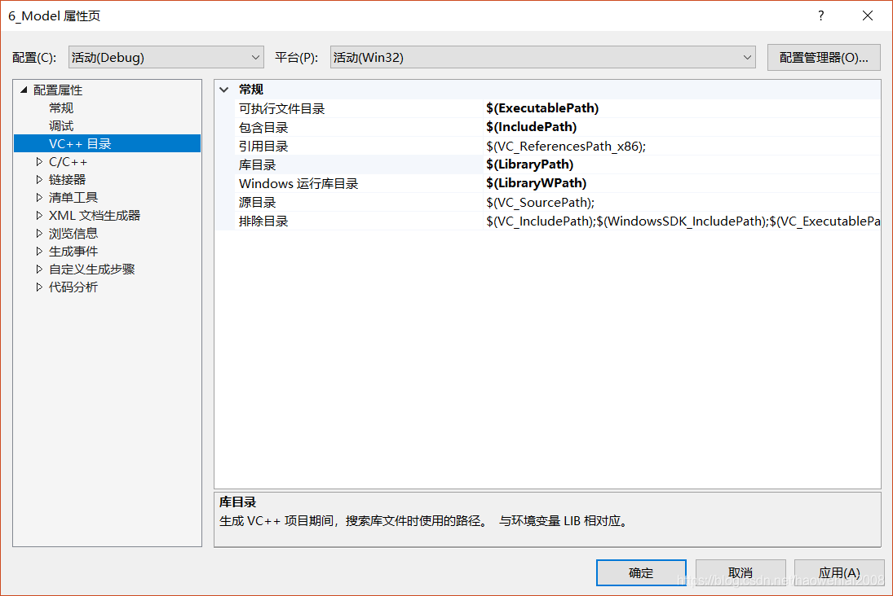

点击包含目录，点击右边的下拉箭头，点击编辑，添加新的项，手动输入附加库头文件的路径


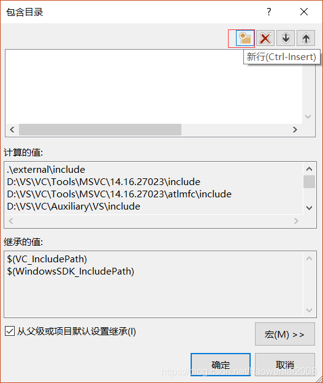

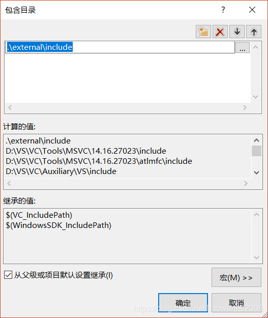

点击确定保存，这样就能保证我们能用<>引用我们想要使用的库的头文件了

###### 1.1.2 使用双引号引用头文件的配置

要使用双引号""引用项目中的头文件的话，在配置属性->c/c++->附加包含目录中添加头文件所在路径即可

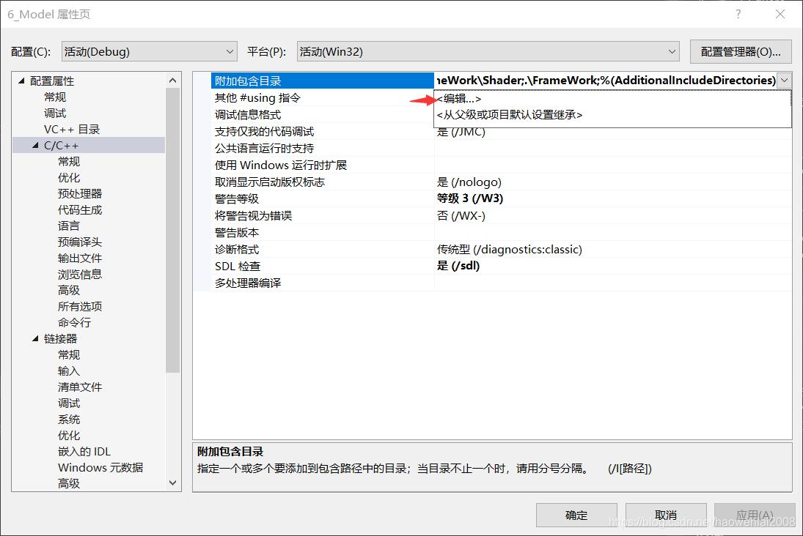

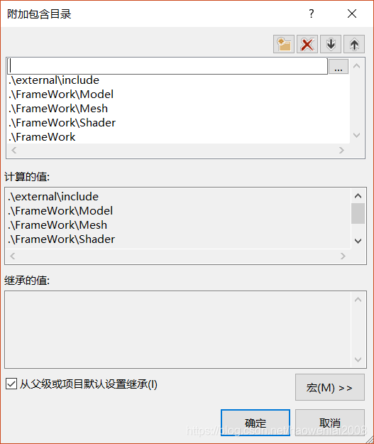

确定，完成配置

###### 1.2 添加静态库所在目录

和添加包含目录同理，点击库目录，点击右边的下拉箭头，编辑，添加静态库所在目录

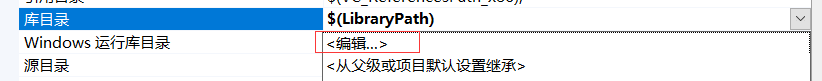

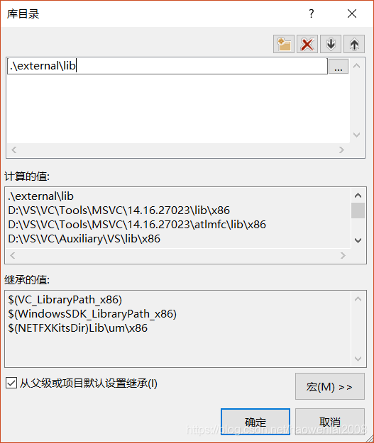

也可以在配置属性->链接器->常规->附加库目录中添加库所在路径

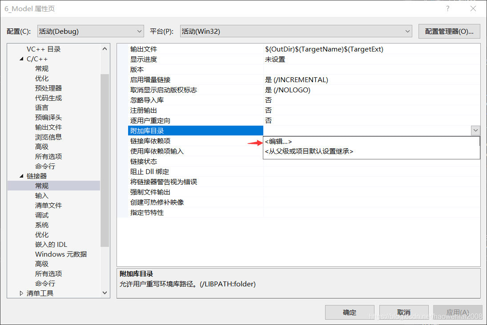

###### 1.3 添加附加依赖项

右键项目->属性->配置属性->链接器->附加依赖项->编辑

添加依赖的lib文件名

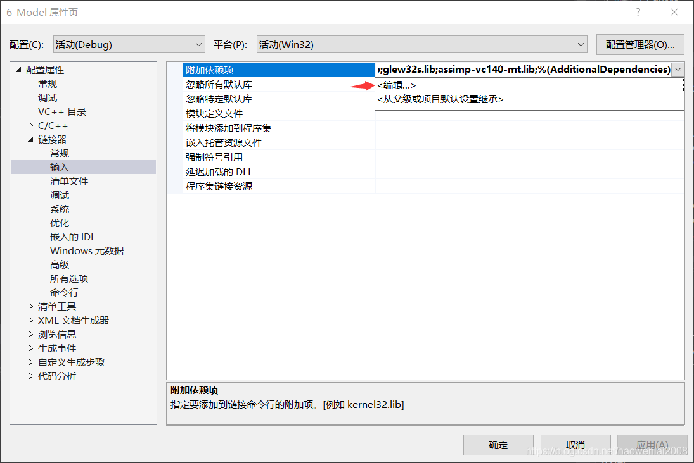

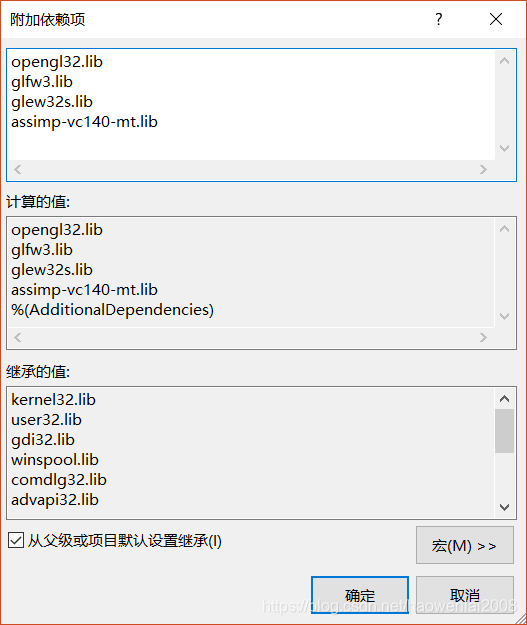

到此位置lib的配置就结束了

###### 1.4 测试以及常见错误

1. 试着引用一下glfw库，没有出现红线说明我们的头文件包含目录没问题了

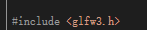

2. 跑一下程序，如果出现LNK1104，说明库目录出了问题


3. 出现LNK2019 无法解析的外部符号XXXXX，该符号在函数XXX被引用

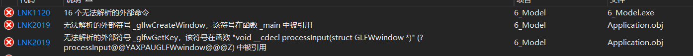

```text
 这种情况就是没有添加附加依赖项导致的

 **总结一下配置静态库可能会出现的问题**
```

- **预处理错误**，未找到头文件
  **解决方式**：[在VC++目录或者c/c++的附加目录中添加头文件所在目录](https://www.cnblogs.com/NightFrost/p/10792600.html#1.1)
- **链接错误**，LNK1104，无法找到库文件
  **解决方式**：[在VC++目录或者链接器的附加库目录添加库所在的目录](https://www.cnblogs.com/NightFrost/p/10792600.html#1.2)
- **链接错误**，LNK1120,LNK2019, 无法解析的外部符号
  **解决方式**：[在链接器中添加附加依赖项](https://www.cnblogs.com/NightFrost/p/10792600.html#1.3)

##### 二. 动态链接库环境配置

动态链接库可以在运行时被使用，调用动态库需要用到 .dll .lib .h三个文件，**其中.lib和.h文件的配置方式和静态库一样**，就不重新说一次了

###### 2.1 设置.dll的环境

关键的一步是在项目的调试环境中添加.dll文件所在路径 右键项目->配置属性->调试->环境->编辑

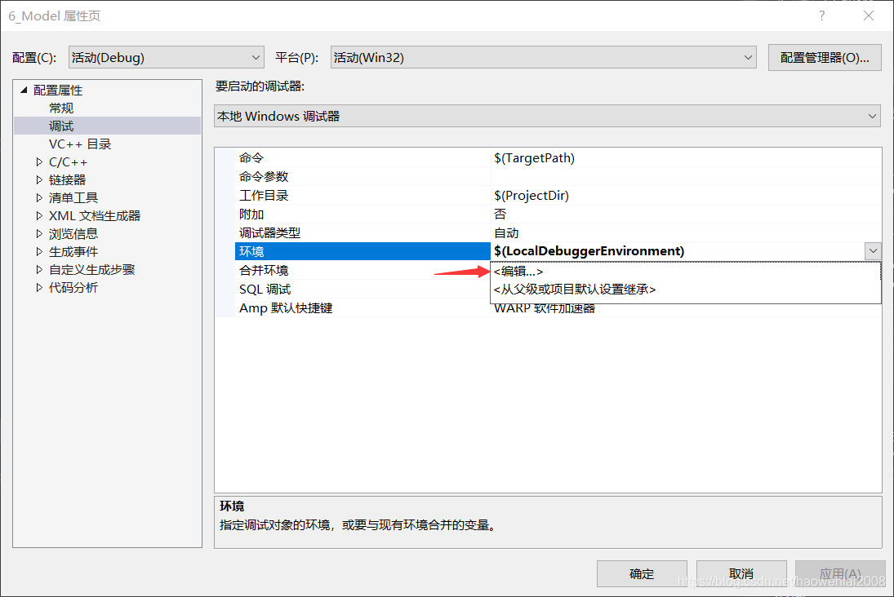

输入PATH=附加库的路径1;附加库的路径2;附加库的路径3;…

每个路径用分号隔开

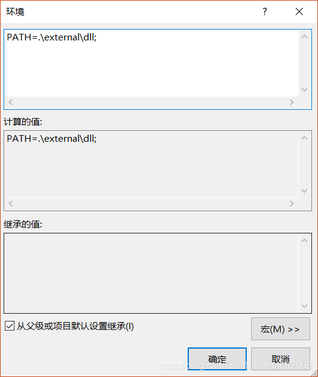

点击确定，保存

**最后将添加的第三方dll和lib放到生成的debug和release目录下才能被生成的程序找到**

##### 总结

梳理一下动态链接库环境配置的流程

1. [添加头文件(.h)所在路径到VC++的包含目录或者项目配置属性c/c++的附加包含目录中](https://www.cnblogs.com/NightFrost/p/10792600.html#1.1)
2. [添加静态库(.lib)所在路径到VC++库目录或者链接器的附加库目录中](https://www.cnblogs.com/NightFrost/p/10792600.html#1.2)
3. [添加附加依赖项到链接器的附加依赖项中](https://www.cnblogs.com/NightFrost/p/10792600.html#1.3)
4. [添加动态链接库(.dll)所在路径到项目调试环境中](https://www.cnblogs.com/NightFrost/p/10792600.html#2.1)

### VS调试Release

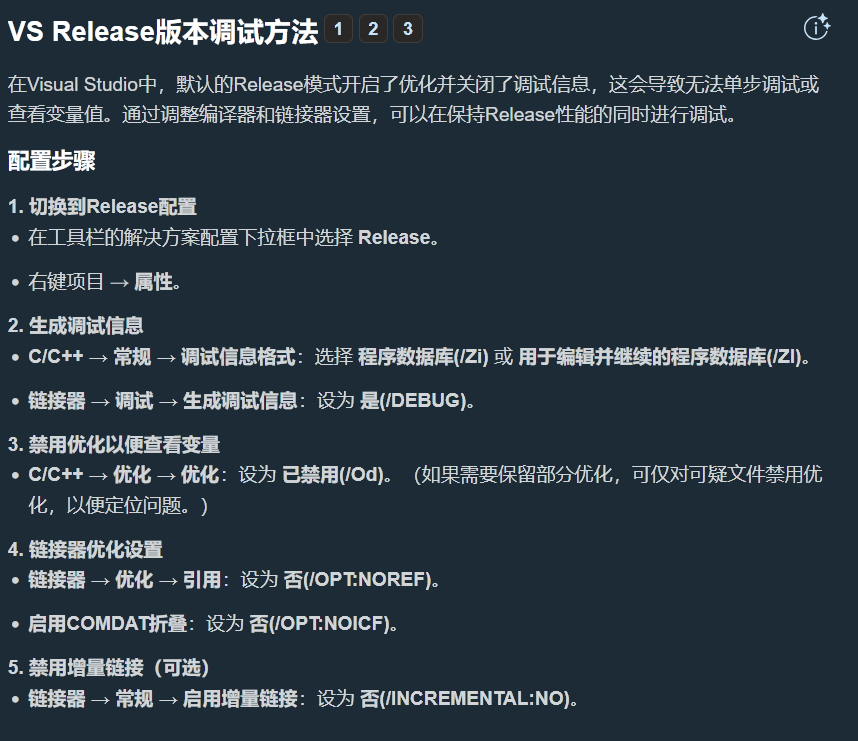

### 版本控制上传

在版本控制中，我们只需要添加.sln、.vcxproj、vcxproj.filters 这三种文件。

### VS2022强制 utf8

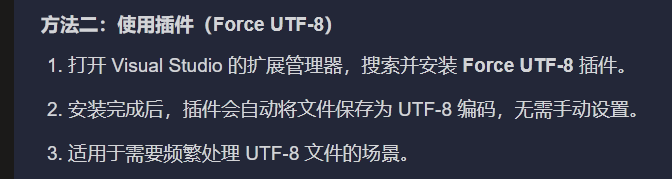

# 计算机基础

## 大小端

**大端**：高字节存放在低地址，低字节存放在高地址，一般叫 网络字节顺序。

**小端**：高字节存放在高地址，低字节存放在低地址（记忆方法，高高低低），一般叫 主机字节顺序。

例如，十六进制数 `12 34 56 78`，转换后为 `78 56 34 12`

对于 1 个字节的数据不需要考虑大小端，超过 1 个字节的数据才需要考虑。

# 编程基础

### 常见的语句类型

1.声明语句

2.表达式语句

3.跳转语句

4.复合语句

5.选择语句

6.迭代语句

7.异常捕获语句


---

### 拷贝初始化

int width = 100;

### 直接列表初始化

int width{ 100 };


---

### 注释使用三个原则

1.在程序，库或函数前，使用代码描述代码的用途

2.在库或函数里，描述代码如何实现功能

3.语句层面，描述代码为什么这样写


---

## 命名空间

自定义命名空间与使用示例

```cpp
#include <iostream>

namespace Foo // 定义了命名空间 Foo
{
    // doSomething() 在命名空间 Foo 中
    int doSomething(int x, int y)
    {
        return x + y;
    }
}

namespace Goo // 定义了命名空间 Goo
{
    // doSomething() 在命名空间 Goo 中
    int doSomething(int x, int y)
    {
        return x - y;
    }
}

int main()
{
    std::cout << Foo::doSomething(4, 3) << '\n'; // 使用的是命名空间 Foo 中的 doSomething
    std::cout << Goo::doSomething(4, 3) << '\n'; // 使用的是命名空间 Goo 中的 doSomething
    return 0;
}

```

使用无名称前缀的域解析操作符

```cpp
#include <iostream>

void print() // 这个 print() 在全局命名空间
{
	std::cout << " there\n";
}

namespace Foo
{
	void print() // 这个 print() 在 Foo 命名空间
	{
		std::cout << "Hello";
	}
}

int main()
{
	Foo::print(); // 调用 Foo 命名空间中的 print()
	::print();    // 调用 全局命名空间中的 print() (这里与只输入print()效果一样)

	return 0;
}

```

命名空间内的标识符解析

```cpp
#include <iostream>

void print() // 这个 print() 在全局命名空间
{
	std::cout << " there\n";
}

namespace Foo
{
	void print() // 这个 print() 在 Foo 命名空间
	{
		std::cout << "Hello";
	}

	void printHelloThere()
	{
		print();   // 调用 Foo 命名空间中的 print()
		::print(); // 调用 全局命名空间中的 print()
	}
}

int main()
{
	Foo::printHelloThere();

	return 0;
}

```

命名空间中内容的向前声明

```cpp
//add.h
#ifndef ADD_H
#define ADD_H

namespace BasicMath
{
    // 函数 add() 在命名空间 BasicMath 中
    int add(int x, int y);
}

#endif

//add.cpp
#include "add.h"

namespace BasicMath
{
    // 函数 add() 定义在命名空间 BasicMath 中
    int add(int x, int y)
    {
        return x + y;
    }
}


//main.cpp
#include "add.h" // for BasicMath::add()
#include <iostream>

int main()
{
    std::cout << BasicMath::add(4, 3) << '\n';

    return 0;
}
```

单个命名空间可以存在多个文件中

```cpp
//circle.h
#ifndef CIRCLE_H
#define CIRCLE_H

namespace BasicMath
{
    constexpr double pi{ 3.14 };
}

#endif

//growth.h
#ifndef GROWTH_H
#define GROWTH_H

namespace BasicMath
{
    // 常量 e 也是命名空间 BasicMath 的一部分
    constexpr double e{ 2.7 };
}

#endif

//main.cpp
#include "circle.h" // for BasicMath::pi
#include "growth.h" // for BasicMath::e

#include <iostream>

int main()
{
    std::cout << BasicMath::pi << '\n';
    std::cout << BasicMath::e << '\n';

    return 0;
}
```

嵌套命名空间

```cpp
#include <iostream>

namespace Foo
{
    namespace Goo // Goo 命名空间 在 Foo 命名空间 中
    {
        int add(int x, int y)
        {
            return x + y;
        }
    }
}

int main()
{
    std::cout << Foo::Goo::add(1, 2) << '\n';
    return 0;
}

```

命名空间别名

```cpp
#include <iostream>

namespace Foo::Goo
{
    int add(int x, int y)
    {
        return x + y;
    }
}

int main()
{
    namespace Active = Foo::Goo; // active 现在指代 Foo::Goo

    std::cout << Active::add(1, 2) << '\n'; // 这等价于 Foo::Goo::add()

    return 0;
} // Active 别名这里失效

```


## 类型转换

### Cpp中推荐使用四个转换操作符

1. static_cast

	**用法**：static_cast<new_type>(expression)

	与C语言中()做强制类型转换基本上是等价的。

	**与（）强制类型转换的区别**：

	static_cast：从 Derived* 到 Base* 的上行转换和从 Base* 到 Derived* 的下行转换是安全的，并且通过编译时检查。然而，试图将 Base* 转换为与之无关的类 Unrelated* 会导致编译错误。

	强制类型转换：将 Base* 转换为与之无关的类 Unrelated* 并不会导致编译错误。

	**主要用于一下场景**

	1.1 基本类型之间的转换

	```cpp
	int a = 42;
	double b = static_cast<double>(a); // 将整数a转换为双精度浮点数b
	```

	1.2 指针类型之间的转换

	```cpp
	class Base {};
	class Derived : public Base {};
	
	Base* base_ptr = new Derived();
	Derived* derived_ptr = static_cast<Derived*>(base_ptr); // 将基类指针base_ptr转换为派生类指针derived_ptr
	```

	1.3 引用类型之间的转换

	```cpp
	Derived derived_obj;
	Base& base_ref = derived_obj;
	Derived& derived_ref = static_cast<Derived&>(base_ref); // 将基类引用base_ref转换为派生类引用derived_ref
	```

	

2. dynamic_cast

	**用法**： dynamic_cast<new_type>(expression)

	主要应用于父子类层次结构中的安全类型转换。它在运行时会执行类型检查，相较于static_cast更安全。

	**主要应用场景**

	2.1 向下类型转换

	```cpp
	class Base { virtual void dummy() {} };
	class Derived : public Base { int a; };
	
	Base* base_ptr = new Derived();
	Derived* derived_ptr = dynamic_cast<Derived*>(base_ptr); // 将基类指针base_ptr转换为派生类指针derived_ptr，如果类型兼容，则成功
	```

	2.2 用于多态类型检查

	```cpp
	class Animal { public: virtual ~Animal() {} };
	class Dog : public Animal { public: void bark() { /* ... */ } };
	class Cat : public Animal { public: void meow() { /* ... */ } };
	
	Animal* animal_ptr = /* ... */;
	
	// 尝试将Animal指针转换为Dog指针
	Dog* dog_ptr = dynamic_cast<Dog*>(animal_ptr);
	if (dog_ptr) {
	    dog_ptr->bark();
	}
	
	// 尝试将Animal指针转换为Cat指针
	Cat* cat_ptr = dynamic_cast<Cat*>(animal_ptr);
	if (cat_ptr) {
	    cat_ptr->meow();
	}
	```

	

3. const_cast

	**用法**：const_cast<new_type>(expression)

	new_type必须是一个指针、引用或者指向对象类型成员的指针。

	**主要应用场景**

	3.1 需要修改const对象时，用来删除const属性

	```cpp
	const int a = 42;
	int* mutable_ptr = const_cast<int*>(&a); // 删除const属性，使得可以修改a的值
	*mutable_ptr = 43; // 修改a的值
	```

	3.2 const对象调用非const成员函数

	```cpp
	class MyClass {
	public:
	    void non_const_function() { /* ... */ }
	};
	
	const MyClass my_const_obj;
	MyClass* mutable_obj_ptr = const_cast<MyClass*>(&my_const_obj); // 删除const属性，使得可以调用非const成员函数
	mutable_obj_ptr->non_const_function(); // 调用非const成员函数
	```

	**注意**：上述行为都不是很安全，可能导致未定义的行为，请谨慎使用。

4. reinterpret_cast

	**用法**：reinterpret_cast<new_type>(expression)

	用于不同类型之间进行低级别的转换，它仅仅是重新解析底层比特（也就是指针所指的那片比特位换个类型做解释），不进行任何类型检查。

	**应用场景**

	指针类型之间的转换

	```cpp
	int a = 42;
	int* int_ptr = &a;
	char* char_ptr = reinterpret_cast<char*>(int_ptr); // 将int指针转换为char指针
	```

----

## 函数

### 向前声明

```cpp
#include<iostream>
int add(int a,int b);
int main()
{
    std::cout << add(5,6);
}

int add(int a,int b)
{
    return a+b;
}
```

### 不建议使用命名空间 using namespace std

```cpp
#include<iostream>
using namespace std;

int cout()
{
   return 5; 
}

int main()
{
    cout << 5; //程序在编译时，不知道调用标准库还是自定义函数
}
```

### 数据类型

浮点型（float）只能确保六位精度


---

## 头文件

### 头文件#include顺序

要尽量提高编译器发现缺失include的概率，请按以下顺序排列#includes：

1. 与当前cpp文件对应的h文件
2. 本项目中的其它头文件
3. 第三方库的头文件
4. 标准库的头文件

注意

1. 每个分组的头文件应按字母顺序排序（除非第三方库的文档有明确指示）。
2. 除头文件中必须的引入外，建议把其他所有引入改到cpp文件中，可以提高编译速度，防止链式包含。

### 头文件保护

头文件保护旨在确保给定头文件的内容不会多次复制到任何单个文件中，以防止重复定义。

重复声明是可以的——但即使您的头文件只由声明（没有定义）组成，也最好使用头文件保护。

请注意，头文件保护不会阻止将头文件的内容复制到多个文件中。

```cpp
//实现方法一(常用)
//在.h文件加入  
#pragma once

//实现方法二(传统)
//举例文件为add.h
#ifndef ADD_H //头文件保护  
#define ADD_H

int add(int a, int b);  //前向声明

#endif // !ADD_H
```

## 基本数据类型

#### 使用uint32_t等这种关键字

```cpp
// 引入头文件
#include <cstdint>

uint16_t m_u16 = 0;
```


#### 关键概念

比特/位 （bit） ：储存0/1

字节（byte）：8个比特

没个存储器地址保存1个字节的数据


### C++中的基本数据类型

|类型 |类别 |含义 |样例 |
|---|---|---|---|
|float / double / long double |浮点数 |有分数部分的数字 |3.1415926 |
|bool |bool 整型 |true 或 false |true |
|char / wchar_t / char8_t (C++20) / char16_t (C++11) / char32_t (C++11) |字符 整型 |一个单独的字符 |‘c’ |
|short int / int / long int / long long int (C++11) |整数 整型 |含0，正数或负数 |42 |
|std::nullptr_t (C++11) |Null Pointer |空指针 |nullptr |
|void |Void |无类型 |n/a |


### 后缀（_t）

在较新版本的C++中定义的许多类型（例如，std::nullptr_t）使用_t后缀。这个后缀的意思是“类型(type)”，它是应用于现代类型的一个常见术语。

如果您看到带_t后缀的东西，它可能是一种类型。但许多类型没有_t后缀，这是不同版本引入的不一致导致的。


### Void

void表示没有类型，一般只用于定义不返回值的函数，不可用于定义变量。


### 对象大小和sizeof运算符

#### 对象大小

C++标准没有定义任何基本数据类型的确切大小，它只为整型和char类型定义了最小大小（以比特为单位），并将所有数据类型的实际大小留给具体编译器实现定义，C++标准也不假设一个字节是8比特

在本教程系列中，我们将通过做出一些合理的假设来简化概念，这些假设通常适用于现代架构：

1. 一个字节是8比特。
2. 内存是字节可寻址的，因此最小的对象是1个字节。
3. 浮点数符合IEEE-754标准。
4. 我们采用的是32位或64位体系结构。

基于于此，我们可以声明如下：

|类别 |类型 |最小大小（字节） |通常大小（字节） |
|---|---|---|---|
|布尔 |bool |1 |1 |
|字符 |char |1 |1 |
|   |wchar_t |1 |2或4 |
|   |char8_t |1 |1 |
|   |char16_t |2 |2 |
|   |char32_t |4 |4 |
|整数 |short |2 |2 |
|   |int |2 |4 |
|   |long |4 |4或8 |
|   |long long |8 |8 |
|浮点数 |float |4 |4 |
|   |double |8 |8 |
|   |long double |8 |8或12或16 |
|指针 |std::nullptr_t |4 |4或8 |


#### sizeof运算符

sizeof是一元运算符，接受类型或变量，返回其大小，以字节为单位。

sizeof（）中不可放入void

```cpp
#include <iomanip> // 引入std::setw (可以指定输出数据的宽度)
#include <iostream>

int main()
{
    std::cout << std::left; // 左对齐
    std::cout << std::setw(16) << "bool:" << sizeof(bool) << " bytes\n";
    std::cout << std::setw(16) << "char:" << sizeof(char) << " bytes\n";
    std::cout << std::setw(16) << "short:" << sizeof(short) << " bytes\n";
    std::cout << std::setw(16) << "int:" << sizeof(int) << " bytes\n";
    std::cout << std::setw(16) << "long:" << sizeof(long) << " bytes\n";
    std::cout << std::setw(16) << "long long:" << sizeof(long long) << " bytes\n";
    std::cout << std::setw(16) << "float:" << sizeof(float) << " bytes\n";
    std::cout << std::setw(16) << "double:" << sizeof(double) << " bytes\n";
    std::cout << std::setw(16) << "long double:" << sizeof(long double) << " bytes\n";

    return 0;
}
```


#### 有符号整数

|类型 |最小大小(字节) |注 |
|---|---|---|
|short int |2 |   |
|int |2 |现代机器上通常是4个字节 |
|long int |4 |   |
|long long int |8 |   |
|类型大小 |取值范围 |   |
|-------- |------------------------------------------------------- |   |
|8位 |-128 to 127 |   |
|16位 |-32,768 to 32,767 |   |
|32位 |-2,147,483,648 to 2,147,483,647 |   |
|64位 |-9,223,372,036,854,775,808 to 9,223,372,036,854,775,807 |   |

#### 无符号整数

尽量避免使用无符号整数

```cpp
unsigned short us;
unsigned int ui;
unsigned long ul;
unsigned long long ull;
```

|类型大小 |取值范围 |
|---|---|
|8位 |0 to 255 |
|16位 |0 to 65,535 |
|32位 |0 to 4,294,967,295 |
|64位 |0 to 18,446,744,073,709,551,615 |

#### 固定宽度整数

|类型 |类别 |范围 |
|---|---|---|
|std::int8_t |一字节有符号 |-128 to 127 |
|std::uint8_t |一字节无符号 |0 to 255 |
|std::int16_t |两字节有符号 |-32,768 to 32,767 |
|std::uint16_t |两字节无符号 |0 to 65,535 |
|std::int32_t |四字节有符号 |-2,147,483,648 to 2,147,483,647 |
|std::uint32_t |四字节无符号 |0 to 4,294,967,295 |
|std::int64_t |八字节有符号 |-9,223,372,036,854,775,808 to 9,223,372,036,854,775,807 |
|std::uint64_t |八字节无符号 |0 to 18,446,744,073,709,551,615 |

```cpp
#include <cstdint> // 引入 固定宽度整数
#include <iostream>

int main()
{
    std::int16_t i{5};
    std::cout << i << '\n';
    return 0;
}
```

**警告**

8位固定宽度整数类型通常被视为字符而不是整数值（这可能因系统而异）。在大多数情况下，首选16位固定宽度整数类型。

**最佳做法**

1. 当整数的大小无关紧要时，首选int（例如，int始终适合2字节有符号整数的范围）。例如，如果您要求用户输入他们的年龄，或者从1数到10，那么int是16位还是32位并不重要（将适合任何一种情况）。这将涵盖您可能遇到的绝大多数情况。
2. 存储需要保证范围的数量时，首选std::int#_t。
3. 当执行位操作或需要定义良好的环绕行为时，首选std::uint#_t。

尽可能避免以下情况：

1. 持有数量的无符号类型
2. 8位固定宽度整数类型
3. 快速和至小固定宽度类型
4. 任何编译器特定的固定宽度整数——例如，Visual Studio定义_*int8、****i__n____t____1____6____等****…*___

### 浮点数

|类型 |最小大小 |常见大小 |
|---|---|---|
|float |4字节 |4字节 |
|double |8字节 |8字节 |
|long double |8字节 |8,12或16字节 |

默认情况下，浮点字面值默认为类型double。f后缀用于表示float类型的文本。

```cpp
int x{5}; // 5 意味着整数
double y{5.0}; // 5.0 是浮点数字面值常量 (默认情况下是double)
float z{5.0f}; // 5.0 是浮点数字面值常量 , f 后缀意味着float
```

#### 浮点范围

|位数 |范围 |精度 |
|---|---|---|
|4 字节 |±1.18 x 10^-38 to ±3.4 x 10^38 and 0.0 |6-9 个有效位, 通常是 7 个 |
|8 字节 |±2.23 x 10^-308 to ±1.80 x 10^308 and 0.0 |15-18 个有效位，通常 16 个 |
|80 位 (通常占用12 或 16 字节) |±3.36 x 10^-4932 to ±1.18 x 10^4932 and 0.0 |18-21 个有效位 |
|16 字节 |±3.36 x 10^-4932 to ±1.18 x 10^4932 and 0.0 |33-36 个有效位 |

当输出浮点数时，std::cout的默认精度为6——即，它假设所有浮点变量仅对6位有效（浮点的最小精度），将截断其后的任何内容。

可以通过使用名为std::setprecision()的输出操纵函数来覆盖std::cout显示的默认精度。输出操纵器改变数据的输出方式，并在iomanip头文件中定义。

```cpp
#include <iomanip> // 引入 std::setprecision()
#include <iostream>

int main()
{
    std::cout << std::setprecision(17); // 输出时，精度保留17位
    std::cout << 3.33333333333333333333333333333333333333f <<'\n'; // f 意味着 float 类型
    std::cout << 3.33333333333333333333333333333333333333 << '\n'; // 没有后缀意味着 double 类型

    return 0;
}
```

**除非存储空间紧张，否则使用双精度浮点，因为单精度浮点数通常会导致保存的不准确。**

#### NaN和lnf

浮点数有两种特殊的类别。第一个是Inf，它表示无穷大。Inf可以是正的，也可以是负的。第二个是NaN，它代表“不是数字”。有几种不同类型的NaN（我们在这里不讨论）。NaN和Inf仅在编译器使用特定的浮点数规则（IEEE 754）时可用。如果编译器使用其他标准，则以下代码将产生未定义的行为。

```cpp
#include <iostream>

int main()
{
    double zero {0.0};
    double posinf { 5.0 / zero }; // 正无穷
    std::cout << posinf << '\n';

    double neginf { -5.0 / zero }; // 负无穷
    std::cout << neginf << '\n';

    double nan { zero / zero }; // 不是数字
    std::cout << nan << '\n';

    return 0;
}
//在Windows上使用Visual Studio 2008运行的结果：
/*
1.#INF
-1.#INF
1.#IND
*/
```

**完全避免除以0.0，即使编译器支持它。**

#### 结论

总之，关于浮点数，应该记住三件事：

1. 浮点数通常用来存储带有分数，或者非常大或者非常小的数字。
2. 浮点数通常有小的舍入误差，即使数字的有效位小于精度。大部分情况下，误差比较小，或者输出截断，难以注意到误差。但是比较浮点数的时候，误差就会比较明显。
3. 在浮点数上执行算数运算会导致误差累积变大。

#### 布尔值（Boolean）

```cpp
bool b1 { true };
bool b2 { false };
b1 = false;
bool b3 {}; // 默认初始化成 false
//可以使用！取反
bool b1 { !true }; // b1 初始化成 false
bool b2 { !false }; // b2 初始化成 true
```

打印布尔值时，std::cout打印0表示false，打印1表示true。

如果希望std::cout打印“true”或“false”，而不是0或1，则可以使用std::boolalpha。下面是一个示例：

```cpp
#include <iostream>

int main()
{
    std::cout << true << '\n';
    std::cout << false << '\n';

    std::cout << std::boolalpha; // 以  true ， false 格式打印bool

    std::cout << true << '\n';
    std::cout << false << '\n';
    return 0;
}
//将打印
/*
1
0
true
false
*/
```

#### 整数转化为布尔值

不能使用列表初始化

```cpp
bool b{ 4 }; // 错误: 发生数据范围舍入

bool b1 = 4 ; // 拷贝初始化允许隐式的将 int 转成 bool
bool b2 = 0 ; // 拷贝初始化允许隐式的将 int 转成 bool
```

**整数可以转换为布尔值的地方，整数0转换为false，任何其他整数转换为true。**

#### 输入布尔值

std::cin只接受布尔变量的两个输入：0和1（不是true或false）。

要允许std:：cin接受“false”和“true”作为输入，必须启用std::boolalpha选项：

```cpp
#include <iostream>

int main()
{
	bool b{};
	std::cout << "Enter a boolean value: ";

	// 允许用户输入 'true' or 'false' 作为bool变量的值
	// 大小写敏感, True or TRUE 都不行
	std::cin >> std::boolalpha;
	std::cin >> b;

	std::cout << "You entered: " << b << '\n';

	return 0;
}
//！当启用std:：boolalpha时，“0”和“1”将不再解释为布尔输入（它们都解析为“false”，就像任何非“true”输入一样）。
//！启用std:：boolalpha将仅允许接受小写的“false”或“true”。不接受大写字母的输入。
```

#### 布尔返回值

布尔值通常用作检查某些内容是否为真的函数的返回值。此类函数通常以单词is（例如isEqual）或has（例如hasCommonDivisor）开头命名。

### 字符

char数据类型是整型，这意味着底层值存储为整数。

ASCII（ American Standard Code for Information Interchange，美国信息交换标准代码），它定义了一种特殊的编码方法，将英语字符（加上一些其他符号）表示为0到127之间的数字（称为ASCII码）。

下面是ASCII字符的完整表格：

|编号 |字符 |编号 |字符 |编号 |字符 |编号 |字符 |
|---|---|---|---|---|---|---|---|
|0 |NUL (null) |32 |(space) |64 |@ |96 |` |
|1 |SOH (start of header) |33 |! |65 |A |97 |a |
|2 |STX (start of text) |34 |” |66 |B |98 |b |
|3 |ETX (end of text) |35 |# |67 |C |99 |c |
|4 |EOT (end of transmission) |36 |$ |68 |D |100 |d |
|5 |ENQ (enquiry) |37 |% |69 |E |101 |e |
|6 |ACK (acknowledge) |38 |& |70 |F |102 |f |
|7 |BEL (bell) |39 |’ |71 |G |103 |g |
|8 |BS (backspace) |40 |( |72 |H |104 |h |
|9 |HT (horizontal tab) |41 |) |73 |I |105 |i |
|10 |LF (line feed/new line) |42 |* |74 |J |106 |j |
|11 |VT (vertical tab) |43 |+ |75 |K |107 |k |
|12 |FF (form feed / new page) |44 |, |76 |L |108 |l |
|13 |CR (carriage return) |45 |- |77 |M |109 |m |
|14 |SO (shift out) |46 |. |78 |N |110 |n |
|15 |SI (shift in) |47 |/ |79 |O |111 |o |
|16 |DLE (data link escape) |48 |0 |80 |P |112 |p |
|17 |DC1 (data control 1) |49 |1 |81 |Q |113 |q |
|18 |DC2 (data control 2) |50 |2 |82 |R |114 |r |
|19 |DC3 (data control 3) |51 |3 |83 |S |115 |s |
|20 |DC4 (data control 4) |52 |4 |84 |T |116 |t |
|21 |NAK (negative acknowledge) |53 |5 |85 |U |117 |u |
|22 |SYN (synchronous idle) |54 |6 |86 |V |118 |v |
|23 |ETB (end of transmission block) |55 |7 |87 |W |119 |w |
|24 |CAN (cancel) |56 |8 |88 |X |120 |x |
|25 |EM (end of medium) |57 |9 |89 |Y |121 |y |
|26 |SUB (substitute) |58 |: |90 |Z |122 |z |
|27 |ESC (escape) |59 |; |91 |[ |123 |{ |
|28 |FS (file separator) |60 |< |92 |\ |124 |\ |
|29 |GS (group separator) |61 |= |93 |] |125 |} |
|30 |RS (record separator) |62 |> |94 |^ |126 |~ |
|31 |US (unit separator) |63 |? |95 |_ |127 |DEL (delete) |

字符0-31被称为不可打印字符，它们主要用于格式化和控制打印机。其中大多数现在已经过时了。

注意不要将字符与整数混淆。以下两个初始化不相同：

```cpp
char ch{5}; // 使用数字 5 (存储为 5)
char ch{'5'}; // 使用字符 '5' (存储为 53)
```

#### 打印字符

使用std::cout打印字符时，std::cout将字符变量输出为ASCII字符：

```cpp
#include <iostream>

int main()
{
    char ch1{ 'a' };
    std::cout << ch1; // 打印字符 'a'

    char ch2{ 98 }; // 初始化为字符 'b' (不推荐)
    std::cout << ch2; // 打印字符 'b'


    return 0;
}
//输出结果
/*
ab
*/
```

#### 以hex输出

```cpp
int m_var = 16;
std::cout << std::hex << m_var << std::endl;

//输出为10
```

#### 输入字符

std::cin允许您输入多个字符。然而，变量ch只能容纳1个字符。因此，只有第一个输入字符被提取到变量ch中。其余的用户输入留在std::cin的输入缓冲区中，并且可以通过后续继续调用std:∶cin来提取。

```cpp
#include <iostream>

int main()
{
    std::cout << "Input a keyboard character: "; // 假设此时用户输入 "abcd"

    char ch{};
    std::cin >> ch; // ch = 'a', "bcd" 被缓存起来
    std::cout << "You entered: " << ch << '\n';

    // 注: 下面的cin不需要用户再输入了, 读的是缓冲区的数据!
    std::cin >> ch; // ch = 'b', "cd" 被缓存
    std::cout << "You entered: " << ch << '\n';
    
    return 0;
}
```

#### 字符大小、范围和符号

char由C++定义，大小始终为1个字节。默认情况下，字符可以有符号或无符号（尽管它通常是有符号的）。如果使用字符来保存ASCII字符，则不需要指定符号（因为有符号和无符号字符都可以保存0到127之间的值）。

如果使用char来保存小的整数（除非显式的优化存储空间，否则不应该这样做），那么应该始终指定它是有符号的还是无符号的。有符号字符可以容纳-128到127之间的数字。无符号字符可以容纳0到255之间的数字。

#### 转义

三个值得注意的转义序列是：

1. \’ 单引号
2. " 双引号
3. \ 反斜杠

下面是所有转义序列的表：

|名称 |符号 |含义 |
|---|---|---|
|告警（Alert） |\a |发出告警，例如响铃 |
|退格（Backspace） |\b |将光标往后移一格 |
|换页（Formfeed） |\f |将光标移动到下一页 |
|换行（Newline） |\ |将光标移动到下一行 |
|回车（Carriage return） |\r |将光标移动到行的开头 |
|水平制表（Horizontal tab） |\t |水平制表符 |
|垂直制表（Vertical tab） |\v |垂直制表符 |
|单引号（Single quote） |\’ |单引号 |
|双引号（Double quote） |" |双引号 |
|反斜杠（Backslash） |\ |反斜杠 |
|问号（Question mark） |? |问号 |
|八进制数字（Octal number） |(number) |按八进制解释为数字 |
|十六进制数字（Hex number） |\x(number) |按十六进制解释为数字 |

#### 将字符放在单引号和双引号中有什么区别？

单个字符总是放在单引号中（例如’a’、’+’、‘5’）。一个字符只能表示一个符号（例如，字母A、加号、数字5）。

双引号之间的文本（例如"Hello，world！"）被视为多个字符组成的字符串。后续在字符串章节进行介绍。

**最佳做法：将独立字符放在单引号中（例如，’t’或’\
’，而不是"t"或"\
"）。这有助于编译器更有效地优化。**

**避免多字符文本**

出于向后兼容性的原因，许多C++编译器支持’‘中包含多个字符（例如'56’）, 具体代表的功能因编译器而异。由于它们不是C++标准的一部分，并且它们的值没有严格定义，因此应该避免这样使用。

### 类型转换

#### 隐式类型转换

编译器在没有显式询问我们的情况进行的类型转换，称为隐式类型转换。

```cpp
#include <iostream>

void print(double x) //  参数是 double 类型
{
	std::cout << x << '\n';
}

int main()
{
	int y { 5 };
	print(y); // y 是 int 类型的变量

	return 0;
}
```

**类型转换会产生新值**

即使被称为转换，类型转换实际上也不会更改转换前的值或类型。相反，要转换的值用作输入，并且转换产生目标类型的新值。

在上面的示例中，转换不会将变量y从int类型更改为double。相反，转换使用y（5）的值作为输入来创建新的双精度值（5.0）。然后将该双精度值传递给函数print。

#### 通过static_cast操作符进行显式类型转换

```cpp
#include <iostream>

void print(int x)
{
	std::cout << x << '\n';
}

int main()
{
	print( static_cast<int>(5.5) ); // 显示的将 double 值 5.5 转换为 int
		                           //static_cast<新类型>(表达式)
	return 0;
}
```

**每当您看到使用尖括号（<>）的C++语法（不包括预处理器）时，尖括号之间的东西很可能是类型。这通常是C++处理需要参数化类型的代码的方式。**

#### 使用static_cast将值从char转换为int：

```cpp
#include <iostream>

int main()
{
    char ch{ 97 }; // 97 是 ASCII 码 'a'
    std::cout << ch << " has value " << static_cast<int>(ch) << '\n'; // 将 ch 转换为 int

    return 0;
}
//结果
/*
a has value 97
*/
```

#### 将无符号数字转换为有符号数字

```cpp
#include <iostream>

int main()
{
    unsigned int u { 5 };
    int s { static_cast<int>(u) }; // 将变量 u 的值转换为 int

    std::cout << s << '\n';
    return 0;
}
```

static_cast操作符不执行任何范围检查，因此如果将值强制转换为超出表示范围的类型，则将导致未定义的行为。因此，如果无符号int的值大于有符号int可以容纳的最大值，则上述从无符号int到int的转换将产生不可预测的结果。

**如果要转换的值不适合新类型的范围，static_cast操作符将产生未定义的行为。**

#### 章节回顾

存储器的最小单位是二进制数字，也称为比特。可以直接寻址（访问）的最小单位内存量是字节。现代标准是一个字节等于8位。

数据类型告诉编译器如何以某种有意义的方式解释内存的内容。

C++支持许多基本数据类型，包括浮点数、整数、布尔值、字符、空指针和void。

void用于表示没有类型。它主要用于指示函数不返回值。

不同的类型占用不同的内存大小，使用的内存量可能因机器而异。

sizeof运算符可用于返回类型的大小（以字节为单位）。

有符号整数用于保存正整数和负整数，包括0。特定数据类型可以保存的值集称为其范围。使用整数时，请注意溢出和整数除法问题。

无符号整数仅包含正数（和0），通常应避免使用，除非您正在进行位操作。

固定宽度整数是具有保证大小的整数，但它们可能并不存在于所有体系结构上。快速整数和至小整数是至少具有某种大小的最快和最小整数。通常应避免使用std::int8_t和std::uint8_t，因为它们的行为倾向于像字符而不是整数。

size_t是一种无符号整数类型，用于表示对象的大小或长度。

科学记数法是书写冗长数字的一种速记方法。C++支持科学记数法和浮点数。有效位中的数字（e之前的部分）称为有效数字。

浮点数是一组用于保存实数的类型（包括具有分数的实数）。数字的精度定义了它可以表示多少个有效数字，而不会丢失信息。当浮点数中存储了太多的有效数字，而该浮点数不能保持如此高的精度时，可能会发生舍入错误。舍入错误始终发生，即使是简单的数字，如0.1。因此，不应该直接比较浮点数。

布尔类型用于存储true或false值。

如果某些条件为真，if语句允许我们执行一行或多行代码。if语句的条件表达式被解释为布尔值。当if语句条件的计算结果为false时，可以使用else语句来执行语句。

char用于存储解释为ASCII字符的值。使用字符时，请注意不要混淆ASCII代码值和数字。将字符打印为整数值需要使用static_cast。

尖括号 <> 通常在C++中用于表示需要参数化类型的内容。它与static_cast一起使用，以确定参数应转换为哪种数据类型（例如，static_cast<int>(x)，将x的值作为int返回）。

## static

### static 修饰全局变量

static修饰全局变量可以将变量的作用域限定在当前文件中，使得其他文件无法访问该变量。static修饰的全局变量在程序启动时被初始化(在main.cpp执行之前)，生命周期和程序一样长。

```cpp
// a.cpp 文件
static int a = 10;  // static 修饰全局变量
int main() {
    a++;  // 合法，可以在当前文件中访问 a
    return 0;
}

// b.cpp 文件
extern int a;  // 声明 a
void foo() {
    a++;  // 非法，会报链接错误，其他文件无法访问 a
}
```

### static 修饰局部变量

static修饰局部变量可以使变量在函数调用结束后不会被销毁，一直存在于内存中，下次调用该函数时可以继续使用。

```cpp
void foo() {
    static int count = 0;  // static 修饰局部变量
    count++;
    cout << count << endl;
}

int main() {
    foo();  // 输出 1
    foo();  // 输出 2
    foo();  // 输出 3
    return 0;
}
```

### static 修饰函数

static修饰函数可以将函数的作用于限定在当前文件中，使得其他文件无法访问该函数。同时，由于static修饰的函数只能在当前文件中被调用，因此可以便面命名冲突和代码重复定义。

```cpp
// a.cpp 文件
static void foo() {  // static 修饰函数
    cout << "Hello, world!" << endl;
}

int main() {
    foo();  // 合法，可以在当前文件中调用 foo 函数
    return 0;
}

// b.cpp 文件
extern void foo(); // 声明 foo
void bar() {
    foo();  // 非法，会报链接错误，找不到 foo 函数，其他文件无法调用 foo 函数
}
```

### static修饰类成员变量和函数

static修饰类成员变量和函数可以使得他们在所有类对象中共享，且不需要创建对象就可以直接访问。

```cpp
class MyClass {
public:
    static int count;  // static 修饰类成员变量
    static void foo() {  // static 修饰类成员函数
        cout << count << endl;
    }
};
// 访问：

MyClass::count;
MyClass::foo();
```

### static实现单例模式

#### 实现原理

**核心原理**

控制实例创建过程，确保一个类只有一个实例，并提供全局访问点。

**关键要素**

1. 私有化构造函数

	```cpp
	class Singleton {
	private:
	    Singleton() {}  // 私有构造，外部无法直接创建
	    ~Singleton() {}
	};
	```

	

2. 进制拷贝和赋值

	```cpp
	Singleton(const Singleton&) = delete;
	Singleton& operator=(const Singleton&) = delete;
	```

	

3. 静态成员存储唯一实例

	```cpp
	static Singleton* instance;  // 或 static Singleton instance
	```

	

4. 静态方法提供全局访问点

	```cpp
	static Singleton* getInstance() {
	    // 控制实例化逻辑
	}
	```

	

#### 代码实现方式

1. 懒汉式（线程不安全）

	```cpp
	class Singleton {
	private:
	    static Singleton* instance;
	    Singleton() {}  			// 私有构造函数
	    ~Singleton() {}
	    Singleton(const Singleton&) = delete;    		//禁用赋值
	    Singleton& operator=(const Singleton&) = delete;//禁用拷贝 
	    
	public:
	    static Singleton* getInstance() {
	        if (instance == nullptr) {
	            instance = new Singleton();
	        }
	        return instance;
	    }
	};
	
	Singleton* Singleton::instance = nullptr;
	```

	

2. 懒汉式（线程安全-互斥锁）

	```cpp
	#include <mutex>
	
	class Singleton {
	private:
	    static Singleton* instance;
	    static std::mutex mtx;
	    Singleton() {}
	    ~Singleton() {}
	    Singleton(const Singleton&) = delete;
	    Singleton& operator=(const Singleton&) = delete;
	    
	public:
	    static Singleton* getInstance() {
	        std::lock_guard<std::mutex> lock(mtx);
	        if (instance == nullptr) {
	            instance = new Singleton();
	        }
	        return instance;
	    }
	};
	
	Singleton* Singleton::instance = nullptr;
	std::mutex Singleton::mtx;
	```

	

3. 双重检查锁定（DCLP）

	```cpp
	#include <atomic>
	#include <mutex>
	
	class Singleton {
	private:
	    static std::atomic<Singleton*> instance;
	    static std::mutex mtx;
	    Singleton() {}
	    ~Singleton() {}
	    
	public:
	    static Singleton* getInstance() {
	        Singleton* tmp = instance.load(std::memory_order_acquire);
	        if (tmp == nullptr) {
	            std::lock_guard<std::mutex> lock(mtx);
	            tmp = instance.load(std::memory_order_relaxed);
	            if (tmp == nullptr) {
	                tmp = new Singleton();
	                instance.store(tmp, std::memory_order_release);
	            }
	        }
	        return tmp;
	    }
	};
	
	std::atomic<Singleton*> Singleton::instance{nullptr};
	std::mutex Singleton::mtx;
	```

	

4. 饿汉式（线程安全）

	```cpp
	class Singleton {
	private:
	    static Singleton* instance;
	    Singleton() {}
	    ~Singleton() {}
	    Singleton(const Singleton&) = delete;
	    Singleton& operator=(const Singleton&) = delete;
	    
	public:
	    static Singleton* getInstance() {
	        return instance;
	    }
	};
	
	Singleton* Singleton::instance = new Singleton();
	```

	

5. Meyers Singleton（C++11及以后，最佳实践）

	```cpp
	class Singleton {
	private:
	    Singleton() {}
	    ~Singleton() {}
	    Singleton(const Singleton&) = delete;
	    Singleton& operator=(const Singleton&) = delete;
	    
	public:
	    static Singleton& getInstance() {
	        static Singleton instance;  // C++11保证线程安全
	        return instance;
	    }
	};
	```

	

6. 带智能指针的版本

	```cpp
	#include <memory>
	#include <mutex>
	
	class Singleton {
	private:
	    static std::shared_ptr<Singleton> instance;
	    static std::mutex mtx;
	    Singleton() {}
	    
	public:
	    static std::shared_ptr<Singleton> getInstance() {
	        std::lock_guard<std::mutex> lock(mtx);
	        if (!instance) {
	            instance = std::shared_ptr<Singleton>(new Singleton());
	        }
	        return instance;
	    }
	};
	
	std::shared_ptr<Singleton> Singleton::instance = nullptr;
	std::mutex Singleton::mtx;
	```

**为什么叫懒汉式**

- 延迟加载，第一次调用getInstance时才创建

- 需要处理线程安全问题。

**Meyers Singleton原理**

- 利用C++11标准的**静态局部变量线程安全初始化**

- 编译器在底层添加了双重检查锁机制

- 原理

	```cpp
	static Singleton& getInstance() {
	    static Singleton instance;  // 编译器的魔法：
	    // 1. 添加守卫变量标志是否已初始化
	    // 2. 线程安全地检查和初始化
	    return instance;
	}
	```

### 常用场景

1. 配置管理类

	```cpp
	class ConfigManager {
	private:
	    unordered_map<string, string> configs;
	    ConfigManager() { loadConfig(); }
	    
	public:
	    static ConfigManager& getInstance() {
	        static ConfigManager instance;
	        return instance;
	    }
	    
	    string getValue(const string& key) {
	        return configs[key];
	    }
	};
	
	// 使用：全局统一配置
	auto& config = ConfigManager::getInstance();
	string dbHost = config.getValue("database.host");
	```

	

2. 日志记录器

	```cpp
	class Logger {
	private:
	    ofstream logFile;
	    mutex mtx;
	    
	    Logger() {
	        logFile.open("app.log", ios::app);
	    }
	    
	public:
	    static Logger& getInstance() {
	        static Logger instance;
	        return instance;
	    }
	    
	    void log(const string& message) {
	        lock_guard<mutex> lock(mtx);
	        logFile << timestamp() << " - " << message << endl;
	    }
	};
	
	// 使用：全局日志记录点
	Logger::getInstance().log("User logged in");
	```

	

3. 数据库连接池

	```cpp
	class ConnectionPool {
	private:
	    queue<Connection*> connections;
	    int poolSize = 10;
	    
	    ConnectionPool() {
	        for(int i = 0; i < poolSize; i++) {
	            connections.push(new Connection());
	        }
	    }
	    
	public:
	    static ConnectionPool& getInstance() {
	        static ConnectionPool instance;
	        return instance;
	    }
	    
	    Connection* getConnection() {
	        Connection* conn = connections.front();
	        connections.pop();
	        return conn;
	    }
	};
	```

	

4. 任务队列/线程池

	```cpp
	class ThreadPool {
	private:
	    vector<thread> workers;
	    queue<function<void()>> tasks;
	    
	    ThreadPool() {
	        // 初始化工作线程
	    }
	    
	public:
	    static ThreadPool& getInstance() {
	        static ThreadPool instance;
	        return instance;
	    }
	    
	    void enqueue(function<void()> task) {
	        tasks.push(task);
	    }
	};
	```

	

5. 硬件接口管理器

	```cpp
	class HardwareManager {
	private:
	    HardwareManager() {
	        initGPIO();
	        initI2C();
	    }
	    
	public:
	    static HardwareManager& getInstance() {
	        static HardwareManager instance;
	        return instance;
	    }
	    
	    void setPin(int pin, bool value) {
	        // 控制硬件引脚
	    }
	};
	```

	

6. 缓存管理器

	```cpp
	class CacheManager {
	private:
	    unordered_map<string, string> cache;
	    unordered_map<string, time_t> expireTime;
	    
	public:
	    static CacheManager& getInstance() {
	        static CacheManager instance;
	        return instance;
	    }
	    
	    void set(const string& key, const string& value, int ttl = 3600) {
	        cache[key] = value;
	        expireTime[key] = time(nullptr) + ttl;
	    }
	};
	```

	

7. GUI应用中的窗口管理器

	```cpp
	class WindowManager {
	private:
	    vector<Window*> windows;
	    Window* activeWindow = nullptr;
	    
	    WindowManager() {}
	    
	public:
	    static WindowManager& getInstance() {
	        static WindowManager instance;
	        return instance;
	    }
	    
	    void registerWindow(Window* win) {
	        windows.push_back(win);
	    }
	    
	    void setActiveWindow(Window* win) {
	        activeWindow = win;
	    }
	};
	```

	

### 最佳实践建议

即保持单例的便利性，又通过接口隔离具体实现，提高可测试性。

```cpp
// 推荐：Meyers Singleton + 接口抽象
class ILogger {
public:
    virtual void log(const string& msg) = 0;
    virtual ~ILogger() = default;
};

class FileLogger : public ILogger {
private:
    FileLogger() {}
public:
    static FileLogger& getInstance() {
        static FileLogger instance;
        return instance;
    }
    void log(const string& msg) override {
        // 实现
    }
};

// 使用时通过接口依赖注入，便于测试
class UserService {
    ILogger& logger;
public:
    UserService(ILogger& log) : logger(log) {}
    void doSomething() {
        logger.log("doing something");
    }
};
```

## extern


```cpp
//fileA.cpp
int i = 1;         //声明并定义全局变量i

//fileB.cpp
extern int i;    //声明i，链接全局变量

//fileC.cpp
extern int i = 2;        //错误，多重定义
int i;                    //错误，这是一个定义，导致多重定义
main()
{
    extern int i;        //正确
    int i = 5;            //正确，新的局部变量i;
}
```

extern C


## 常量

C++支持两种不同类型的常量：

1. 命名常量（Named constants）是与标识符关联的常量值。这些有时也被称为符号常量（symbolic constants），或者只称为常量（constants）。
2. 字面值常量（Literal constants）是与标识符无关的常量值。

##### 命名常量的类型

在C++中定义命名常量有三种方法：

1. 将变量设置为不可更改，即为常变量（Constant variables）（在本课中介绍）。
2. 具有替换文本的类对象宏（在-预处理器简介 中介绍，在本课中有额外的介绍）。
3. 枚举常数（在后续-枚举值中介绍）。

###### 常变量

命名常变量

```cpp
const double gravity { 9.8 };  // 更推荐将 const 放在类型前
```

**定义常变量时必须对其进行初始化，之后不能通过赋值更改该值**

##### const修饰指针的四种情况

​	**指向只读变量的指针**

​	指针指向const修饰的变量，指针内容不可修改，指针指向可以修改。

```cpp
const int* p;  // 声明一个指向只读变量的指针，可以指向 int 类型的只读变量
int a = 10;
const int b = 20;
p = &a;  // 合法，指针可以指向普通变量
p = &b;  // 合法，指针可以指向只读变量
*p = 30;  // 非法，无法通过指针修改只读变量的值
```

​	**只读指针**

​	const修饰指针本身，指针指向不可修改，指针内容可以修改。

```cpp
int a = 10;
int b = 20;
int* const p = &a;  // 声明一个只读指针，指向 a
*p = 30;  // 合法，可以通过指针修改 a 的值
p = &b;  // 非法，无法修改只读指针的值
```

​	**只读指针指向只读变量**

​	const同时修饰指针和内容，都不可修改

```cpp
const int a = 10;
const int* const p = &a;  // 声明一个只读指针，指向只读变量 a
*p = 20;  // 非法，无法通过指针修改只读变量的值
p = nullptr;  // 非法，无法修改只读指针的值
```

​	**常量引用**

​	引用一个只读变量的引用

```cpp
const int a = 10;
const int& b = a;  // 声明一个常量引用，引用常量 a
b = 20;  // 非法，无法通过常量引用修改常量 a 的值
```

##### constexpr关键字

如果constexpr变量的初始化值不是常量表达式，编译器将报错。

```cpp
#include <iostream>

int five()
{
    return 5;
}

int main()
{
    constexpr double gravity { 9.8 }; // ok: 9.8 是常量表达式
    constexpr int sum { 4 + 5 };      // ok: 4 + 5 是常量表达式
    constexpr int something { sum };  // ok: sum 是常量表达式

    std::cout << "Enter your age: ";
    int age{};
    std::cin >> age;

    constexpr int myAge { age };      // 编译报错: age 不是常量表达式
    constexpr int f { five() };       // 编译报错: five() 返回值不是常量表达式

    return 0;
}
```

**最佳实践**

任何在初始化后不修改，且其初始值在编译时已知的变量都应声明为constexpr。任何在初始化后不修改，且其初始值在编译时未知的变量都应声明为const。

## 条件判断

### if-else

```cpp
#include <iostream>

int main()
{
    constexpr bool inBigClassroom { false };

    if (inBigClassroom)
        constexpr int classSize { 30 };
    else
        constexpr int classSize { 20 };

    std::cout << "The class size is: " << classSize;

    return 0;
}
```

这无法编译，并且将得到一条错误消息，即classSize未定义。就像函数中定义的变量在函数的末尾失效一样，在if语句或else语句内定义的变量也会在if或else的末尾失效。

**表达式的类型必须匹配或可转换**

```cpp
#include <iostream>

int main()
{
    std::cout << (true ? 1 : 2) << '\n';    // okay: 两个操作数的类型都是int

    std::cout << (false ? 1 : 2.2) << '\n'; // okay: int  1 被转换为 double

    std::cout << (true ? -1 : 2u) << '\n';  // 令人惊讶: -1 被转换为 unsigned int, 发生溢出

    return 0;
}
```

## 以十进制、八进制或十六进制输出值

```cpp
#include <iostream>

int main()
{
    int x { 12 };
    std::cout << x << '\n'; // 十进制 (默认)
    std::cout << std::hex << x << '\n'; // 16进制
    std::cout << x << '\n'; // 现在是16进制
    std::cout << std::oct << x << '\n'; // 八进制
    std::cout << std::dec << x << '\n'; // 重新设置回十进制
    std::cout << x << '\n'; // 十进制

    return 0;
}
```

### 输出二进制值

以二进制格式输出值有点困难，因为std::cout没有内置此功能。幸运的是，C++标准库包含一个名为std::bitset的类型，它将为我们完成这项工作（在头文件中）。

要使用std::bitset，我们可以定义一个std::bitset变量，并告诉std::bitset要存储多少位。位数必须是编译时常量。可以用整数值（以任何格式，包括十进制、八进制、十六进制或二进制）初始化std::bitset。

```cpp
#include <bitset> // 引入 std::bitset
#include <iostream>

int main()
{
	// std::bitset<8> 意味着要存储 8 个 bit
	std::bitset<8> bin1{ 0b1100'0101 }; // 二进制的 1100 0101
	std::bitset<8> bin2{ 0xC5 }; // 十六进制的 1100 0101

	std::cout << bin1 << '\n' << bin2 << '\n';
	std::cout << std::bitset<4>{ 0b1010 } << '\n'; // 创建一个临时的bitset并打印

	return 0;
}
```

## 枚举

### 自动排序赋值

```cpp
#include <iostream>
using namespace std;
enum Color { Red = 1, Green = 5, Blue }; // Blue 的值为 6（前一个值加 1）
int main() {
   Color favorite = Green;
   cout << "Favorite color value: " << favorite << endl; // 输出 5
   return 0;
}
```

## 结构体

### Cpp与C的struct区别

在C语言中，struct只能包含成员变量，C++中还可以包含成员函数。


### 重载operator<<以打印结构体

```cpp
#include <iostream>

//定义
struct Employee
{
    int id {};
    int age {};
    double wage {};
};

//重载
std::ostream& operator<<(std::ostream& out, const Employee& e)
{
    out << e.id << ' ' << e.age << ' ' << e.wage;
    return out;
}

int main()
{
    //初始化
    // joe.wage will be value-initialized to 0.0
    Employee joe { 2, 28 }; 
    
    //调用
    std::cout << joe << '\n';

    return 0;
}
```


## 内存对齐

### 内存对齐的好处

有助于提高内存访问速度，因为许多处理器都优化了对齐数据的访问。但是，这可能会导致内存中的一些空间浪费。

### 取消内存对齐

```cpp
// 实例1
#include <iostream>
using namespace std;

// 按1字节对齐，相当于取消对齐
#pragma pack(push, 1)
struct Student {
   char a; // 1字节
   int b; // 4字节
   short c; // 2字节
};
#pragma pack(pop)

int main() {
   cout << "结构体大小: " << sizeof(Student) << endl;
   return 0;
}

// 实例2
#include <iostream>

#pragma pack(push, 1) // 设置字节对齐为 1 字节，取消自动对齐
struct UnalignedStruct {
    char a;
    int b;
    short c;
};
#pragma pack(pop) // 恢复默认的字节对齐设置

struct AlignedStruct {
    char a;   // 本来1字节，padding 3 字节
    int b;    //  4 字节
    short c;  // 本来 short 2字节，但是整体需要按照 4 字节对齐(成员对齐边界最大的是int 4) 
              // 所以需要padding 2
   // 总共: 4 + 4 + 4
};

struct MyStruct {
 double a;    // 8 个字节
 char b;      // 本来占一个字节，但是接下来的 int 需要起始地址为4的倍数
              //所以这里也会加3字节的padding
 int c;       // 4 个字节
 // 总共:  8 + 4 + 4 = 16
};

struct MyStruct1 {
 char b;    // 本来1个字节 + 7个字节padding
 double a;  // 8 个字节
 int c;     // 本来 4 个字节，但是整体要按 8 字节对齐，所以 4个字节padding
  // 总共: 8 + 8 + 8 = 24
};


int main() {
    std::cout << "Size of unaligned struct: " << sizeof(UnalignedStruct) << std::endl; 
    // 输出：7
    std::cout << "Size of aligned struct: " << sizeof(AlignedStruct) << std::endl; 
    // 输出：12，取决于编译器和平台
    std::cout << "Size of aligned struct: " << sizeof(MyStruct) << std::endl; 
    // 输出：16，取决于编译器和平台
    std::cout << "Size of aligned struct: " << sizeof(MyStruct1) << std::endl;
     // 输出：24，取决于编译器和平台
    return 0;
}
```

## 引用

给变量起别名

```cpp
#include <iostream>

int main()
{
	int a = 20;
	int& b = a;
	std::cout << b <<std::endl;
    
    return 0;
}
```

**注意事项**

- 引用必须初始化
- 引用初始化后不可修改

### 作为参数传递

```cpp
#include <iostream>

void mySwap(int &a, int &b)
{
    int temp = a;
    a = b;
    b = temp;
}

int main()
{
    int a = 20;
	int b = 30;  

	mySwap(a, b);
	std::cout << a << "         b:  " << b << std::endl;

	return 0;
}
```

**引用的函数可以作为左值**

```cpp
#include <iostream>

int& getNum()
{
	static int a = 20;  //静态变量，防止被清除
	return a;
}

int main()
{
    int& b = getNum();
	std::cout << b << std::endl; //output: 20
	std::cout << b << std::endl;

	getNum() = 1000;
	std::cout << b << std::endl; //output: 1000
	std::cout << b << std::endl;

	return 0;
}
```

**常量引用**

防止数据在函数中被修改

```cpp
#include <iostream>

void showValue(const int& a)
{
	//a = 200;   不可执行，函数内的a不能被修改
	std::cout << a << std::endl;
}
int main()
{
    int a = 100;

	showValue(a);

	return 0;
}
```

## 函数高级

### 默认参数

### 函数占位参数

### 函数重载

重载操作符

```cpp
#include <iostream>
#include <string>

class Person
{
public:
    int age;
    std::string name;

    bool operator == (Person pTmp);  //重载 == 运算符
};

bool Person::operator==(Person pTmp)  
{
    return (age == pTmp.age && name == pTmp.name);
}


class Point
{
public:
    Point(int xIn,int yIn)
    {
        x = xIn;
        y = yIn;
    }
    int x,y;

    Point operator+(Point pTmp);  //重载 + 运算符
};

Point Point::operator+(Point pTmp)
{
    return Point(x + pTmp.x,y + pTmp.y);
}

int main()
{
    Person p1;
    p1.age = 18;
    p1.name = "张三";

    Person p2;
    p2.age = 18;
    p2.name = "罗翔";

    Person p3;
    p3.age = 18;
    p3.name = "张三";

    std::cout << "p1 = p2 ? :  " << std::to_string(p1 == p2) <<std::endl;
    std::cout << "p1 = p3 ? :  " << std::to_string(p1 == p3) <<std::endl;


    Point pt1(1,3);
    Point pt2(3,1);

    Point pt3 = pt1 + pt2;

    std::cout << "pt3 x: " << pt3.x << " ,y: " << pt3.y << std::endl;


    return 0;
}


//析构函数例子
#include <iostream>

class Nums
{
public:
    int* nums;

    Nums(int size)
    {
        nums = new int[size];
    }

    ~Nums()  //析构函数
    {
        std::cout << "调用析构函数" <<std::endl;
        delete [] nums;  //清除nums占用的空间
    }
};

int main()
{
    Nums* nn = new Nums(10);

    delete nn; //清除nn占用的Nums空间

    return 0;
}
```

### 函数指针

```cpp
#include <iostream>

int func(const int &a, int b)
{
    return a+b;
}

int main()
{
    int (*func_p2)(const int &a, int b) = func;    //标准定义
    decltype(func) *func_p = func;                 //自动解构参数  decltype
    std::cout << func_p(1,2) << std::endl;
}
```

### 回调函数

```cpp
#include <functional>
#include <iostream>
#include <string_view>
#include <string>

//定义要被回调的函数
void m_func(std::string_view  content)
{
    std::cout << content << " and run by functional." << std::endl;
}

//调用回调函数的函数
void doSomething(std::function<void(std::string_view)> callback)
{
    std::string cont = "here is doSomething";

    callback(cont);
}

//主程序示例
int main()
{
    doSomething(&m_func);

    //lambda定义匿名函数，作为回调函数
    doSomething([](std::string_view content){
        std::cout << content << " and run by lambda." << std::endl;
        
    });
}
```


### 运算符重载

```cpp
//operator 
std::vector<int> operator+(std::vector<int> a, std::vector<int> b)
{
    std::vector<int> res;
    for (size_t i = 0; i < std::max(a.size(), b.size()); ++i)
    {
        int first{0};
        int second{0};
        if(i < a.size())
        {
            first = a[i];
        }

        if(i < b.size())
        {
            second = b[i];
        }
        res.emplace_back(first + second);
    }
    return res;
}

int main()
{
    std::vector<int> a1 = {1,2,3,4,5};
    std::vector<int> a2 = {5,6,7,8,9,10,11};
    auto res {a1 + a2};
    for (auto it : res)
    {
        std::cout << it << '\n';
    }
    
}
```

## 类和对象

### class与struct的区别

- class中的成员默认为private，struct默认public
- class继承默认为private，struct默认public
- class可以用于定义模板参数，struct不能

### 封装

访问权限

- public          类内外都可以访问
- private         类外不可访问
- protected    类外不可访问，但子类可访问

类中默认权限为private

#### 构造函数和析构函数

构造函数用于创建实例

析构函数用于实例销毁

类默认的构造函数和析构函数为空函数，不执行任何操作

```cpp
//Person.h
#include <iostream>

class Person
{
	//默认为private，需要写在public里
public:
	Person()
	{
		std::cout << "这是构造函数" << std::endl;
	}

	~Person()
	{
		std::cout << "这是析构函数" << std::endl;
	}
};

//main.cpp
#include "Person.h"
#include <iostream>

void test1()
{
	Person p;
}

int main()
{
	test1();
	return 0;
}
```

构造函数使用初始化列表

```cpp
#include <iostream>

class Person
{
public:
    int age;
    std::string name;

    Person();
    Person(int ageIn,std::string nameIn) : age(ageIn), name(nameIn){  //初始化列表
    }

};
```

#### explicit关键字

构造函数不应该用于转换构造函数

1. explicit构造函数不能用于执行拷贝初始化或拷贝列表初始化。
2. explicit构造函数不能用于执行隐式转换（因为它使用拷贝初始化或拷贝列表初始化）。

```cpp
//加上explicit前
#include <iostream>

class Foo
{
private:
    int m_x{};
public:
    Foo(int x)   //转换构造函数
        : m_x{ x }
    {
    }

    int getX() const { return m_x; }
};

void printFoo(Foo f) // 参数为 Foo
{
    std::cout << f.getX();
}

int main()
{
    printFoo(5); // 输入为 int，5在传入后会隐式转换为Foo类型，并执行后续输出

    return 0;
}

//加上explicit后
#include <iostream>

class Dollars
{
private:
    int m_dollars{};

public:
    explicit Dollars(int d) // 现在是 explicit
        : m_dollars{ d }
    {
    }

    int getDollars() const { return m_dollars; }
};

void print(Dollars d)
{
    std::cout << "$" << d.getDollars();
}

int main()
{
    print(5); // 编译失败，因为 Dollars(int) 是 explicit

    return 0;
}
```

explicit构造函数可用于直接初始化和列表初始化

```cpp
// 假设为 Dollars(int) 是 explicit
int main()
{
    Dollars d1(5); // ok  直接初始化
    Dollars d2{5}; // ok  列表初始化
}
```

按值返回和explicit构造函数

```cpp
#include <iostream>

class Foo
{
public:
    explicit Foo() // explicit
    {
    }

    explicit Foo(int x) // explicit
    {
    }
};

Foo getFoo()
{
    // explicit Foo()
    return Foo{ };   // ok
    return { };      // 错误: 不能隐式的列表初始化Foo

    // explicit Foo(int)
    return 5;        // 错误: 不能隐式的将 int 转换为 Foo
    return Foo{ 5 }; // ok
    return { 5 };    // 错误: 不能隐式的将初始化列表转换为 Foo
}

int main()
{
    return 0;
}
```

#### 使用explicit的最佳实践

现代最佳实践是使默认情况下接受单个参数的任何构造函数标记为explicit。也包括大多数或全部参数有默认值的有多个参数的构造函数。

这将禁止编译器使用该构造函数进行隐式转换。

如果在特定情况下实际需要这样的转换，则使用列表初始化将隐式转换转换改写为显式定义是很容易的。

以下构造函数不应标记explicit：

1. 复制（和移动）构造函数（因为它们不执行转换）。

以下构造函数通常不应标记explicit：

1. 没有参数的默认构造函数（因为它们仅用于将{}转换为默认对象）。
2. 仅接受多个参数的构造函数。

在某些情况下，将单参数构造函数设置为非explicit是有意义的。当以下所有条件都为真时，这可能很有用：

1. 转换的值在语义上等同于参数值。
2. 转换是性能更好的。

例如，接收C样式字符串，参数类型为std::string_view的构造函数不是explicit的，因为不太可能出现这样的情况，即我们不同意将C样式字符串视为std::string_view。

相反，接收std::string_view，参数类型std::string构造函数需要标记为explicit，因为虽然std:∶string值在语义上等同于std::string_view值，但构造std::string代价较高。

#### 链式调用

```cpp
#include <iostream>

class Person
{
public:
    int age;
    std::string name;

    Person();
    Person(int ageIn,std::string nameIn) : age(ageIn), name(nameIn){  //初始化列表
    }

    Person& setAge(int age)  //调用结束后返回对象本身
    {
        this->age = age;
        return *this;
    }

    void displayInfo()
    {
        std::cout << "age is " << age << " , name is " << name << std::endl;
    }

};

int main()
{
    Person p1(18,"小明");

    p1.setAge(38).displayInfo();  //链式调用

    return 0;
}
```

### 继承

基类构造函数

```cpp
#include <iostream>

class Viecle
{
public:
    std::string name;
    int year;

    Viecle(std::string name,int year)
    {
        this->name = name;
        this->year = year;
    }
};

class sportCar: public Viecle
{
public:
    int gas;

    sportCar(std::string name, int year,int gas): Viecle(name,year)   //基类构造函数
    {
        this->gas = gas;
    }
};

int main()
{
    sportCar * ftype = new sportCar("奇瑞路虎捷豹",2024,2);

    std::cout << ftype->gas << "........" <<ftype->name <<std::endl;

    return 0;
}
```

### 虚继承

```cpp
#include <iostream>

class Base
{
    public:
        int a ;
};

class classA : virtual public Base
{
    private:
    int aa = 0;
};

class classB : virtual public Base
{
    private:
    int bb = 0;
};

class teil : public classA, public classB
{
    int nn = 0;
};

int main()
{
    //teil 钻石继承于base，如果访问base中的元素，本应该加上作用域，
    //但virtual继承于base的classA和classB指向的是同一块内存，所以不用加作用域

    teil tt;
    tt.classA::a = 0;  ///带作用域的访问
    tt.classB::a = 1;
    std::cout << tt.a << std::endl;  //不带作用域的访问
    //最后输出结果为 1
}
```

### 虚函数与多态

在基类中声明虚函数，允许在派生类中重写，实现多态

如果类中有虚函数，通常应该将析构函数也声明为虚函数

抽象类：如果一个类中所有的方法都为虚函数且只有定义没有实现，那么该类为抽象类，继承于此类的子类必须对虚函数进行重写。

```cpp
//////////////
//虚函数
//////////////
#include <iostream>
class Viecle
{
public:
    virtual ~Viecle(){};
    virtual void run()
    {
        std::cout << "Run Slower" <<std::endl;
    }
};
class sportCar: public Viecle
{
public:
    void run() override
    {
        std::cout << "Run Faster...." <<std::endl;
    }
};
int main()
{
    Viecle * v = new Viecle();
    sportCar * ftype = new sportCar();

    v->run();
    ftype->run();

    return 0;
}

///////////////////
//多态
//////////////////
#include <iostream>
class Bike
{
    public:
        virtual void showMe()
        {
            std::cout << "I am a bike" << std::endl;
        }
};
class RaodBike :  public Bike
{
    public:
        //重写父类的虚函数
        void showMe() override            
        {
            std::cout << "I am a road bike" << std::endl;
        }
    
};
class MountBike : public Bike
{
    public:
        void showMe() override
        {
            std::cout << "I am a mount bike" << std::endl;
        }
};
int main()
{
    //多态，基于统一父类，指针可在不同类型间转换

    Bike m_bike;
    RaodBike m_roadBike;
    MountBike m_mountBike;

    Bike * m_pBike = &m_roadBike;
    m_pBike->showMe();
    m_pBike = &m_mountBike;
    m_pBike->showMe();
}

//输出：
// I am a road bike
// I am a mount bike
```

### 模板

模板实现阶乘功能

```cpp
template <int n> int factorial()
{
    int res;
    for (int i=2; i <= n; ++i) 
    {
        res *= i;
    }
    return res;
}

int main() {
    std::cout << factorial<5>();
}
```

一个方法对两种类型数据做比较

```cpp
#include <iostream>
#include <type_traits>

//std::common_type_t<T1, T2>会返回两个类型中更宽的数据类型
 template <typename T1, typename T2> std::common_type_t<T1, T2> max(const T1 &a, const T2 &b)
 {
    return a>b ? a : b;
 }


int main() {
    std::cout << max(50, 50.1);
}
```

管道运算符实现数据筛选

```cpp
#include <iostream>
#include <string>
#include <vector>

//通用容器打印
template<typename T> void print_stl(const T &vec)
{
    for(const auto &item : vec)
    {
        std::cout << item << ' ';
    }
}

//管道运算符
template<typename T, typename Func> std::vector<T> operator|(const std::vector<T> & vec, const Func &func)
{
    std::vector<T> result;
    for(auto item : vec)
    {
        if(func(item))
        {
            result.emplace_back(item);
        }
    }
    return result;
}

int main() {
    std::vector<int> data;
    for (int i= 1; i <= 100; ++i) {
        data.emplace_back(i);
    }

    //是不是偶数
    auto is_even = [](int i) {
        if(i%2 == 0)
        {
            return true;
        }
        return false;
    };

    //是不是奇数
    auto is_odd = [](int i){
        if(i%2 == 1)
        {
            return true;
        }
        return false;
    };


    //通过管道，筛选数据
    print_stl(data | is_even);
    std::cout << '\n';
    print_stl(data | is_odd);
}
```

或者筛选有空格的字符串

```cpp
int main() {
    std::vector<std::string> data{ "nihao","I am a computer", "yes you are right","HelloWorld"};

    //筛选含有空格的字符串
    print_stl(data | [](std::string str){
        // 能找到空格且该空格不是空标识符
        if (str.find(' ') != std::string::npos) {
            return true;
        }
        return false;
    });
}
```

### 数组作为参数时，使用模板在函数内获取数组长度

数组在作为函数参数时，会降级为指针，所以在函数内直接使用szieof(arr)时会返回指针大小8byte（32位系统上为4）

```cpp
#include <iostream>
#include <cstring>
template <typename T, std::size_t N>
void printSizeAndLength(const T (&arr)[N]) {
    std::cout << "Size of arr in function: " << sizeof(arr) << std::endl; // 计算数组的大小
    //std::cout << "Length of arr: " << strlen(arr) << std::endl; // 计算字符串的长度
}
int main() {
    char str[] = "Hello, world!";
    std::cout << "Size of str in main: " << sizeof(str) << std::endl; // 计算整个字符数组的大小
    printSizeAndLength(str);

    int intAry[] = {0,1,2,3,4,5,6,7,8,9};
    std::cout << "Size of intAry in main: " << sizeof(intAry) << std::endl; // 计算整个字符数组的大小
    printSizeAndLength(intAry);
}
```


### 类模板

```cpp
#include <iostream>

//类模板
template <typename T>
class printEverything
{
private:
    T data;
public:
    void print();
    void set(T d);
};

//类外定义需要添加 template
template <typename T>
void printEverything<T>::print()
{
    std::cout << data <<std::endl;
}

template <typename T>
void printEverything<T>::set(T d)
{
    this->data = d;
}

int main()
{
    printEverything<int> prInt;
    prInt.set(15);
    prInt.print();

    printEverything<double> prDouble;
    prDouble.set(4.444);
    prDouble.print();

    return 0;
}
```

## 左值与右值

- 左值：可调用对象
- 右值：临时对象
- 左值引用 引左值
- 右值引用 引右值  右值引用的结果是左值
- const修饰的左值引用  可以引左值   也可以引右值

## 回调函数

```cpp
#include <iostream>

using namespace std;

bool compare(int a, int b)
{
    return a > b;
}

//回调函数，获得两数最大值
int getMax(int a,int b, bool (*compare)(int a,int b))
{
    if(compare(a,b))
    {
        return a;
    }else
    {
        return b;
    }
}

int main()
{
    int x = 10;
    int y =20;

//    bool (*p)(int a,int b) = compare;  //函数指针
//    int max = getMax(x,y,p);

    //改为Lamda表达式
    int max = getMax(x,y,[](int a,int b)->bool{
                            return a>b;
                     });

    cout << max << endl;

    return 0;
}
```

## STL

### MAP

```cpp
#include <map>
#include <iostream>

int main()
{
    std::map<std::string, int> map;

    std::string str;
    while (std::cin >> str)
    {
        ++map[str];
    }

    for(auto it {map.begin()}; it != map.end(); ++it)
    {
        auto pair = (*it);
        std::cout << pair.first << ":" << pair.second << "\n";
    }
}
```

### String

```cpp
// 大写转换
int main()
{
    std::string s1 = "SDHOAHDP+==_dasid";
    std::string s2;
    s2.resize(s1.size() + 1);
    std::transform(s1.begin(),s1.end(),s2.begin(), [](auto i){
        if (std::isupper(i))
        {
            return std::tolower(i);
        }
        return static_cast<int>(i);
    });

    std::cout << s2;
}
```

## 文件操作

### 文件打开失败获取错误信息

```cpp
#include <iostream>
#include <fstream>
#include <cerrno>
#include <cstring>

const char * filePath = "recvTTTT.dat";

// 尝试不同的打开模式
std::fstream file(filePath, std::ios::in | std::ios::binary);

if (!file.is_open()) 
{
    std::cout << "=== File Open Failed ===" << std::endl;
    std::cout << "Path: " << filePath << std::endl;
    std::cout << "Error: " << strerror(errno) << " (errno: " << errno << ")" << std::endl;
    
    // 常见错误码含义
    switch(errno) {
        case ENOENT:
            std::cout << "Reason: File or path does not exist" << std::endl;
            break;
        case EACCES:
            std::cout << "Reason: Permission denied" << std::endl;
            break;
        case EISDIR:
            std::cout << "Reason: Path is a directory, not a file" << std::endl;
            break;
        case EMFILE:
            std::cout << "Reason: Too many open files" << std::endl;
            break;
        default:
            std::cout << "Reason: Unknown error" << std::endl;
    }
    return -1;
}
```

### 追加内容

```cpp
#include <iostream>
#include <fstream>

int main() {
   std::ofstream file("example.txt", std::ios::app); // 以追加模式打开文件
   if (!file) {
       std::cerr << "无法打开文件！" << std::endl;
       return 1;
   }
   file << "这是追加的内容。" << std::endl; // 写入内容到文件末尾
   file.close(); // 关闭文件
   cout << "数据已成功追加到文件末尾！" << std::endl;
   return 0;
}
```

### 综合案例

```cpp
//读取jpg图片文件，将RGB三个通道的数据分别写入到三个txt中
#include <iostream>
#include <fstream>
#include <vector>
#include <string>

struct Pixel
{
    u_int8_t red;
    u_int8_t green;
    u_int8_t blue;
};

int main()
{
    const char * inputImagePath = "pic.jpg";
    
    //打开图像文件
    std::ifstream imageFile(inputImagePath , std::ios::in | std::ios::binary);

    if(!imageFile.is_open())
    {
        std::cerr << "无法打开图像文件: " << inputImagePath << std::endl;
        return -1;
    }

    //读取图片以获取尺寸
    imageFile.seekg(0 , std::ios::end);
    std::streampos fileSize = imageFile.tellg();
    imageFile.seekg(0, std::ios::beg);

    //读取jpeg文件
    const int headerSize = 2; //jpeg头部大小为2
    const int channels = 3;   //假设文件为RGB图像

    if(fileSize <= headerSize)
    {
        std::cerr  << "图片文件无效" << std::endl;
        return -1;
    }

    int imageWidth = 0;
    int imageHeight = 0;

    //跳过文件头
    imageFile.ignore(headerSize);

    //读取像素数据
    const int pixelDataSize = static_cast<int>(fileSize - imageFile.tellg());
    const int pixelCount = pixelDataSize / channels;

    //使用vector存储像素数据，他会在销毁时自动释放内存
    std::vector<Pixel> pixels(pixelCount);
    imageFile.read(reinterpret_cast<char *>(pixels.data()),pixelDataSize);

    imageFile.close();

    //将通道数据写入txt文件
    for (int channel = 0; channel < channels; channel++)
    {
        std::string outFileName = "channel_" + std::to_string(channel + 1) + ".txt";
        std::ofstream outFile(outFileName);

        if(!outFile.is_open())
        {
            std::cerr << "写入文件无法打开: " << outFileName << std::endl;
            return -1;
        }

        //遍历所有像素，并将指定通道的值写入对应的文件
        for(const Pixel&pixel : pixels)
        {
            u_int8_t value;
            switch (channel)
            {
            case 0:
                value = pixel.red;
                break;
            case 1:
                value = pixel.green;
                break;
            case 2:
                value = pixel.blue;
                break;
            default:
                std::cerr << "不支持的通道" << std::endl;
                return -1;
            }
            outFile << static_cast<int>(value) << " ";
        }
        outFile.close();
        std::cout << "通道 " << channel + 1 << "数据已存入文件: " << outFileName << std::endl;
    }
    

}
```

## 官方库

### cctype

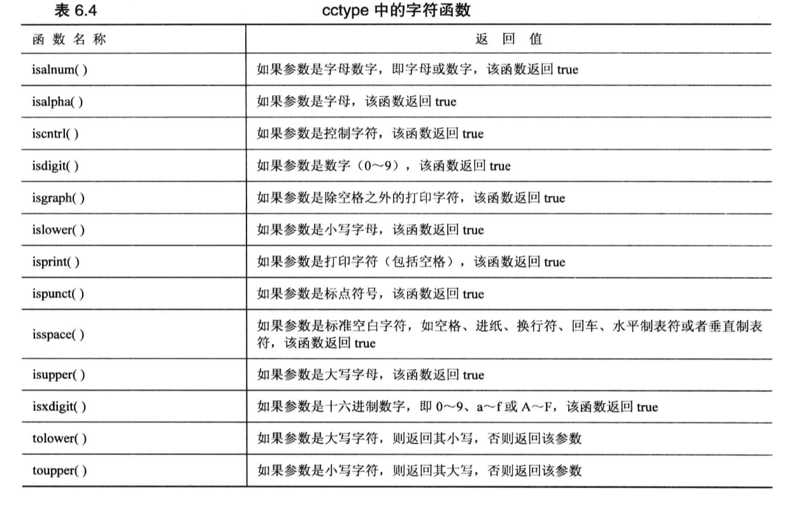


## 多线程

创建线程

```cpp
///  1. 初级使用

#include <iostream>
#include <thread>

// 要被放入线程的函数
void myFunc(int value)
{
    std::cout << "Here is child thread  value: " << value << std::endl;
}

int main()
{
    // 创建一个线程，放入myFunc函数，10为传给函数的参数
    std::thread th1(myFunc, 10);
    // join会运行子线程并阻塞当前线程直到子线程运行结束
    th1.join();
    
    std::cout << "here is main" << std::endl;
    return 0;
}


//  2. 传入引用的值
#include <iostream>
#include <thread>

void myFunc(int& value)
{
    std::cout << "Here is child thread  value: " << value << std::endl;
}

int main()
{
    int var = 10;

    std::thread th1(myFunc, std::ref(var));
    th1.join();
    
    std::cout << "here is main" << std::endl;
    return 0;
}


// 3. 分离线程
#include <iostream>
#include <thread>
#include <chrono>

void myFunc(int& value)
{
    std::cout << "Here is child thread  value: " << value << std::endl;
}

int main()
{
    int var = 10;

    std::thread th1(myFunc, std::ref(var));
    
    // 将子线程与当前线程分离，子线程单独执行，不再影响当前线程，
   	//由于当前线程为主线程，所以主线程结束时会结束子线程
    th1.detach();   
    
    std::cout << "here is main" << std::endl;
    
    // cpp中的等待
    std::this_thread::sleep_for(std::chrono::milliseconds(20));
    
    return 0;
}
```


> 如果不调用join()也不调用detach()，程序结束时会报错。


互斥锁mutex

```cpp
// 1. 不加锁
#include <iostream>
#include <thread>
#include <chrono>

unsigned long counter = 0;

void addCounter(int times)
{
    std::cout << std::this_thread::get_id() << "  is my thread ID" << std::endl;             // 操作
    while (times > 0) {
        counter++;
        times--;
    }
}

int main()
{
    int var = 10;

    std::thread th1(addCounter, 10000);
    std::thread th2(addCounter, 10000);

    // 
    th1.join();
    th2.join();
    
    std::cout << std::this_thread::get_id() << "    here is main, counter is   " << counter << std::endl;

    // cpp中的等待
    std::this_thread::sleep_for(std::chrono::milliseconds(20));

    return 0;
}

/*
上面代码中主函数的最终输出结果可能与预期不一致，因为两个线程互相竞争counter，会造成数据混乱
*/


// 2. 加入锁
#include <iostream>
#include <thread>
#include <chrono>
#include <mutex>    // 引入锁的头文件


unsigned long counter = 0;
// 定义一个锁
std::mutex counter_mutex;


void addCounter(int times)
{
    std::cout << std::this_thread::get_id() << "  is my thread ID" << std::endl;

    while (times > 0) {

        counter_mutex.lock();       // 加锁
        
        counter++;                  // 操作
        
        counter_mutex.unlock();     // 解锁

        times--;
    }
}


int main()
{
    int var = 10;

    std::thread th1(addCounter, 10000);
    std::thread th2(addCounter, 10000);

    // 
    th1.join();
    th2.join();
    
    std::cout << std::this_thread::get_id() << "    here is main, counter is   " << counter << std::endl;

    // cpp中的等待
    std::this_thread::sleep_for(std::chrono::milliseconds(20));

    return 0;
}

/*
此时输出结果为
23  is my thread ID
  is my thread ID
1    here is main, counter is   20000

因为std::cout 不是线程安全，导致第第一个线程输出时，将第二个线程中的id值覆盖

此时counter时安全的，最后结果为20000
*/

// 要想解决std::cout的线程安全问题,可以服用counter_mutex
/* 输出结果为
2  is my thread ID
3  is my thread ID
1    here is main, counter is   20000
*/
void addCounter(int times)
{
    counter_mutex.lock();       // 加锁
        
    std::cout << std::this_thread::get_id() << "  is my thread ID" << std::endl;             // 操作
        
    counter_mutex.unlock();     // 解锁
    
    
    // 或者定义一个专门用于输出的锁
    /*
    std::mutex print_mutex;

	void addCounter(int times) {
    	{
        	std::lock_guard<std::mutex> lock(print_mutex);
        	std::cout << std::this_thread::get_id() << "  is my thread ID" << std::endl;
        }
    	// 后续的循环操作...
	}
	*/

    while (times > 0) {

        counter_mutex.lock();       // 加锁
        
        counter++;                  // 操作
        
        counter_mutex.unlock();     // 解锁

        times--;
    }
}


```


## 补充

### dll和lib

#### 1 静态库和动态链接库的区别

动态链接库是在运行的时候被调用的，静态库在链接的时候被链接到最终生成的应用程序(.exe)中

**静态库**需要用到的文件 (.lib .h)

头文件(.h)提供接口，库文件(.lib)提供实现

**动态链接库**需要用到的文件 (.dll .lib .h)

头文件(.h)提供接口，库文件(.lib)仅提供索引，动态链接库文件(.dll)提供实现

#### 2 尖括号<>和双引号""引用.h文件的区别

尖括号<>会从VC++包含目录中寻找.h文件，一般是用于调用第三方库

双引号""会从**项目配置属性中c/c++的附加包含目录**寻找.h文件，一般是用于寻找工程内的.h文件

# CMake

## 指令

### 基础指令

```bash
# -B 标志告诉 CMake 使用给定的相对路径作为在构建过程中生成文件和存储构件的位置。如果省
# 略，则使用当前工作目录。将这些生成的文件放在源树本身中执行“源内”构建通常被认为是不好的
# 做法。
cmake -B build

# 指定源文件路径,默认为当前文件夹
cmake -S 

# 接下来，使用 cmake --build 告诉 CMake 构建项目，并将我们用 -B 标志传递的相同相对路
# 径传递给它。
cmake --build build


# 查看支持的Generator(生成器),带*的为默认
cmake --help
# 或
cmake -G

# 指定生成器构建
cmake -S . -B build -G "Unix Makefiles"
```


### 指定编译类型

cmake支持预定义的构造类型

|构建类型 |说明 |优化 |调试信息 |适用场景 |
|---|---|---|---|---|
|**Debug** |调试版本 |无优化 |完整 |开发和调试 |
|**Release** |发布版本 |最大优化 |无 |生产环境 |
|**RelWithDebInfo** |带调试信息的发布版 |优化 |有 |性能分析 |
|**MinSizeRel** |最小体积发布版 |体积优化 |无 |嵌入式、移动端 |

编译标志对比

```cmake


# GCC/Clang编译器
Debug:          -g
Release:        -O3 -DNDEBUG
RelWithDebInfo: -O2 -g -DNDEBUG
MinSizeRel:     -Os -DNDEBUG

# MSVC编译器
Debug:          /MDd /Zi /Ob0 /Od /RTC1
Release:        /MD /O2 /Ob2 /DNDEBUG
RelWithDebInfo: /MD /Zi /O2 /Ob1 /DNDEBUG
MinSizeRel:     /MD /O1 /Ob1 /DNDEBUG
```

可以通过`-DCMAKE_BUILD_TYPE`来指定构建类型，如下

```bash
# Debug构建（开发阶段）
cmake -S . -B build-debug -DCMAKE_BUILD_TYPE=Debug
cmake --build build-debug
# 生成带调试符号的可执行文件，未优化

# Release构建（生产环境）
cmake -S . -B build-release -DCMAKE_BUILD_TYPE=Release
cmake --build build-release
# 生成优化的可执行文件，无调试符号

# RelWithDebInfo构建（性能分析）
cmake -S . -B build-profile -DCMAKE_BUILD_TYPE=RelWithDebInfo
cmake --build build-profile
# 生成优化的可执行文件，保留调试符号

# MinSizeRel构建（嵌入式）
cmake -S . -B build-small -DCMAKE_BUILD_TYPE=MinSizeRel
cmake --build build-small
# 生成最小体积的可执行文件
```

配置完成后，可以使用以下命令查看编译标志

```bash
# 列出所有缓存变量
cmake -LA <构建目录>

# 列出所有缓存变量，包括帮助文本
cmake -LAH <构建目录>
```

## Debug和Release

首先，配置`Debug`和`Release`版本

```bash
# Debug 版本
cmake -S . -B build/Debug -G "Ninja" -DCMAKE_C_COMPILER=gcc \
      -DCMAKE_CXX_COMPILER=g++ -DCMAKE_BUILD_TYPE=Debug

# Release 版本
cmake -S . -B build/Release -G "Ninja" -DCMAKE_C_COMPILER=gcc \
      -DCMAKE_CXX_COMPILER=g++ -DCMAKE_BUILD_TYPE=Release
```

然后构建编译出可执行文件

```bash
# Debug 版本
cmake --build build/Debug

# Release 版本
cmake --build build/Release
```

## Windows平台完整编译指南

### 1. 环境准备

确保您已安装以下软件：

- **MinGW-w64** 或 **MSYS2**
- **CMake** (3.10或更高版本)

#### 检查安装：

bash

```text
# 检查MinGW
g++ --version

# 检查CMake
cmake --version
```

### 2. 项目目录结构确认

text

```text
D:\antenna-coordinate-converter\
├── CMakeLists.txt
├── README.md
├── include\
│   ├── coordinate_converter.h
│   └── antenna_controller.h
├── src\
│   ├── coordinate_converter.cpp
│   ├── antenna_controller.cpp
│   └── main.cpp
└── tests\
    ├── CMakeLists.txt
    └── test_converter.cpp
```

### 3. 编译命令（Windows + MinGW）

#### 方式1：使用命令行

batch

```sh
:: 打开命令提示符或PowerShell
cd D:\antenna-coordinate-converter

:: 清理并创建build目录
if exist build rmdir /s /q build
mkdir build
cd build

:: 配置CMake（使用MinGW生成器）
cmake .. -G "MinGW Makefiles" -DCMAKE_BUILD_TYPE=Release

:: 编译
mingw32-make

:: 或者使用并行编译
mingw32-make -j4
```

#### 方式2：使用批处理脚本

创建 `build_mingw.bat` 文件：

batch

```sh
@echo off
setlocal enabledelayedexpansion

echo === 天线控制程序构建脚本 (MinGW) ===
echo.

:: 设置颜色（可选）
set "GREEN=[92m"
set "RED=[91m"
set "YELLOW=[93m"
set "RESET=[0m"

:: 检查MinGW
where g++ >nul 2>nul
if %errorlevel% neq 0 (
    echo %RED%错误：未找到MinGW编译器%RESET%
    echo 请确保MinGW已安装并添加到PATH
    pause
    exit /b 1
)

:: 检查CMake
where cmake >nul 2>nul
if %errorlevel% neq 0 (
    echo %RED%错误：未找到CMake%RESET%
    echo 请确保CMake已安装并添加到PATH
    pause
    exit /b 1
)

echo %GREEN%环境检查通过%RESET%
echo.

:: 清理build目录
if exist build (
    echo 清理旧build目录...
    rmdir /s /q build
)

:: 创建build目录
echo 创建build目录...
mkdir build
cd build

:: 配置CMake
echo.
echo %YELLOW%配置CMake...%RESET%
cmake .. -G "MinGW Makefiles" -DCMAKE_BUILD_TYPE=Release
if %errorlevel% neq 0 (
    echo %RED%CMake配置失败%RESET%
    cd ..
    pause
    exit /b 1
)

:: 编译
echo.
echo %YELLOW%编译项目...%RESET%
mingw32-make -j4
if %errorlevel% neq 0 (
    echo %RED%编译失败%RESET%
    cd ..
    pause
    exit /b 1
)

:: 运行测试
echo.
echo %YELLOW%运行测试...%RESET%
ctest -C Release --output-on-failure
if %errorlevel% neq 0 (
    echo %RED%测试失败%RESET%
) else (
    echo %GREEN%测试通过%RESET%
)

echo.
echo %GREEN%=== 构建完成 ===%RESET%
echo 可执行文件位置：%cd%\bin\antenna_converter.exe

cd ..
pause
```

## cmake指定vs2015生成器

```shell
# 创建build目录并进入
mkdir build
cd build

# 采用外部构建,指令-D的内容为增加dll的生成
# win32 
cmake -G "Visual Studio 14 2015" -A Win32 -DQXLSX_SHARED_LIBRARY=ON -DBUILD_SHARED_LIBS=ON ..

# x64
cmake -G "Visual Studio 14 2015" -A x64 -DQXLSX_SHARED_LIBRARY=ON -DBUILD_SHARED_LIBS=ON ..

# 编译 Release 版本
cmake --build . --config Release

# 编译 Debug 版本
cmake --build . --config Debug

# 安装到系统目录（可选，需要管理员权限）
cmake --install . --config Release --prefix 你想要安装的路径
```


# 多平台开发


## 平台识别

在代码中识别所处的开发环境

```cpp
// 操作系统识别
#if defined(_WIN32) || defined(_WIN64)
    #define PLATFORM_WINDOWS 1
#elif defined(__APPLE__) && defined(__MACH__)
    // 注意：Apple 的模拟器和 iOS 也会走这里，通常需要进一步区分
    #include <TargetConditionals.h>
    #if TARGET_OS_MAC && !TARGET_OS_IPHONE
        #define PLATFORM_MACOS 1
    #else
        #define PLATFORM_IOS 1
    #endif
#elif defined(__linux__)
    #define PLATFORM_LINUX 1
#elif defined(__ANDROID__)
    #define PLATFORM_ANDROID 1
#else
    #error "Unknown platform"
#endif


// 编译器识别
#if defined(_MSC_VER)
    #define COMPILER_MSVC 1
    // _MSC_VER 的值如 1929 表示 VS 2019
#elif defined(__clang__)
    #define COMPILER_CLANG 1
#elif defined(__GNUC__)
    #define COMPILER_GCC 1
#endif


// 平台识别
#if defined(__x86_64__) || defined(_M_AMD64)
    #define ARCH_X86_64 1
#elif defined(__aarch64__) || defined(_M_ARM64)
    #define ARCH_ARM64 1
#elif defined(__arm__) || defined(_M_ARM)
    #define ARCH_ARM 1
#elif defined(__i386__) || defined(_M_IX86)
    #define ARCH_X86 1
#endif
```


# 疑难杂症

## Visual Studio

### cmd.exe已退出

#### 代码为-1073741515

程序编译时找不到所需的DLL文件

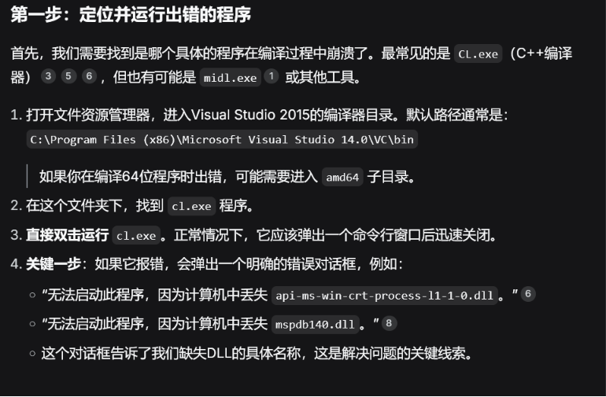


### 子窗口修改无效

现象：切换子窗口设置后，不起作用
解决：修改图中“其他选项”，或将此内容删除

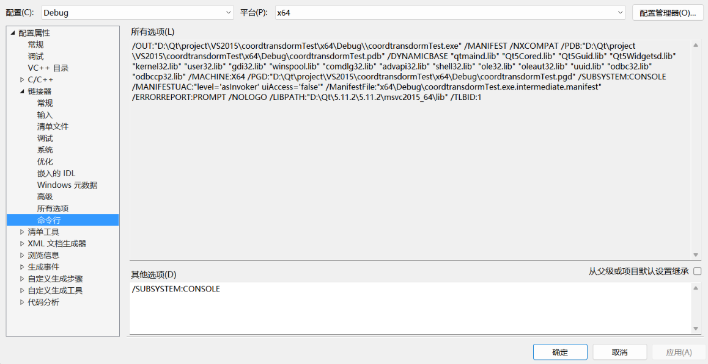


# 项目

## 原生处理

### dat测试数据生成

用到的技术

1. 写入文件(以内存映射的方式)
2. 获取当前时间

内存映射为了提高速度，获取时间为了看运行时间

```cpp
//测试数据生成 - Windows内存映射版
#include <iostream>
#include <cstdint>
#include <windows.h>
#include <iostream>
#include <cstdint>
#include <ctime>
#include <chrono>
#include <iomanip>
#include <string>

unsigned char header[7] = {0x5A, 0x54, 0x00, 0x00, 0x90, 0x05, 0x12};
char tail[2] = {0x45, 0x4E};
uint64_t numbers = 4096 * 9;

class CurrentTime {
public:
    static std::string getCurrentTimeWithMilliseconds() {
        auto now = std::chrono::system_clock::now();
        auto now_time_t = std::chrono::system_clock::to_time_t(now);
        auto ms = std::chrono::duration_cast<std::chrono::milliseconds>(
            now.time_since_epoch()) % 1000;
        
        std::tm* now_tm = std::localtime(&now_time_t);
        
        std::ostringstream oss;
        oss << std::put_time(now_tm, "%Y-%m-%d %H:%M:%S")
            << "." << std::setfill('0') << std::setw(3) << ms.count();
        
        return oss.str();
    }
    
    static std::string getCurrentTimeWithMicroseconds() {
        auto now = std::chrono::system_clock::now();
        auto now_time_t = std::chrono::system_clock::to_time_t(now);
        auto us = std::chrono::duration_cast<std::chrono::microseconds>(
            now.time_since_epoch()) % 1000000;
        
        std::tm* now_tm = std::localtime(&now_time_t);
        
        std::ostringstream oss;
        oss << std::put_time(now_tm, "%Y-%m-%d %H:%M:%S")
            << "." << std::setfill('0') << std::setw(6) << us.count();
        
        return oss.str();
    }
};


int main()
{
    std::cout << "当前时间（毫秒）: " << CurrentTime::getCurrentTimeWithMicroseconds() << std::endl;

    size_t data_size = numbers * sizeof(uint16_t);
    size_t total_size = sizeof(header) + data_size + sizeof(tail);
    
    // 创建文件映射
    HANDLE hFile = CreateFileA("xadc.dat", GENERIC_READ | GENERIC_WRITE,
                               0, NULL, CREATE_ALWAYS, FILE_ATTRIBUTE_NORMAL, NULL);
    if (hFile == INVALID_HANDLE_VALUE) {
        std::cerr << "文件创建失败" << std::endl;
        return 1;
    }
    
    HANDLE hMapping = CreateFileMapping(hFile, NULL, PAGE_READWRITE, 
                                        (total_size >> 32), (total_size & 0xFFFFFFFF), NULL);
    if (hMapping == NULL) {
        std::cerr << "文件映射失败" << std::endl;
        CloseHandle(hFile);
        return 1;
    }
    
    char* mapped = (char*)MapViewOfFile(hMapping, FILE_MAP_ALL_ACCESS, 0, 0, total_size);
    if (mapped == NULL) {
        std::cerr << "视图映射失败" << std::endl;
        CloseHandle(hMapping);
        CloseHandle(hFile);
        return 1;
    }
    
    // 直接写入内存
    memcpy(mapped, header, sizeof(header));
    
    uint16_t* data_ptr = reinterpret_cast<uint16_t*>(mapped + sizeof(header));
    for (uint64_t i = 0; i < numbers; i++) {
        uint16_t temp = (i / 4096 + 1) * 5;
        data_ptr[i] = ((temp & 0x00FF) << 8) | ((temp & 0xFF00) >> 8);
    }
    
    memcpy(mapped + sizeof(header) + data_size, tail, sizeof(tail));
    
    // 清理
    UnmapViewOfFile(mapped);
    CloseHandle(hMapping);
    CloseHandle(hFile);
    

    std::cout << "当前时间（毫秒）: " << CurrentTime::getCurrentTimeWithMicroseconds() << std::endl;
}
```


## 第三方库使用示例

### GMP高精度库使用

```cpp
//GMP简介
//GMP 高精度计算库，计算精度与电脑内存相关

//demo.cpp
#include "x86/include/gmp.h"

/*
#ifdef _WIN64
#define GMP_PATH "x64/lib"
#else
#define GMP_PATH "x86/lib"
#endif

#define STATIC_LIB

#ifdef STATIC_LIB
#pragma comment(lib, GMP_PATH "/libgmp.a")
#pragma comment(lib, GMP_PATH "/libgcc.a")
#pragma comment(lib, GMP_PATH "/libmingwex.a")
#else
#pragma comment(lib, GMP_PATH "/libgmp.dll.a")
#endif
*/

using namespace std;

int main()
{
	//设置精度 256位 约为77位十进制精度
	mpf_set_default_prec(256);
	{
		//声明
		mpf_t a;
		mpf_t b;
		mpf_t c;

		//初始化，使用当前精度
		mpf_init(a);
		mpf_init(b);
		mpf_init(c);

		// 参数： 变量，数值，进制
		mpf_set_str(a,"2",10);
		mpf_set_str(c,"0.1",10);


		mpf_pow_ui(b,a,64);

		//
		mpf_mul(a,b,c);

		// std::cout << "结果: ";
		// mpf_out_str(stdout, 10, 30, a);
		// std::cout << std::endl << std::endl;

		gmp_printf("结果: %.30Ff\n", a);
	}
	return 0;
}

//CMakeLists.txt
#########################################
## 高精度计算
#########################################


cmake_minimum_required(VERSION 3.10)
project(GMP_HighPrecision)

# 设置C++标准
set(CMAKE_CXX_STANDARD 11)
set(CMAKE_CXX_STANDARD_REQUIRED ON)

# 设置使用静态运行时库（可选，根据你的项目需求）
# 如果需要动态运行时库，可以注释掉下面这行
# set(CMAKE_MSVC_RUNTIME_LIBRARY "MultiThreaded$<$<CONFIG:Debug>:Debug>")

# 根据平台设置GMP路径
if(CMAKE_SIZEOF_VOID_P EQUAL 8)
    # 64位平台
    set(GMP_BASE_DIR ${CMAKE_CURRENT_SOURCE_DIR}/x64)
    message(STATUS "Configuring for x64 platform")
else()
    # 32位平台
    set(GMP_BASE_DIR ${CMAKE_CURRENT_SOURCE_DIR}/x86)
    message(STATUS "Configuring for x86 platform")
endif()

# 设置GMP的包含目录和库目录
set(GMP_INCLUDE_DIR ${GMP_BASE_DIR}/include)
set(GMP_LIB_DIR ${GMP_BASE_DIR}/lib)

# 查找GMP库文件
find_library(GMP_LIBRARY
    NAMES libgmp.a gmp libgmp gmpxx
    PATHS ${GMP_LIB_DIR}
    NO_DEFAULT_PATH
    REQUIRED
)

# 根据你的代码中使用的静态库，也查找其他依赖库
find_library(GCC_LIBRARY
    NAMES libgcc.a gcc
    PATHS ${GMP_LIB_DIR}
    NO_DEFAULT_PATH
)

find_library(MINGWEX_LIBRARY
    NAMES libmingwex.a mingwex
    PATHS ${GMP_LIB_DIR}
    NO_DEFAULT_PATH
)

# 添加可执行文件
add_executable(${PROJECT_NAME} demo.cpp)

# 包含目录
target_include_directories(${PROJECT_NAME} PRIVATE ${GMP_INCLUDE_DIR})

# 链接库
target_link_libraries(${PROJECT_NAME}
    ${GMP_LIBRARY}
    ${GCC_LIBRARY}
    ${MINGWEX_LIBRARY}
)

# 如果找不到gcc和mingwex库，只链接gmp库也可以
# target_link_libraries(${PROJECT_NAME} ${GMP_LIBRARY})

# 设置平台特定的编译选项
if(MSVC)
    # VS2015对应的是19.0版本
    if(MSVC_VERSION EQUAL 1900)
        message(STATUS "Using Visual Studio 2015")
    endif()
    
    # 添加必要的编译选项
    target_compile_options(${PROJECT_NAME} PRIVATE
        /W3           # 警告级别3
        /EHsc         # 启用C++异常处理
    )
    
    # Debug/Release配置
    set_target_properties(${PROJECT_NAME} PROPERTIES
        RUNTIME_OUTPUT_DIRECTORY_DEBUG ${CMAKE_BINARY_DIR}/bin/Debug
        RUNTIME_OUTPUT_DIRECTORY_RELEASE ${CMAKE_BINARY_DIR}/bin/Release
    )

    target_link_options(${PROJECT_NAME} PRIVATE 
        /SAFESEH:NO
        /IGNORE:4221  # 忽略LNK4221警告
    )
endif()

# 打印配置信息
message(STATUS "GMP Include Dir: ${GMP_INCLUDE_DIR}")
message(STATUS "GMP Library Dir: ${GMP_LIB_DIR}")
message(STATUS "GMP Library: ${GMP_LIBRARY}")
```

