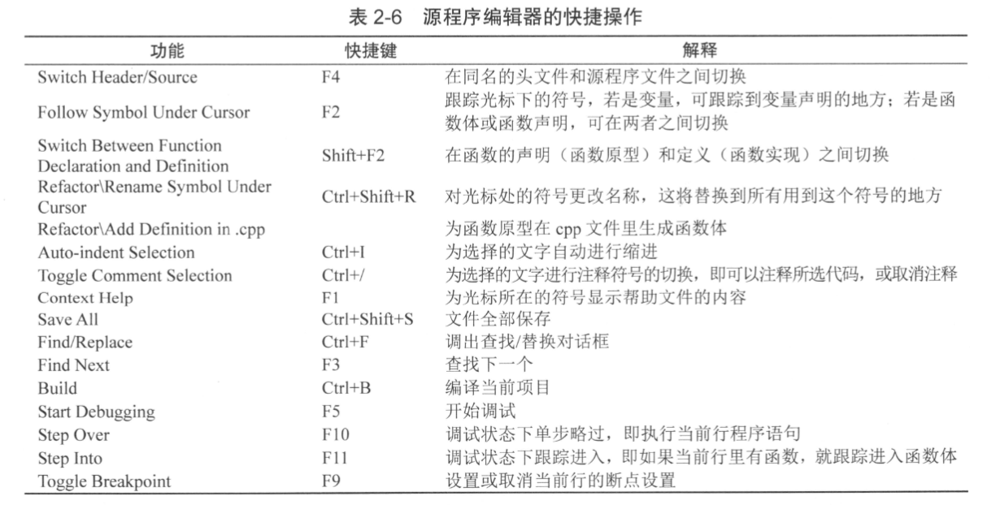
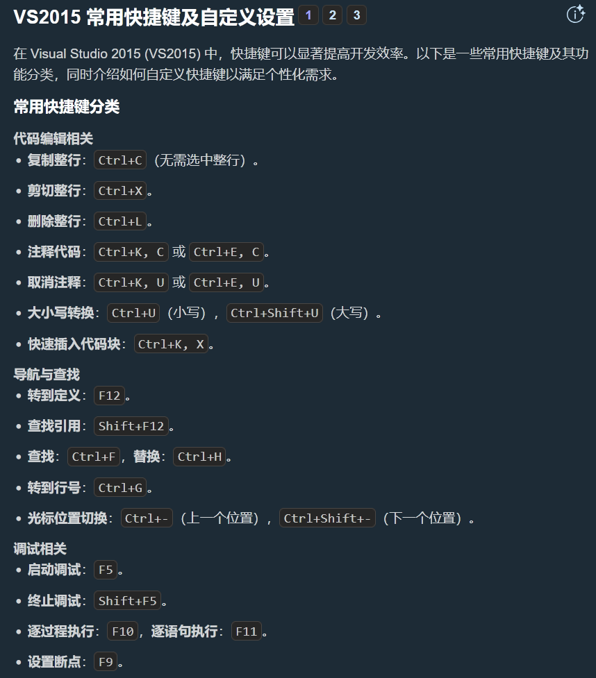
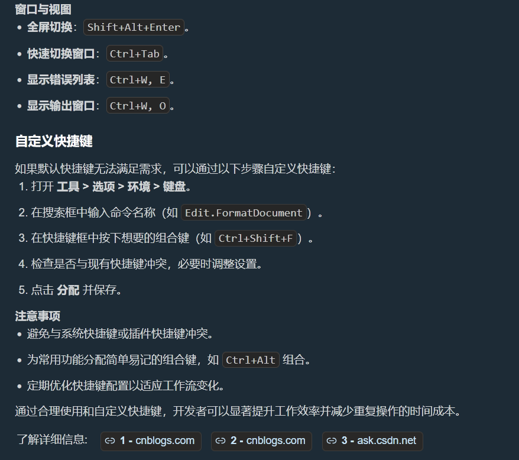
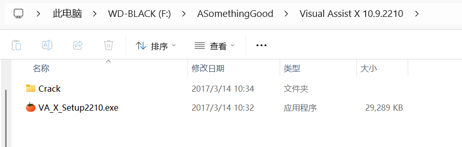
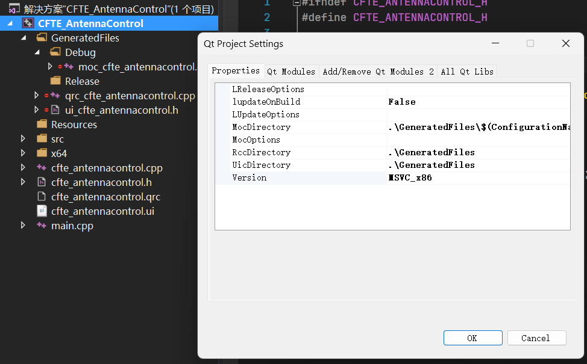
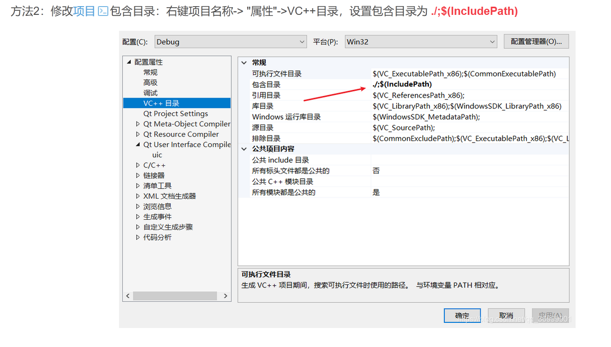
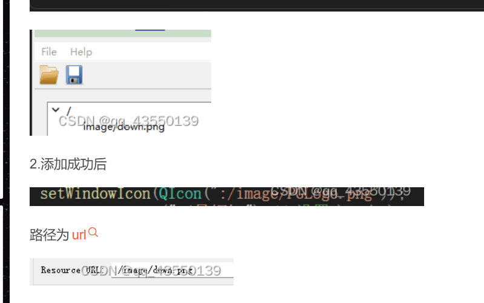

# QT

### Qt Creator快捷键



## vs2015相关

### vs2015快捷键





### vs2015不提示QT关键字

附加包含目录

### 代码颜色和提示工具Va_x



### 新建的项目编译没有对应的QT版本和找不到ui文件

将下方的Version设置位对应版本



找不到ui文件



### 添加资源文件



### exe不能运行，但也没报错，检查是否缺库

使用系统中vs2015开发人员命令提示

```bash
dumpbin /dependents  路径/程序.exe   或者 dll文件

#这条命令会列出所有依赖的库
#看一下是不是缺少了qt的某一个库
```

## 开发相关

### 界面显示

#### 不同分辨率显示一致性

```cpp
#include "datatransmittermonitor.h"
#include <QtWidgets/QApplication>
#include <QString>
#include <QDebug>

//保证程序在不同分辨率屏幕上的显示一致性
RECT RetrieveMonitorBounds(int idx){	
    DISPLAY_DEVICE dd;
    dd.cb = sizeof(dd);	
    BOOL flag = EnumDisplayDevicesW(nullptr, idx, &dd, 0);	
    DEVMODEW dm;	dm.dmSize = sizeof(dm);	dm.dmDriverExtra = 0;
    flag = EnumDisplaySettingsExW(dd.DeviceName, ENUM_CURRENT_SETTINGS, &dm, 0);
  RECT rect = { 
    dm.dmPosition.x, 
    dm.dmPosition.y, 
    dm.dmPosition.x + dm.dmPelsWidth, 
    dm.dmPosition.y + dm.dmPelsHeight 
  };	
  return rect;
}
void enableHighReslution(){	
  int monitorCount = ::GetSystemMetrics(SM_CMONITORS);
  qDebug() << "Detected monitoring: " << monitorCount;
  QString scalingFactors;
  for (int j = 0; j < monitorCount; ++j)
  {		
    RECT dimension = RetrieveMonitorBounds(j);
    int h = dimension.bottom - dimension.top;
    double scale = (h > 1080) ? double(h) / 1080.0 : 1.0;
    scalingFactors += (j == 0 ? "" : ";") + QString::number(scale, 'f', 1);	
  }
  QByteArray  envArray = scalingFactors.toUtf8();
  qputenv("QT_SCREEN_SCALE_FACTORS", envArray);	
  //开启高DPI
  QApplication::setAttribute(Qt::AA_EnableHighDpiScaling);	
  //使用高分辨率
  pixelMap	QApplication::setAttribute(Qt::AA_UseHighDpiPixmaps);
}
int main(int argc, char *argv[]){	
  //开启高分辨率支持	
  enableHighReslution();
  QApplication a(argc, argv);
  int nInputParaCnt = argc;
  g_bAdmin = false;
  if (nInputParaCnt == 3)	
  {
    QString strargc = QString("%1").arg(argc);
    QString strargkeyv = argv[1];
    QString strargvaluev = argv[2];
    if (strargkeyv == QString("-u") && strargvaluev == QString("tcadmin"))
      //管理员权限
    {			
      g_bAdmin = true;		
    }	
  }	
  DataTransmitterMonitor w;	w.show();
  return a.exec();
}
```

### 串口开发

在.pro文件中添加 QT +=serialport

#### 以hex形式显示收到的hex数据

```cpp
QByteArray recv = serialPort->readAll();
//方法一
QString hexStream;QTextStream stream(&hexStream);for (int i = 0 ; i < recv.size() ; ++i)
{
  stream << QString("%1").arg(static_cast<quint8>(recv[i]),2,16,Qlatin1Char('0')).toUpper();
}
//方法二
QString hexString; for (int i = 0; i < data.size(); i++) 
{
  hexString += QString("%1 ").arg((quint8)data.at(i), 2, 16, QChar('0')); 
} 
//此时收到的hex数据就变成了字符串，可以显示到窗口信息中ui->textEdit->append(hexStream);
```

### 网络开发

在.pro文件中添加 QT +=network

### 数据类型

#### QByteArray和QString相互转换

```cpp
QByteArray =  QString . toUTF8().toHex()QString = QString::fromUtf8(QByteArray)
```

#### QByteArray中的元素与0xFF类的数据比较

0xFF在有符号char中为-1，其他最高位为1的数据类似，也是负数。

因为QByteArray::at(int index)返回的char有符号，在与无符号数据比较时会出错。

```c++
//最佳实践
if(static_cast<unsigned char>(byteArray.at(index)) == 0xFF)
{
    return true;
}
```

#### int转16进制

```cpp
int value = 12;QString str = QString::number(value,16);//此时str = c
```

#### QByteArray判断

`QByteArray::at()` 返回的是 `char` 类型，而 `0x80` 超出了有符号 `char` 的范围。这样就会导致 QByteArray.at(n) == 0x80 即使值是对的，也会返回false。

```cpp
// 解决方法
if (static_cast<unsigned char>(m_byt.at(4)) == 0x80) 
{    
  // 匹配成功
}
// 或者
if (unsigned char(m_byt.at(4)) == 0x80)
{    
  // 匹配成功
}
```

### 组件

#### 伙伴关系

当QLabelText与QLineInput绑定伙伴关系时，点击label会触发lineInput输入

&符号加在ObjectName上可以实现快捷键，按 alt+绑定

#### QListWidget

##### 为内容添加双击事件

```cpp
#include <QListWidget>#include <QApplication>#include <QMessageBox>// 创建QListWidgetQListWidget *listWidget = new QListWidget;// 添加一些项目listWidget->addItem("Item 1");listWidget->addItem("Item 2");listWidget->addItem("Item 3");// 连接双击信号到槽函数QObject::connect(listWidget, &QListWidget::itemDoubleClicked, [](QListWidgetItem *item) {    QMessageBox::information(nullptr, "双击事件",                            "你双击了: " + item->text());});//实际应用-音乐播放器项目歌曲列表void MainWindow::loadMusicDir(const QString &filePath){    QDir dir(filePath);    if (dir.exists() == false)    {        QMessageBox::warning(this,"文件夹","文件夹不存在");        return ;    }    QFileInfoList musicList = dir.entryInfoList(QDir::Files);    for(QFileInfo music : musicList)    {        //判断后缀        if(music.suffix() == "flac" || music.suffix() == "mp3" )        {            ui->listWidget_music->addItem(music.baseName());        }    }    connect(ui->listWidget_music,&QListWidget::itemDoubleClicked,this,[=](QListWidgetItem * item)    {        for(QFileInfo music : musicList)        {            if(music.baseName() == item->text())            {                mediaPlayer->setMedia(QUrl::fromLocalFile(music.filePath()));                mediaPlayer->play();                setButtonStyle(ui->pushButton_play,":/res/Resources/Icon/play.png");                isPlay = true;                return ;            }        }    });}
```

#### QMessageBox

教程链接: <https://c.biancheng.net/view/9421.html>

##### 通用的消息框

```cpp
//1. informationStandardButton QMessageBox::information(QWidget *parent,                                        const QString &title,                                        const QString &text,                                        StandardButtons buttons = Ok,                                        StandardButton defaultButton = NoButton);/*  defaultButton：指定 Enter 回车键对应的按钮，用户按下回车键时就等同于按下此按钮。注意，defaultButton 参数的值必须是 buttons 中包含的按钮，当然也可以不手动指定，QMessageBox 会自动从 buttons 中选择合适的按钮作为 defaultButton 的值。*///2. critical 消息对话框常用于给用户提示“操作错误”或“运行失败”的信息StandardButton QMessageBox::critical(QWidget *parent,                                     const QString &title,                                     const QString &text,                                     StandardButtons buttons = Ok,                                     StandardButton defaultButton = NoButton);//3.  question消息对话框StandardButton QMessageBox::question(QWidget *parent,                                     const QString &title,                                     const QString &text,                                     StandardButtons buttons = StandardButtons( Yes | No ),                                     StandardButton defaultButton = NoButton);//4. warning消息对话框StandardButton QMessageBox::warning(QWidget *parent,                                    const QString &title,                                    const QString &text,                                    StandardButtons buttons = Ok,                                    StandardButton defaultButton = NoButton);//5. about和aboutQt对话框void QMessageBox::about(QWidget *parent, const QString &title, const QString &text);void QMessageBox::aboutQt(QWidget *parent, const QString &title = QString());
```

##### 自定义按钮

```cpp
#include <QApplication>#include <QMessageBox>#include <QPushButton>#include <QDebug>int main(int argc, char *argv[]){    QApplication a(argc, argv);    QMessageBox MBox;    MBox.setWindowTitle("QMessageBox自定义对话框");    MBox.setText("这是一个自定义的对话框");    MBox.setIconPixmap(QPixmap("C:UsersxiexuewuDesktopicon_c.png"));    QPushButton *agreeBut = MBox.addButton("同意", QMessageBox::AcceptRole);    MBox.exec();    if (MBox.clickedButton() == (QAbstractButton*)agreeBut) {        //在 Qt Creator 的输出窗口中输出指定字符串        qDebug() << "用户点击了同意按钮";    }    return a.exec();}//main.cpp#include <QApplication>#include <QWidget>#include <QMessageBox>#include <QPushButton>#include <QAbstractButton>QPushButton* agreeBut;QPushButton* disagreeBut;class MyWidget:public QWidget{    Q_OBJECTpublic slots:    void buttonClicked(QAbstractButton * butClicked);};void MyWidget::buttonClicked(QAbstractButton * butClicked){    if(butClicked == (QAbstractButton*)disagreeBut){        this->close();    }}///窗口弹出时，阻止点击主窗口int main(int argc, char *argv[]){    QApplication a(argc, argv);    //创建主窗口    MyWidget myWidget;    myWidget.setWindowTitle("主窗口");    myWidget.resize(400,300);    //创建消息框    QMessageBox MyBox(QMessageBox::Question,"","");    MyBox.setParent(&myWidget);    //设置消息框的属性为对话框，它会是一个独立的窗口    MyBox.setWindowFlags(Qt::Dialog);    MyBox.setWindowTitle("协议");    MyBox.setText("使用本产品，请您严格遵守xxx规定！");    //自定义两个按钮    agreeBut = MyBox.addButton("同意", QMessageBox::AcceptRole);    disagreeBut = MyBox.addButton("拒绝", QMessageBox::RejectRole);    myWidget.show();    //添加信号和槽，监听用户点击的按钮，如果用户拒绝，则主窗口随之关闭。    QObject::connect(&MyBox,&QMessageBox::buttonClicked,&myWidget,&MyWidget::buttonClicked);    MyBox.exec();    return a.exec();}//MyWidget类的定义应该放到 .h 文件中，本例中将其写到 main.cpp 中，程序最后需要添加 #include "当前源文件名.moc" 语句，否则无法通过编译。#include "main.moc"
```

#### QButtonGroup

多个按钮加入群组后，每个群组内的按钮点击后触发的信号

```cpp
QButtonGroup * m_btnGroup;
//添加多个按钮
m_btnGroup->addButton(ui.btn0, 0);
m_btnGroup->addButton(ui.btn1, 1);
m_btnGroup->addButton(ui.btn2, 2);
connect(
  m_btnGroup,
  QOverLoad<QAbstrackButton*>::of(&QButtonGroup::buttonClicked),
  //槽函数
  );
```


### 信号与槽

#### 创建信号和槽的连接

1.无参数传递

```cpp
//test.hclass Test: public QObject{    Q_OBJECTpublic:    Test();   //构造函数    ~Test();  //析构函数        public slots:    void doSomething();signals:    void sentSignal();  //只需要定义};//qt的默认主函数#include "Test.h"#include <iostream>MainWindow::MainWindow(QWidget *parent)    : QMainWindow(parent)    , ui(new Ui::MainWindow){    ui->setupUi(this);        Test test = new Test(this);    //第一个参数为发送方，第二个参数为信号，第三个参数为处理方，第四个参数为处理方法    connect(test,&Test::sendSignal,test,&Test::doSomething);    //Lambda 表达式处理信号    connect(test,&Test::sendSignal,[](){        std::cout << "I Can Do It!";    });            emit test.sendSignal;  //触发信号}
```

2.有参数传递

```cpp
//默认主函数结构#include <QMainWindow>namespace Ui {class MainWindow;}class MainWidow : public QMainWindow{    Q_OBJECT        public :    explicit MainWindow(QWidget *parent = nullptr);    ~MainWindow();    public slots:    void doPrint(QString str);    signals:    void sentStr(QString str); };#include <iostream>#include "MainWindow"MainWindow::MainWindow(QWidget *parent)    : QMainWindow(parent)    , ui(new Ui::MainWindow){    ui->setupUi(this);        // this指代本实例，即主窗口类    //信号和槽函数都不需要带括号    connect(this,&MainWindow::sentStr,this,&MainWindow::doPrint);            //在触发信号时带上所需参数    emit sentStr("Well Done");}void doPrint(QString str){    std::cout << str <<std::endl;}
```

#### 第五个参数

第五个参数为Qt::ConnectType type

- Qt::AutoConnection(缺省值): 如果信号的接收者与发送者在同一线程，就是用Qt::DirectConnection; 否则使用Qt::QueuedConnection方式，在信号发射时自动确定关联方式。
- Qt::DirectConnection: 信号被发射时槽函数立刻执行，槽函数与信号在同一线程。
- Qt::QueuedConnection: 在事件循环回到接收者线程后执行槽函数，槽函数与信号不在同一线程。
- Qt::BlockingQueuedConnection: 与Qt::QueuedConnection相似，只是信号线程会阻塞直到槽函数执行完毕。当信号和槽函数在同一线程时不能用这种方法，会死锁。

#### 断开信号和槽函数的连接

```cpp
//断开一个信号和一个槽的连接disconnect(sender,&Sender::Signal,processor,&Processor::slot);//断开一个信号的所有连接者disconnect(sender,&Sender::signal,nullptr,nullptr);//断开信号发送者的所有信号和槽disconnect(serder,nullptr,nullptr,nullptr);
```

#### 补充

1. 一个信号可以连接多个槽
2. 一个槽可以连接多个信号
3. 两个信号可以连接
4. 严格情况下，信号和槽携带的参数类型必须一致
5. 在使用信号和槽的类，必须在类的定义中加入宏Q_OBJECT
6. 当一个信号发出时，与其连接的槽函数会立刻执行，只有槽函数执行结束后才会执行发射信号后的代码

### 多线程

#### 创建多线程

1.继承QThread类

```cpp
//继承QThread类并重写run() 方法
// MyThread.h
#include <QThread>
#include <QDebug>
class MyThread : 
public QThread{    
  Q_OBJECT
  protected:
  void run() override {
    for(int i = 0; i < 5; i++)
      {
        qDebug() << "Thread running:" << i;
        sleep(1); 
        // 模拟耗时操作 
      }
  }};
// 使用方式
MyThread *thread = new MyThread();thread->start(); 
// 启动线程
```

2.使用moveToThread

```cpp
// Worker.h
#include <QObject>
#include <QDebug>
#include <QThread>

class Worker : public QObject
{    
  Q_OBJECT
  public slots:
  void doWork() {
    for(int i = 0; i < 5; i++)
      {
        qDebug() << "Worker running:" << i << QThread::currentThread(); 
        QThread::sleep(1);
      }
    emit workFinished();
  }
  signals:
  void workFinished();
};
// 使用方式
QThread *thread = new QThread();
Worker *worker = new Worker();
worker->moveToThread(thread);
// 将worker对象移动到新线程
// 连接信号和槽
connect(thread, &QThread::started, worker, &Worker::doWork);
connect(worker, &Worker::workFinished, thread, &QThread::quit);
connect(worker, &Worker::workFinished, worker, &QObject::deleteLater);
connect(thread, &QThread::finished, thread, &QObject::deleteLater);
thread->start();
// 启动线程
```

3.使用QtConcurrent

```cpp
//简单并行的任务
#include <QtConcurrent>
#include <QDebug>

void simpleTask(int value) 
{    
  qDebug() << "Concurrent task:" << value << QThread::currentThread();
}
// 使用方式
// 运行单个任务
QFuture<void> future = QtConcurrent::run(simpleTask, 42);
// 运行多个任务
QList<int> values = {1, 2, 3, 4, 5};
QFuture<void> futures = QtConcurrent::map(values, simpleTask);
// 等待完成
future.waitForFinished();
```

#### QMutex

QMutex类提供的是线程之间的访问顺序化。QMutex的目的是保护一个对象、数据结构或者代码段，所以同一时间只有一个线程可以访问它。

使用互斥锁保护线程资源

```cpp
#include <QMutex>
#include <QWaitCondition>

class ThreadSafeCounter : public QObject{   
  Q_OBJECT
  public:
  ThreadSafeCounter() : count(0) {}
  void increment() {
    QMutexLocker locker(&mutex);
    count++;
    emit valueChanged(count);
  }
  int getValue() {
    QMutexLocker locker(&mutex);
    return count;
  }
  signals:
  void valueChanged(int newValue);
  private:
  int count;
  QMutex mutex;
};
```

#### 推荐做法

- 对于复杂的长时间运行任务，使用 `moveToThread()` 方式
- 对于简单的并行计算，使用 `QtConcurrent`
- 始终在主线程中创建和操作 GUI 组件
- 使用信号槽进行线程间通信

#### 关闭线程

```cpp
m_thread.requestInterruption(); //请求停止m_thread.wait(); //等待m_thread.terminal(); //强制停止
```

### QSettings读写ini文件

INI文件机构示例

```ini
[Database]
host=localhost
port=3306
username=admin
password=123456

[Window]
width=1024
height=768
fullscreen=false

[RecentFiles]
file1=C:/projects/test1.txt
file2=C:/projects/test2.txt
count=2
```

基本读写操作

```cpp
#include <QSettings>
#include <QDebug>
#include <QCoreApplication>

// ========== 1. 写入 INI 文件 ==========
void writeIniFile()
{
    // 指定 INI 文件路径
    QString iniPath = "./config.ini";
    
    // 创建 QSettings 对象，第二个参数指定格式为 INI
    QSettings settings(iniPath, QSettings::IniFormat);
    
    // 写入数据（分组.键 = 值）
    settings.beginGroup("Database");
    settings.setValue("host", "192.168.1.100");
    settings.setValue("port", 3306);
    settings.setValue("username", "root");
    settings.setValue("password", "admin123");
    settings.endGroup();
    
    settings.beginGroup("Window");
    settings.setValue("width", 1280);
    settings.setValue("height", 720);
    settings.setValue("fullscreen", false);
    settings.endGroup();
    
    settings.beginGroup("RecentFiles");
    settings.setValue("file1", "/home/user/doc1.txt");
    settings.setValue("file2", "/home/user/doc2.txt");
    settings.setValue("count", 2);
    settings.endGroup();
    
    qDebug() << "INI 文件写入成功";
}

// ========== 2. 读取 INI 文件 ==========
void readIniFile()
{
    QString iniPath = "./config.ini";
    QSettings settings(iniPath, QSettings::IniFormat);
    
    // 读取数据库配置（提供默认值）
    settings.beginGroup("Database");
    QString host = settings.value("host", "localhost").toString();
    int port = settings.value("port", 3306).toInt();
    QString username = settings.value("username", "default").toString();
    QString password = settings.value("password", "").toString();
    settings.endGroup();
    
    qDebug() << "=== 数据库配置 ===";
    qDebug() << "Host:" << host;
    qDebug() << "Port:" << port;
    qDebug() << "Username:" << username;
    qDebug() << "Password:" << password;
    
    // 读取窗口配置
    settings.beginGroup("Window");
    int width = settings.value("width", 1024).toInt();
    int height = settings.value("height", 768).toInt();
    bool fullscreen = settings.value("fullscreen", false).toBool();
    settings.endGroup();
    
    qDebug() << "=== 窗口配置 ===";
    qDebug() << "Width:" << width;
    qDebug() << "Height:" << height;
    qDebug() << "Fullscreen:" << fullscreen;
    
    // 读取最近文件列表
    settings.beginGroup("RecentFiles");
    int fileCount = settings.value("count", 0).toInt();
    qDebug() << "=== 最近文件 ===";
    for (int i = 1; i <= fileCount; ++i) {
        QString fileKey = QString("file%1").arg(i);
        QString filePath = settings.value(fileKey).toString();
        qDebug() << fileKey << ":" << filePath;
    }
    settings.endGroup();
}

// ========== 3. 修改指定键值 ==========
void modifyIniValue()
{
    QSettings settings("./config.ini", QSettings::IniFormat);
    
    // 修改单个值
    settings.setValue("Database/host", "192.168.1.200");
    settings.setValue("Window/width", 1920);
    
    qDebug() << "修改成功";
}

// ========== 4. 删除键或分组 ==========
void deleteIniEntries()
{
    QSettings settings("./config.ini", QSettings::IniFormat);
    
    // 删除单个键
    settings.remove("Database/password");
    
    // 删除整个分组（删除所有该分组下的键）
    settings.remove("RecentFiles");
    
    qDebug() << "删除成功";
}

// ========== 5. 检查键是否存在 ==========
void checkKeyExists()
{
    QSettings settings("./config.ini", QSettings::IniFormat);
    
    // 方法1：使用 contains()
    if (settings.contains("Database/host")) {
        qDebug() << "Database/host 存在";
    }
    
    // 方法2：使用 value() 并检查默认值（不推荐）
    if (settings.value("Database/host").isValid()) {
        qDebug() << "Database/host 有效";
    }
}

// ========== 6. 遍历所有分组和键 ==========
void iterateAllSettings()
{
    QSettings settings("./config.ini", QSettings::IniFormat);
    
    // 获取所有分组名
    QStringList groups = settings.childGroups();
    qDebug() << "所有分组:" << groups;
    
    foreach (const QString &group, groups) {
        settings.beginGroup(group);
        
        // 获取当前分组下的所有键
        QStringList keys = settings.childKeys();
        qDebug() << "分组 [" << group << "] 包含以下键:";
        
        foreach (const QString &key, keys) {
            QVariant value = settings.value(key);
            qDebug() << "  " << key << "=" << value;
        }
        
        settings.endGroup();
    }
}

// ========== 7. 使用默认组织/应用名（跨平台推荐） ==========
void useDefaultOrganization()
{
    // 设置组织名和应用名后，QSettings 会自动选择平台相关的存储位置
    QCoreApplication::setOrganizationName("MyCompany");
    QCoreApplication::setApplicationName("MyApp");
    
    // 不指定文件名，自动使用系统默认位置
    // Windows: HKEY_CURRENT_USER\\Software\\MyCompany\\MyApp
    // macOS: ~/Library/Preferences/MyCompany.MyApp.plist
    // Linux: ~/.config/MyCompany/MyApp.conf
    QSettings settings;
    
    settings.setValue("MainWindow/geometry", "1920x1080");
    settings.setValue("MainWindow/maximized", true);
    settings.setValue("User/name", "张三");
    
    QString userName = settings.value("User/name", "未登录").toString();
    qDebug() << "用户名:" << userName;
}
```

实战示例

```cpp
// ========== AppSettings.h ==========
#ifndef APPSETTINGS_H
#define APPSETTINGS_H

#include <QSettings>
#include <QString>
#include <QColor>
#include <QRect>

class AppSettings
{
public:
    static AppSettings& instance() {
        static AppSettings instance;
        return instance;
    }
    
    // 加载设置
    void load() {
        QSettings settings("MyCompany", "MyApp");
        
        // 读取窗口设置
        windowGeometry = settings.value("Window/geometry").toByteArray();
        windowMaximized = settings.value("Window/maximized", false).toBool();
        
        // 读取用户设置
        username = settings.value("User/name", "").toString();
        language = settings.value("User/language", "zh_CN").toString();
        theme = settings.value("User/theme", "light").toString();
        
        // 读取编辑器设置
        autoSave = settings.value("Editor/autoSave", true).toBool();
        autoSaveInterval = settings.value("Editor/autoSaveInterval", 30).toInt();
        fontSize = settings.value("Editor/fontSize", 12).toInt();
        
        // 读取颜色（特殊类型需要特殊处理）
        if (settings.contains("Editor/backgroundColor")) {
            backgroundColor = settings.value("Editor/backgroundColor").value<QColor>();
        }
        
        // 读取最近文件列表
        recentFiles.clear();
        int recentCount = settings.beginReadArray("RecentFiles");
        for (int i = 0; i < recentCount; ++i) {
            settings.setArrayIndex(i);
            QString filePath = settings.value("path").toString();
            recentFiles.append(filePath);
        }
        settings.endArray();
    }
    
    // 保存设置
    void save() {
        QSettings settings("MyCompany", "MyApp");
        
        // 保存窗口设置
        settings.setValue("Window/geometry", windowGeometry);
        settings.setValue("Window/maximized", windowMaximized);
        
        // 保存用户设置
        settings.setValue("User/name", username);
        settings.setValue("User/language", language);
        settings.setValue("User/theme", theme);
        
        // 保存编辑器设置
        settings.setValue("Editor/autoSave", autoSave);
        settings.setValue("Editor/autoSaveInterval", autoSaveInterval);
        settings.setValue("Editor/fontSize", fontSize);
        settings.setValue("Editor/backgroundColor", backgroundColor);
        
        // 保存最近文件列表
        settings.beginWriteArray("RecentFiles");
        for (int i = 0; i < recentFiles.size(); ++i) {
            settings.setArrayIndex(i);
            settings.setValue("path", recentFiles[i]);
        }
        settings.endArray();
        
        // 立即写入磁盘
        settings.sync();
    }
    
    // Getter 和 Setter 方法
    QByteArray getWindowGeometry() const { return windowGeometry; }
    void setWindowGeometry(const QByteArray &geom) { windowGeometry = geom; }
    
    bool isWindowMaximized() const { return windowMaximized; }
    void setWindowMaximized(bool max) { windowMaximized = max; }
    
    QString getUsername() const { return username; }
    void setUsername(const QString &name) { username = name; }
    
    QString getLanguage() const { return language; }
    void setLanguage(const QString &lang) { language = lang; }
    
    QString getTheme() const { return theme; }
    void setTheme(const QString &t) { theme = t; }
    
    bool isAutoSave() const { return autoSave; }
    void setAutoSave(bool save) { autoSave = save; }
    
    int getAutoSaveInterval() const { return autoSaveInterval; }
    void setAutoSaveInterval(int interval) { autoSaveInterval = interval; }
    
    int getFontSize() const { return fontSize; }
    void setFontSize(int size) { fontSize = size; }
    
    QColor getBackgroundColor() const { return backgroundColor; }
    void setBackgroundColor(const QColor &color) { backgroundColor = color; }
    
    QStringList getRecentFiles() const { return recentFiles; }
    void addRecentFile(const QString &filePath) {
        recentFiles.removeAll(filePath);
        recentFiles.prepend(filePath);
        if (recentFiles.size() > 10) {
            recentFiles.removeLast();
        }
    }
    
private:
    AppSettings() { load(); }
    
    // 窗口设置
    QByteArray windowGeometry;
    bool windowMaximized = false;
    
    // 用户设置
    QString username;
    QString language;
    QString theme;
    
    // 编辑器设置
    bool autoSave = true;
    int autoSaveInterval = 30;
    int fontSize = 12;
    QColor backgroundColor = Qt::white;
    
    // 最近文件
    QStringList recentFiles;
};

#endif // APPSETTINGS_H

// ========== 在程序中使用 ==========
void useAppSettings()
{
    // 获取单例实例
    AppSettings& settings = AppSettings::instance();
    
    // 读取设置
    qDebug() << "Username:" << settings.getUsername();
    qDebug() << "Theme:" << settings.getTheme();
    
    // 修改设置
    settings.setUsername("新用户名");
    settings.setTheme("dark");
    settings.setAutoSaveInterval(60);
    
    // 添加最近文件
    settings.addRecentFile("/path/to/new/file.txt");
    
    // 保存到文件
    settings.save();
}
```

实用技巧和注意事项

```cpp
// 1. 设置 INI 文件编码（默认 UTF-8）
QSettings settings("./config.ini", QSettings::IniFormat);
settings.setIniCodec("UTF-8");  // 确保中文字符正确读写

// 2. 手动同步到磁盘（确保数据安全）
settings.sync();

// 3. 清空所有设置
settings.clear();

// 4. 处理相对路径和绝对路径
QSettings settings1("./config.ini", QSettings::IniFormat);  // 程序当前目录
QSettings settings2(QApplication::applicationDirPath() + "/config.ini", QSettings::IniFormat);  // 程序所在目录
QSettings settings3(QStandardPaths::writableLocation(QStandardPaths::AppConfigLocation) + "/config.ini", QSettings::IniFormat);  // 标准配置目录

// 5. 使用 fallback 机制（读取失败时使用默认值）
int port = settings.value("Database/port", 3306).toInt();  // 如果不存在，返回 3306

// 6. 检查写入权限
if (!settings.isWritable()) {
    qWarning() << "配置文件不可写！";
}

// 7. 处理特殊字符（自动转义）
settings.setValue("Path/with/slashes", "C:/Program Files/MyApp");
settings.setValue("Special chars", "=;:#[]");  // INI 格式会自动处理

// 8. 批量操作使用事务（确保原子性）
settings.beginGroup("BatchOperation");
settings.setValue("key1", "value1");
settings.setValue("key2", "value2");
settings.setValue("key3", "value3");
settings.endGroup();
```

常见问题解决

问题	解决方案
中文乱码	设置 settings.setIniCodec("UTF-8")
路径不生效	使用绝对路径或 QApplication::applicationDirPath()
无法写入	检查目录权限，确保目录存在
读取不到值	检查分组是否正确，使用 settings.childGroups() 调试
数组无法读取	使用 beginReadArray() / beginWriteArray()


#### QTimer与多线程

##### 将QTimer放入单独线程，触发主线程槽函数

```cpp
// 示例代码QTimer* timer = new QTimer();QThread* thread = new QThread();timer->moveToThread(thread);// 问题所在：timer在thread线程，但接收者(this)在主线程connect(timer, &QTimer::timeout, this, &MyClass::onTimeout);thread->start();timer->start(1000); // 调用start的是主线程// 错误：在主线程调用starttimer->start(1000);  // timer在thread线程，但start在主线程调用// 正确：应该在timer所在的线程调用startQMetaObject::invokeMethod(timer, "start", Qt::QueuedConnection, Q_ARG(int, 1000));
```

### QList

#### QList中放结构体，根据结构体中数字元素排序

使用std::sort + Lambda

```cpp
#include <algorithm>#include <QList>// 定义结构体struct MyStruct {    uint id;    QString name;    double value;};// 使用示例QList<MyStruct> list = {    {3, "Alice", 45.5},    {1, "Bob", 32.1},    {5, "Charlie", 67.8},    {2, "David", 12.3},    {4, "Eve", 89.4}};// 按 uint 字段升序排序std::sort(list.begin(), list.end(),           [](const MyStruct& a, const MyStruct& b) {              return a.id < b.id;  // 按 id 升序          });// 按 uint 字段降序排序std::sort(list.begin(), list.end(),           [](const MyStruct& a, const MyStruct& b) {              return a.id > b.id;  // 按 id 降序          });
```

如果需要频繁排序，可以重载运算符

```cpp
struct MyStruct {    uint id;    QString name;    double value;        // 重载小于运算符    bool operator<(const MyStruct& other) const {        return id < other.id;  // 按 id 排序    }};// 使用时更简洁QList<MyStruct> list = {...};std::sort(list.begin(), list.end());  // 自动使用 operator<
```

### QVariant

#### QVariant与QList

##### 直接转换

```cpp
#include <QList>#include <QVariant>#include <QDebug>// 原始 QListQList<int> intList = {1, 2, 3, 4, 5};// QList 转换为 QVariantQVariant variant = QVariant::fromValue(intList);qDebug() << variant;  // QVariant(QList<int>)// QVariant转换为QListQVariant variant = QVariant::fromValue(QList<int>{10, 20, 30});// 提取回 QListif (variant.canConvert<QList<int>>()) {    QList<int> intList = variant.value<QList<int>>();    qDebug() << intList;  // QList(10, 20, 30)}
```

##### 通过QVariantList

```cpp
// QList 转 QVariantListQList<QString> strList = {"A", "B", "C"};QVariantList variantList;for (const QString& str : strList) {    variantList.append(str);  // 每个元素转换为 QVariant}QVariant variant = QVariant::fromValue(variantList);// QVariantList 转 QListQVariantList variantList = {10, 20, 30, 40};QList<int> intList;for (const QVariant& v : variantList) {    intList.append(v.toInt());  // 类型转换}qDebug() << intList;  // QList(10, 20, 30, 40)
```

### QFile文件操作

#### 判断文件是否存在

```cpp
#include <QFile>#include <QDebug>// 静态调用，参数为文件路径if (QFile::exists("/path/to/your/file.txt")) {    qDebug() << "文件存在";} else {    qDebug() << "文件不存在";}
```

#### 文件开启与关闭

#### dat文件写入与读出结构体类型

```cpp
struct DBFinfo {    quint16 ID;    char name[64];    uint16_t freq;};//写进文件void writeDataToFile() {    QFile file("./test.dat");    if(!file.open(QIODevice::WriteOnly))    {        qDebug()  << "文件打开失败";        return ;    }    QDataStream stream(&file);    DBFinfo dbf;    int dataSize = sizeof(DBFinfo);    char * temp = new char[dataSize];    memcpy(temp,&dbf,dataSize);    stream.writeBytes(temp,dataSize);    delete[] temp;    file.close();}//从文件读void readDataFromFile() {    QFile file("./test.dat");    if(!file.open(QIODevice::ReadOnly))    {        qDebug()  << "文件打开失败";        return ;    }    QDataStream stream(&file);    DBFinfo dbf;    int dataSize = sizeof(DBFinfo);    char * temp = new char[dataSize];    stream.readBytes(temp,dataSize);    memcpy(&dbf,temp,dataSize);    delete[] temp;    file.close();}
```

#### 清空文件内容

```cpp
//method.1QFile file("Path.txt");file.open(QIODevice::ReadWrite);file.resize(0);file.close();//method.2QFile file("Path.txt");file.open(QIODevice::ReadWrite | QFile::Truncate);file.close();//
```

### QPainter画笔

#### 基础图形

```cpp
//main.h#ifndef MAINWINDOW_H#define MAINWINDOW_H#include <QMainWindow>#include <QPainter>#include <QDebug>QT_BEGIN_NAMESPACEnamespace Ui { class MainWindow; }QT_END_NAMESPACEclass MainWindow : public QMainWindow{    Q_OBJECTpublic:    MainWindow(QWidget *parent = nullptr);    ~MainWindow();protected:    void paintEvent(QPaintEvent *event) override;private:    Ui::MainWindow *ui;    QPainter * painter;    int i= 0;};#endif // MAINWINDOW_H//重写void paintEvent(QPaintEvent *event)函数，在函数里编写绘画行为//main.cpp#include "mainwindow.h"#include "ui_mainwindow.h"MainWindow::MainWindow(QWidget *parent)    : QMainWindow(parent)    , ui(new Ui::MainWindow){    ui->setupUi(this);}MainWindow::~MainWindow(){    delete ui;}void MainWindow::paintEvent(QPaintEvent *event){    painter = new QPainter(this);    painter->setRenderHint(QPainter::Antialiasing  ,true);  //抗锯齿    painter->setPen(QPen(Qt::red,3));       //设置笔的颜色和粗细    painter->setFont(QFont("Arial",30));    //设置字体    painter->drawText(300,300,"Hello");     //画字    painter->drawEllipse(QPoint(100,100),80,80);  //画圆    QRect rectangle(200,100,200,100);          //定义长方形    painter->drawRect(rectangle);              //画长方形    painter->drawArc(rectangle,30*16,-120*16);  //画弧线，要求在长方形内画    painter->drawArc(30,100,100,180,45*16,90*16);  //目标度数*16    painter->drawPie(300,300,100,200,45*16,-90*16);    //画扇形，比弧线多两条边}
```

#### 渐变色

#### 线性渐变

```cpp
void MainWindow::paintEvent(QPaintEvent *event){    //创建对象    //参数为渐变起点坐标和终点坐标，此例子中从左上角到右下角    QLinearGradient linearGradient(0,0,rect().width(),rect().height());    //设置颜色停靠点    linearGradient.setColorAt(0.0,Qt::red);  //起点颜色    //0-1之间也可设置过度点    linearGradient.setColorAt(1.0,Qt::blue);  //终点颜色    //使用这个渐变创建QBrush    QBrush brush(linearGradient);    //使用QBrush进行绘图    QPainter painter(this);    painter.setBrush(brush);    painter.setPen(Qt::NoPen);  //无边框    painter.drawRect(this->rect());}
```

#### 径向渐变

```cpp
void MainWindow::paintEvent(QPaintEvent *event){    //径向渐变    QPainter painter(this);    //前两个参数为起始点坐标，第三个为辐射范围    QRadialGradient radialGradient(rect().width()/2,rect().height()/2,rect().width());    radialGradient.setColorAt(0.0,Qt::white);    radialGradient.setColorAt(1.0,Qt::black);    painter.setBrush(QBrush(radialGradient));    painter.setPen(Qt::NoPen);    painter.drawRect(0,0,rect().width(),rect().height());}
```

#### 锥形渐变

雷达实例

```cpp
//main.h#ifndef MAINWINDOW_H#define MAINWINDOW_H#include <QMainWindow>#include <QPainter>#include <QDebug>#include <QLinearGradient>#include <QTimer>QT_BEGIN_NAMESPACEnamespace Ui { class MainWindow; }QT_END_NAMESPACEclass MainWindow : public QMainWindow{    Q_OBJECTpublic:    MainWindow(QWidget *parent = nullptr);    ~MainWindow();protected:    void paintEvent(QPaintEvent *event) override;private:    Ui::MainWindow *ui;    QPainter * painter;    QTimer * timer;    int startAngle = 360;    int i= 0;};#endif // MAINWINDOW_H//main.cpp#include "mainwindow.h"#include "ui_mainwindow.h"MainWindow::MainWindow(QWidget *parent)    : QMainWindow(parent)    , ui(new Ui::MainWindow){    ui->setupUi(this);    timer = new QTimer(this);    connect(timer,&QTimer::timeout,[=](){        startAngle -= 10;   //默认角度逆时针旋转，递减可以实现顺时针效果        if(startAngle <= 0)        {            startAngle = 360;        }        update();  //更新界面    });    timer->setInterval(100);    timer->start();}MainWindow::~MainWindow(){    delete ui;}void MainWindow::paintEvent(QPaintEvent *event){    painter = new QPainter(this);    painter->setRenderHint(QPainter::Antialiasing,true);  //抗锯齿    painter->setBrush(QBrush(Qt::black));  //黑色画刷    painter->drawRect(rect());             //重画当前窗口    painter->translate(rect().center());  //原点偏移到窗口中心    painter->setBrush(Qt::NoBrush);       //关闭画刷    painter->setPen(QPen(Qt::green,3));    int rEve = height()/2/7;   //计算七个同心圆的半径     int dataTemp = rEve * 7;    for (int i = 1; i <= 7; i++) {        painter->drawEllipse(QPoint(0,0),rEve*i,rEve*i);    }    painter->drawLine(-rEve * 7,0,rEve * 7,0);    painter->drawLine(0,-rEve * 7,0,rEve * 7);	    //设置锥形渐变，中心点为 0,0   开始角度为变量，实现扫描效果    QConicalGradient conicalGradient(0,0,startAngle);    conicalGradient.setColorAt(0.0,QColor(0,255,0,200));    conicalGradient.setColorAt(0.1,QColor(0,255,0,100));    conicalGradient.setColorAt(0.2,QColor(0,255,0,0));    conicalGradient.setColorAt(1.0,QColor(0,255,0,0));    painter->setBrush(QBrush(conicalGradient));    painter->setPen(Qt::NoPen);    painter->drawPie(QRect(-dataTemp,-dataTemp,dataTemp * 2,dataTemp *2)                     , startAngle * 16                     , 70 * 16);}
```

## Qt6

这是一个很好的问题！良好的项目结构对于长期维护和扩展至关重要。我来为您提供一个专业、可扩展的项目结构方案。

### 推荐的项目结构

```ps1
qt6_cmake_t2/
├── CMakeLists.txt                 # 根CMakeLists
├── cmake/                         # CMake模块文件夹
│   └── modules/                   # 自定义CMake模块
├── src/                           # 源代码主目录
│   ├── CMakeLists.txt              # 源代码CMakeLists
│   ├── main.cpp                    # 主函数
│   ├── mainwindow/                  # 主窗口模块
│   │   ├── CMakeLists.txt
│   │   ├── MainWindow.h
│   │   ├── MainWindow.cpp
│   │   └── MainWindow.ui
│   ├── widgets/                     # 自定义控件模块
│   │   ├── CMakeLists.txt
│   │   ├── CustomWidget.h
│   │   ├── CustomWidget.cpp
│   │   └── CustomWidget.ui
│   └── dialogs/                     # 对话框模块
│       ├── CMakeLists.txt
│       ├── AboutDialog.h
│       ├── AboutDialog.cpp
│       └── AboutDialog.ui
├── resources/                      # 资源文件
│   ├── CMakeLists.txt
│   ├── resources.qrc               # Qt资源文件
│   ├── images/                     # 图片资源
│   │   └── app_icon.png
│   └── styles/                     # 样式表
│       └── dark_theme.qss
├── tests/                          # 测试代码
│   ├── CMakeLists.txt
│   └── test_mainwindow/
└── 3rdparty/                       # 第三方库（如果有）
```

### 详细的CMakeLists.txt文件

#### 1. 根目录 CMakeLists.txt

```cmake
cmake_minimum_required(VERSION 3.16)project(qt6_cmake_t2 VERSION 1.0.0 LANGUAGES CXX)
# 设置CMake模块路径
list(APPEND CMAKE_MODULE_PATH "${CMAKE_CURRENT_SOURCE_DIR}/cmake/modules")
# 设置构建类型（默认Release）
if(NOT CMAKE_BUILD_TYPE)
	set(CMAKE_BUILD_TYPE "Release" CACHE STRING "Build type" FORCE)
endif()
# Qt自动工具设置
set(CMAKE_AUTOUIC ON)
set(CMAKE_AUTOMOC ON)
set(CMAKE_AUTORCC ON)
# C++标准设置
set(CMAKE_CXX_STANDARD 17)
set(CMAKE_CXX_STANDARD_REQUIRED ON)
set(CMAKE_CXX_EXTENSIONS OFF)
# 设置输出目录
set(CMAKE_RUNTIME_OUTPUT_DIRECTORY ${CMAKE_BINARY_DIR}/bin)
set(CMAKE_LIBRARY_OUTPUT_DIRECTORY ${CMAKE_BINARY_DIR}/lib)
set(CMAKE_ARCHIVE_OUTPUT_DIRECTORY ${CMAKE_BINARY_DIR}/lib)
# 查找
Qt6find_package(Qt6 REQUIRED COMPONENTS Core Gui Widgets)
# Qt标准项目设置
qt_standard_project_setup()
# 添加子目录
add_subdirectory(src)
add_subdirectory(resources)
# 如果启用了测试
option(BUILD_TESTS "Build tests" OFF)
if(BUILD_TESTS)
	enable_testing()
    add_subdirectory(tests)
endif()
# 打印构建信息
message(STATUS "Project: ${PROJECT_NAME}")
message(STATUS "Version: ${PROJECT_VERSION}")
message(STATUS "Build type: ${CMAKE_BUILD_TYPE}")
message(STATUS "Qt version: ${Qt6_VERSION}")
```

#### 2. src/CMakeLists.txt

```cmake
# 添加子模块
add_subdirectory(mainwindow)
add_subdirectory(widgets)
add_subdirectory(dialogs)
# 创建主可执行文件
set(EXECUTABLE_SOURCES    main.cpp)
qt_add_executable(${PROJECT_NAME} ${EXECUTABLE_SOURCES})
# 设置目标属性
set_target_properties(${PROJECT_NAME} PROPERTIES    WIN32_EXECUTABLE TRUE    AUTOGEN_TARGET_DEPENDS "${CMAKE_CURRENT_SOURCE_DIR}/mainwindow/MainWindow.ui")
# 链接所有模块
target_link_libraries(${PROJECT_NAME}    PRIVATE        MainWindow        CustomWidgets        Dialogs        Qt6::Core        Qt6::Gui        Qt6::Widgets)
# 包含目录
target_include_directories(${PROJECT_NAME} PRIVATE    ${CMAKE_CURRENT_SOURCE_DIR})
# 如果是Windows，设置应用程序图标
if(WIN32)
	target_sources(${PROJECT_NAME} PRIVATE ${CMAKE_SOURCE_DIR}/resources/app.rc)
endif()
# 编译选项
if(MSVC)
	target_compile_options(${PROJECT_NAME} PRIVATE /W4 /WX-)    
	# 启用多处理器编译    
	target_compile_options(${PROJECT_NAME} PRIVATE /MP)else()    
	target_compile_options(${PROJECT_NAME} PRIVATE -Wall -Wextra -Wpedantic)
endif()
# 安装规则
install(TARGETS ${PROJECT_NAME}    RUNTIME DESTINATION bin)
```

#### 3. src/mainwindow/CMakeLists.txt

```cmake
# 主窗口模块
set(MAINWINDOW_SOURCES
	MainWindow.cpp 
    MainWindow.h
    MainWindow.ui
    )
qt_add_library(MainWindow STATIC ${MAINWINDOW_SOURCES})
target_link_libraries(MainWindow
	PUBLIC
    	Qt6::Core
    	Qt6::Gui
   		Qt6::Widgets
    PRIVATE
    	CustomWidgets
    	Dialogs
    )
target_include_directories(MainWindow
	PUBLIC
    	${CMAKE_CURRENT_SOURCE_DIR}
    PRIVATE
    	${CMAKE_CURRENT_BINARY_DIR}
    )
    # 为了IntelliSense，添加uic输出目录
    target_include_directories(MainWindow
    PRIVATE
    	${CMAKE_CURRENT_BINARY_DIR}/MainWindow_autogen/include
    )
```

#### 4. src/widgets/CMakeLists.txt

```cmake
# 自定义控件模块
set(WIDGETS_SOURCES
	CustomWidget.cpp
    CustomWidget.h
    CustomWidget.ui
)
qt_add_library(CustomWidgets STATIC ${WIDGETS_SOURCES})
target_link_libraries(CustomWidgets
	PUBLIC
    	Qt6::Core
        Qt6::Gui
        Qt6::Widgets
)
target_include_directories(CustomWidgets
	PUBLIC
		${CMAKE_CURRENT_SOURCE_DIR}
)
```

#### 5. resources/CMakeLists.txt

```cmake
# 如果有qrc文件，在这里处理
if(EXISTS ${CMAKE_CURRENT_SOURCE_DIR}/resources.qrc)    
qt_add_resources(RESOURCES resources.qrc)
# 创建一个接口库来传递资源
add_library(ProjectResources INTERFACE)
target_sources(ProjectResources INTERFACE ${RESOURCES})    
target_link_libraries(ProjectResources INTERFACE Qt6::Core)
# 让主项目使用这个资源库
# 在src/CMakeLists.txt中需要链接这个库endif()
```

#### 6. 更新后的 main.cpp

```cpp
#include <QApplication>
#include <QStyleFactory>
#include "mainwindow/MainWindow.h"
int main(int argc, char *argv[]){    
    QApplication app(argc, argv);        
    // 设置应用程序信息    
    QApplication::setApplicationName("Qt6 CMake T2");   
    QApplication::setOrganizationName("YourCompany");   
    QApplication::setApplicationVersion("1.0.0");        
    // 设置样式    
    QApplication::setStyle(QStyleFactory::create("Fusion"));        
    // 创建并显示主窗口    
    MainWindow mainWindow;    
    mainWindow.show();        
    return app.exec();
}
```

#### 7. 更新后的 MainWindow.h

```cpp
#ifndef MAINWINDOW_H
#define MAINWINDOW_H
#include <QMainWindow>
#include "widgets/CustomWidget.h"
QT_BEGIN_NAMESPACEnamespace Ui { class MainWindow; }
QT_END_NAMESPACEclass MainWindow : public QMainWindow{   
    Q_OBJECTpublic:                                             
    explicit MainWindow(QWidget *parent = nullptr);                           
    ~MainWindow();private slots:    
    void on_actionAbout_triggered();    
    void onCustomWidgetClicked();
    private:    
    void setupUi();    
    void createConnections();   
    void loadSettings();   
    void saveSettings();    
    Ui::MainWindow *ui;    
    CustomWidget *m_customWidget;
};#endif // MAINWINDOW_H
```

### 使用建议

1. **模块化开发**：每个功能模块都有独立的CMakeLists，方便复用和维护
2. **分离关注点**：UI、业务逻辑、资源文件分开管理
3. **便于测试**：独立的tests目录方便添加单元测试
4. **易于扩展**：添加新功能只需创建新模块并在主CMakeLists中添加
5. **IDE友好**：结构清晰，VS2022中浏览和导航代码会更方便

### 构建命令

```bash
# 在项目根目录下
mkdir build && cd buildcmake .. -DCMAKE_BUILD_TYPE=Debugcmake --build . --config Debug
```

这种结构不仅适用于当前项目，也是大型Qt项目的标准组织方式。随着项目增长，你可以轻松添加更多模块而不会造成混乱。