# MCU 单片机学习笔记 C51

## Day1 2025.8.6

学习了控制LED灯亮起与闪烁

### C51数据类型

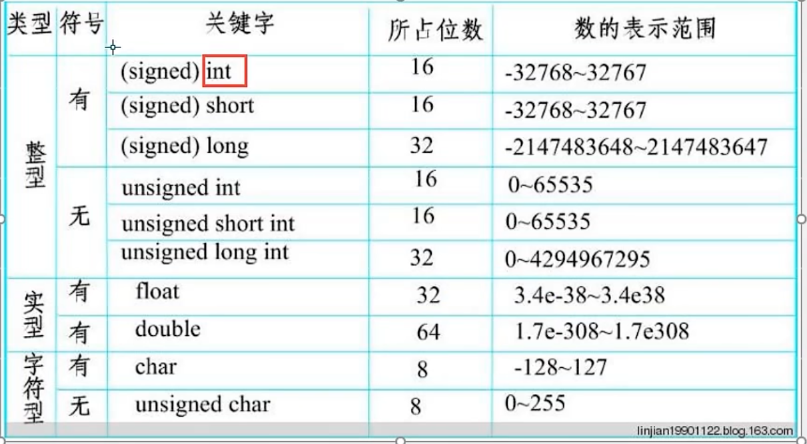

```c
//控制LED逐一亮起，额定间隔500ms#include <REGX52.H>#include <INTRINS.H>  //_nop_()方法需要引用void Delay500ms();//实现延迟500毫秒	//@12.0MHzvoid main(){	while(1)	{		P2 = 0xFE; //1111 1110 八位二进制控制八个灯，0亮起，1熄灭		Delay500ms();		P2 = 0xFD; //1111 1101		Delay500ms();		P2 = 0xFB; //1111 1011		Delay500ms();		P2 = 0xF7; //1111 0111		Delay500ms();		P2 = 0xEF; //1110 1111		Delay500ms();		P2 = 0xDF; //1101 1111		Delay500ms();		P2 = 0xBF; //1011 1111		Delay500ms();		P2 = 0x7F; //0111 1111		Delay500ms();	}}void Delay500ms()	//@12.0MHz{	unsigned char data i, j, k;	_nop_();	i = 4;	j = 205;	k = 187;	do	{		do		{			while (--k);		} while (--j);	} while (--i);}//优化版本#include <REGX52.h>void Delay1ms(unsigned int xms)  //延迟，可通过传入参数控制{	unsigned char i,j;	while(xms)	{		i = 2;		j = 239;		do		{			while (--j);		} while (--i);		xms--;	}}void main(){    //自写代码，使用数组控制，待测试（2025.8.6）    //测试完成，可用（2025.8.7）	unsigned int P2Arr[] = {0xFE,0xFD,0xFB,0xF7,0xEF,0xDF,0xBF,0x7F},i = 0;	while(1)	{		if(i>7)		{			i=0;		}		P2 = P2Arr[i];		Delay1ms(500);		i++;	}	/*	while(1){                     //优化后的代码		P2 = 0xFE; //1111 1110		Delay1ms(500);		P2 = 0xFD; //1111 1101		Delay1ms(500);		P2 = 0xFB; //1111 1011		Delay1ms(500);		P2 = 0xF7; //1111 0111		Delay1ms(500);		P2 = 0xEF; //1110 1111		Delay1ms(500);		P2 = 0xDF; //1101 1111		Delay1ms(500);		P2 = 0xBF; //1011 1111		Delay1ms(500);		P2 = 0x7F; //0111 1111		Delay1ms(500);	}	*/}
```

## Day2 2025.8.7

### 配置vscode实现51单片机开发

1.  安装EIDE拓展,keil assiant拓展
2.  配置EIDE使用keil5作为编译器
3.  pip安装serial，不然不能烧录
4.  新建项目设置UTF8，打开C/C++ 代码提醒

### 按钮控制LED灯

```c
#include <Atmel/REGX52.H>void Delay(unsigned int xms){    unsigned char i, j;    while (xms--) {        i = 2;        j = 239;        do {            while (--j);        } while (--i);    }}/* void main(){    while (1) {  //按下开，再按下关        if (P3_1 == 0) {            Delay(20); // 消除按键抖动            while (P3_1 == 0);            Delay(20);            P2_0 = ~P2_0;        }    }} *//* void main(){    unsigned char LEDNum = 0; // 占八位,正好对应一个八位寄存器    while (1) {        if (P3_1 == 0) { // 实现二进制计数            Delay(20);            while (P3_1 == 0);            Delay(20);            LEDNum++;            P2 = ~LEDNum; // 取反        }    }} */void main(){    unsigned char LedNum = 0;    P2                   = ~(0x01 << LedNum);    while (1) {         if (P3_1 == 0) {            Delay(20);            if (LedNum >= 7) {                LedNum = 0;            } else {                LedNum++;            }            P2 = ~(0x01 << LedNum);            while (P3_1 == 0);            Delay(20);        } else if (P3_0 == 0) {            Delay(20);            if (LedNum <= 0) {                LedNum = 7;            } else {                LedNum--;            }            P2 = ~(0x01 << LedNum);            while (P3_0 == 0);            Delay(20);        }    }}
```

### 数码管控制

#### 静态显示

数码管分为供阴极&供阳极，阳极1亮0灭，阴极相反

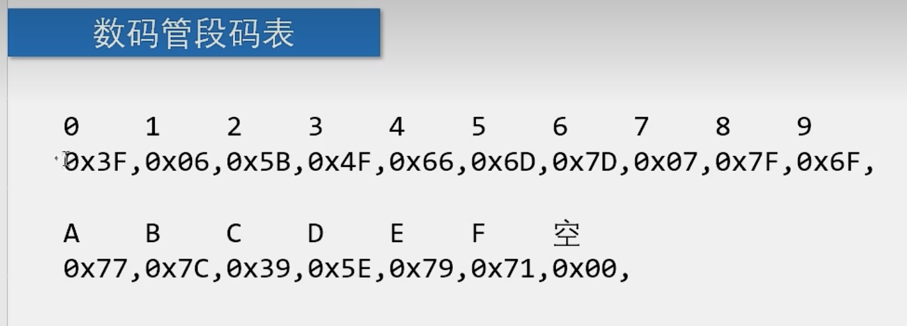

```c
#include <Atmel/REGX52.H>//数码管段码表unsigned char NixieTable[] = {0x3F,0x06,0x5B,0x4F,0x66,0x6D,0x7D,0x07,0x7F,0x6F};void Nixie(unsigned char Location,Number) //Location表示第几个，Number表示显示几{    switch (Location) {        case 1: P2_4 = 1; P2_3 = 1; P2_2 = 1; break;        case 2: P2_4 = 1; P2_3 = 1; P2_2 = 0; break;        case 3: P2_4 = 1; P2_3 = 0; P2_2 = 1; break;        case 4: P2_4 = 1; P2_3 = 0; P2_2 = 0; break;        case 5: P2_4 = 0; P2_3 = 1; P2_2 = 1; break;        case 6: P2_4 = 0; P2_3 = 1; P2_2 = 0; break;        case 7: P2_4 = 0; P2_3 = 0; P2_2 = 1; break;        case 8: P2_4 = 0; P2_3 = 0; P2_2 = 0; break;    }    P0 = NixieTable[Number];}// 静态数码管void main(){    Nixie(2,3);    while (1) {    }}
```

#### 动态显示

```c
#include <Atmel/REGX52.H>//数码管段码表unsigned char NixieTable[] = {0x3F,0x06,0x5B,0x4F,0x66,0x6D,0x7D,0x07,0x7F,0x6F};void Nixie(unsigned char Location,Number); //数码管显示void Delay(unsigned char xms);             //延迟void main(){    while (1)     {        Nixie(1,1);        Nixie(2,2);        Nixie(3,3);        Nixie(4,4);        Nixie(5,5);        Nixie(6,6);        Nixie(7,7);        Nixie(8,8);    }}void Nixie(unsigned char Location,Number){    switch (Location)     {        case 1: P2_4 = 1; P2_3 = 1; P2_2 = 1; break;        case 2: P2_4 = 1; P2_3 = 1; P2_2 = 0; break;        case 3: P2_4 = 1; P2_3 = 0; P2_2 = 1; break;        case 4: P2_4 = 1; P2_3 = 0; P2_2 = 0; break;        case 5: P2_4 = 0; P2_3 = 1; P2_2 = 1; break;        case 6: P2_4 = 0; P2_3 = 1; P2_2 = 0; break;        case 7: P2_4 = 0; P2_3 = 0; P2_2 = 1; break;        case 8: P2_4 = 0; P2_3 = 0; P2_2 = 0; break;    }    P0 = NixieTable[Number];    Delay(200);   //消影：解决数码管串位问题    P0 = 0x00;}void Delay(unsigned char xms){    unsigned char i, j;    while (xms--)     {        i = 2;        j = 239;        do {            while (--j);        } while (--i);    }}
```

## Day3 2025.8.9

#### 模块化编程

延迟

```C
Delay.c/** * @brief  在12.000MHz，延迟xms毫秒 * @param  xms你想要延迟的时间，单位 * @retval 无 */void Delay(unsigned int xms){    unsigned char i, j;    while (xms--) {        i = 2;        j = 239;        do {            while (--j);        } while (--i);    }}//Delay.h#ifndef __DELAY_H__#define __DELAY_H__void Delay(unsigned int xms);#endif
```

独立按键

```C
//Key.c#include <Atmel/REGX52.H>#include "Delay.h"/** * @brief 获取独立按键键码 * @param 无 * @retval 按下按键的键码，范围0~4，无按键按下时返回0 */unsigned char Key(){    unsigned char KeyNumber = 0;    if(P3_1 == 0){        Delay(20);        while (P3_1 == 0);        Delay(20);        KeyNumber = 1;    }    if(P3_0 == 0){        Delay(20);        while (P3_0 == 0);        Delay(20);        KeyNumber = 2;    }    if(P3_2 == 0){        Delay(20);        while (P3_2 == 0);        Delay(20);        KeyNumber = 3;    }    if(P3_3 == 0){        Delay(20);        while (P3_3 == 0);        Delay(20);        KeyNumber = 4;    }    return KeyNumber;}//Key.h#ifndef __KEY_H__#define __KEY_H__unsigned char Key();#endif
```

LCD1602

```c
//LCD1602.c#include <Atmel/REGX52.H>// 引脚配置：sbit LCD_RS = P2 ^ 6;sbit LCD_RW = P2 ^ 5;sbit LCD_EN = P2 ^ 7;#define LCD_DataPort P0// 函数定义：/** * @brief  LCD1602延时函数，12MHz调用可延时1ms * @param  无 * @retval 无 */void LCD_Delay(){    unsigned char i, j;    i = 2;    j = 239;    do {        while (--j);    } while (--i);}/** * @brief  LCD1602写命令 * @param  Command 要写入的命令 * @retval 无 */void LCD_WriteCommand(unsigned char Command){    LCD_RS       = 0;    LCD_RW       = 0;    LCD_DataPort = Command;    LCD_EN       = 1;    LCD_Delay();    LCD_EN = 0;    LCD_Delay();}/** * @brief  LCD1602写数据 * @param  Data 要写入的数据 * @retval 无 */void LCD_WriteData(unsigned char Data){    LCD_RS       = 1;    LCD_RW       = 0;    LCD_DataPort = Data;    LCD_EN       = 1;    LCD_Delay();    LCD_EN = 0;    LCD_Delay();}/** * @brief  LCD1602设置光标位置 * @param  Line 行位置，范围：1~2 * @param  Column 列位置，范围：1~16 * @retval 无 */void LCD_SetCursor(unsigned char Line, unsigned char Column){    if (Line == 1) {        LCD_WriteCommand(0x80 | (Column - 1));    } else if (Line == 2) {        LCD_WriteCommand(0x80 | (Column - 1 + 0x40));    }}/** * @brief  LCD1602初始化函数 * @param  无 * @retval 无 */void LCD_Init(){    LCD_WriteCommand(0x38); // 八位数据接口，两行显示，5*7点阵    LCD_WriteCommand(0x0c); // 显示开，光标关，闪烁关    LCD_WriteCommand(0x06); // 数据读写操作后，光标自动加一，画面不动    LCD_WriteCommand(0x01); // 光标复位，清屏}/** * @brief  在LCD1602指定位置上显示一个字符 * @param  Line 行位置，范围：1~2 * @param  Column 列位置，范围：1~16 * @param  Char 要显示的字符 * @retval 无 */void LCD_ShowChar(unsigned char Line, unsigned char Column, char Char){    LCD_SetCursor(Line, Column);    LCD_WriteData(Char);}/** * @brief  在LCD1602指定位置开始显示所给字符串 * @param  Line 起始行位置，范围：1~2 * @param  Column 起始列位置，范围：1~16 * @param  String 要显示的字符串 * @retval 无 */void LCD_ShowString(unsigned char Line, unsigned char Column, char *String){    unsigned char i;    LCD_SetCursor(Line, Column);    for (i = 0; String[i] != '0'; i++) {        LCD_WriteData(String[i]);    }}/** * @brief  返回值=X的Y次方 */int LCD_Pow(int X, int Y){    unsigned char i;    int Result = 1;    for (i = 0; i < Y; i++) {        Result *= X;    }    return Result;}/** * @brief  在LCD1602指定位置开始显示所给数字 * @param  Line 起始行位置，范围：1~2 * @param  Column 起始列位置，范围：1~16 * @param  Number 要显示的数字，范围：0~65535 * @param  Length 要显示数字的长度，范围：1~5 * @retval 无 */void LCD_ShowNum(unsigned char Line, unsigned char Column, unsigned int Number, unsigned char Length){    unsigned char i;    LCD_SetCursor(Line, Column);    for (i = Length; i > 0; i--) {        LCD_WriteData(Number / LCD_Pow(10, i - 1) % 10 + '0');    }}/** * @brief  在LCD1602指定位置开始以有符号十进制显示所给数字 * @param  Line 起始行位置，范围：1~2 * @param  Column 起始列位置，范围：1~16 * @param  Number 要显示的数字，范围：-32768~32767 * @param  Length 要显示数字的长度，范围：1~5 * @retval 无 */void LCD_ShowSignedNum(unsigned char Line, unsigned char Column, int Number, unsigned char Length){    unsigned char i;    unsigned int Number1;    LCD_SetCursor(Line, Column);    if (Number >= 0) {        LCD_WriteData('+');        Number1 = Number;    } else {        LCD_WriteData('-');        Number1 = -Number;    }    for (i = Length; i > 0; i--) {        LCD_WriteData(Number1 / LCD_Pow(10, i - 1) % 10 + '0');    }}/** * @brief  在LCD1602指定位置开始以十六进制显示所给数字 * @param  Line 起始行位置，范围：1~2 * @param  Column 起始列位置，范围：1~16 * @param  Number 要显示的数字，范围：0~0xFFFF * @param  Length 要显示数字的长度，范围：1~4 * @retval 无 */void LCD_ShowHexNum(unsigned char Line, unsigned char Column, unsigned int Number, unsigned char Length){    unsigned char i, SingleNumber;    LCD_SetCursor(Line, Column);    for (i = Length; i > 0; i--) {        SingleNumber = Number / LCD_Pow(16, i - 1) % 16;        if (SingleNumber < 10) {            LCD_WriteData(SingleNumber + '0');        } else {            LCD_WriteData(SingleNumber - 10 + 'A');        }    }}/** * @brief  在LCD1602指定位置开始以二进制显示所给数字 * @param  Line 起始行位置，范围：1~2 * @param  Column 起始列位置，范围：1~16 * @param  Number 要显示的数字，范围：0~1111 1111 1111 1111 * @param  Length 要显示数字的长度，范围：1~16 * @retval 无 */void LCD_ShowBinNum(unsigned char Line, unsigned char Column, unsigned int Number, unsigned char Length){    unsigned char i;    LCD_SetCursor(Line, Column);    for (i = Length; i > 0; i--) {        LCD_WriteData(Number / LCD_Pow(2, i - 1) % 2 + '0');    }}//LCD1602.h#ifndef __LCD1602_H__#define __LCD1602_H__//用户调用函数：void LCD_Init();void LCD_ShowChar(unsigned char Line,unsigned char Column,char Char);void LCD_ShowString(unsigned char Line,unsigned char Column,char *String);void LCD_ShowNum(unsigned char Line,unsigned char Column,unsigned int Number,unsigned char Length);void LCD_ShowSignedNum(unsigned char Line,unsigned char Column,int Number,unsigned char Length);void LCD_ShowHexNum(unsigned char Line,unsigned char Column,unsigned int Number,unsigned char Length);void LCD_ShowBinNum(unsigned char Line,unsigned char Column,unsigned int Number,unsigned char Length);#endif
```

定时器0

```C
//Timer0.c#include <Atmel/REGX52.H>/** * @brief 定时器0初始化 * @param 无 * @retval 无 */void Timer0_Init() // 1ms@12.00MHz{    // TMOD = 0x01;  // 0000 0001    TMOD &= 0xF0; // 把TMOD的低四位清零，高四位保持不变    TMOD |= 0x01; // 把TMOD的最低位置1，高四位保持不变    TF0 = 0;    TR0 = 1;    TH0 = 0xFC; // 取高八位 64535 / 256计算得出    TL0 = 0x18; // 取低八位  64535 % 256计算得出    ET0 = 1;    EA  = 1;    PT0 = 0;}//Timer0.h#ifndef __TIMER0_H__#define __TIMER0_H__void Timer0_Init();#endif
```

#### 矩阵按键实现密码输入

```c
//main.c#include "Delay.h"#include "LCD1602.h"#include "MatrixKey.h"unsigned char KeyNum  = 0;unsigned int Password = 0;unsigned char Count   = 0;void main(){    LCD_Init();    LCD_ShowString(1, 1, "Password:");    LCD_ShowNum(2, 1, Password, 4);    while (1) {        KeyNum = MatrixKey();        if (KeyNum) {            if (KeyNum <= 10) { // 如果S1~S10按键按下，输入密码                if (Count < 4) {                    Password *= 10;                    Password += (KeyNum % 10);                }                Count++;            }            if (KeyNum == 11) {         // 确认                if (Password == 2345) { // 显示OK                    LCD_ShowString(1, 14, "OK");                    Password = 0;                    Count    = 0;                } else {                    LCD_ShowString(1, 14, "ER");                    Password = 0;                    Count    = 0;                }            }            if (KeyNum == 12) { //取消输入                Password = 0;                Count    = 0;            }            LCD_ShowNum(2, 1, Password, 4);        }    }}
```

```C
//MatrixKey.c#include <Atmel/REGX52.H>#include "Delay.h"/** * @brief  矩阵键盘读取按键键码 * @param  无 * @retval KeyNumber 按下按键的键码值 * 如果按键按下不放，程序会停留在此函数，松手的一瞬间，返回按键的键码，没有按键按下时，返回0 */unsigned char MatrixKey() // 逐列扫描矩阵键盘{    unsigned char KeyNumber = 0;    P1                      = 0xFF;    P1_3                    = 0;    if (P1_7 == 0) {        Delay(20);        while (P1_7 == 0);        Delay(20);        KeyNumber = 1;    }    if (P1_6 == 0) {        Delay(20);        while (P1_6 == 0);        Delay(20);        KeyNumber = 5;    }    if (P1_5 == 0) {        Delay(20);        while (P1_5 == 0);        Delay(20);        KeyNumber = 9;    }    if (P1_4 == 0) {        Delay(20);        while (P1_4 == 0);        Delay(20);        KeyNumber = 13;    }    P1   = 0xFF;    P1_2 = 0;    if (P1_7 == 0) {        Delay(20);        while (P1_7 == 0);        Delay(20);        KeyNumber = 2;    }    if (P1_6 == 0) {        Delay(20);        while (P1_6 == 0);        Delay(20);        KeyNumber = 6;    }    if (P1_5 == 0) {        Delay(20);        while (P1_5 == 0);        Delay(20);        KeyNumber = 10;    }    if (P1_4 == 0) {        Delay(20);        while (P1_4 == 0);        Delay(20);        KeyNumber = 14;    }    P1   = 0xFF;    P1_1 = 0;    if (P1_7 == 0) {        Delay(20);        while (P1_7 == 0);        Delay(20);        KeyNumber = 3;    }    if (P1_6 == 0) {        Delay(20);        while (P1_6 == 0);        Delay(20);        KeyNumber = 7;    }    if (P1_5 == 0) {        Delay(20);        while (P1_5 == 0);        Delay(20);        KeyNumber = 11;    }    if (P1_4 == 0) {        Delay(20);        while (P1_4 == 0);        Delay(20);        KeyNumber = 15;    }    P1   = 0xFF;    P1_0 = 0;    if (P1_7 == 0) {        Delay(20);        while (P1_7 == 0);        Delay(20);        KeyNumber = 4;    }    if (P1_6 == 0) {        Delay(20);        while (P1_6 == 0);        Delay(20);        KeyNumber = 8;    }    if (P1_5 == 0) {        Delay(20);        while (P1_5 == 0);        Delay(20);        KeyNumber = 12;    }    if (P1_4 == 0) {        Delay(20);        while (P1_4 == 0);        Delay(20);        KeyNumber = 16;    }    return KeyNumber;}//MatrixKey.h#ifndef __MATRIXKEY_H__#define __MATRIXKEY_H__unsigned char MatrixKey();#endif
```

#### 定时器实现流水灯和时钟

```c
//main.c/* 定时器时钟*/#include <Atmel/REGX52.H>#include "Delay.h"#include "LCD1602.h"#include "Timer0.h"unsigned char Sec, Min, Hour;void main(){    LCD_Init();    Timer0_Init();    LCD_ShowString(1, 1, "Clock:");    LCD_ShowString(2, 1, "  :  :");    while (1) {        LCD_ShowNum(2, 1, Hour, 2);        LCD_ShowNum(2, 4, Min, 2);        LCD_ShowNum(2, 7, Sec, 2);    }}// 中断函数void Timer0_Routine() interrupt 1{    static unsigned int T0Count = 0;    TH0                         = 0xFC;    TL0                         = 0x18;    T0Count += 1;    if (T0Count >= 1000) { // 1s        T0Count = 0;        Sec++;        if (Sec >= 60) {            Sec = 0;            Min++;            if (Min >= 60) {                Min = 0;                Hour++;                if (Hour >= 24) {                    Hour = 0;                }            }        }    }}/*  定时器实现流水灯#include <Atmel/REGX52.H>#include <INTRINS.H>#include "Timer0.h"#include "Key.h"unsigned char KeyNum, LEDMode;void main(){    P2 = 0xFE;    Timer0_Init();    while (1) {        KeyNum = Key();        if (KeyNum) {            if (KeyNum == 1) {                LEDMode++;                if (LEDMode >= 2) LEDMode = 0;            }        }    }}void Timer0_Routine() interrupt 1{    static unsigned int T0Count = 0;    TH0                         = 0xFC;    TL0                         = 0x18;    T0Count += 1;    if (T0Count >= 1000) { //1s        T0Count = 0;        if (LEDMode == 0) {            P2 = _crol_(P2, 1);   //循环左移        }        if (LEDMode == 1) {            P2 = _cror_(P2, 1);  //循环右移        }    }}    */
```

#### 串口通信

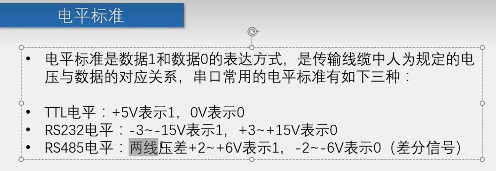

## Day4 2025.8.10

#### LED矩阵

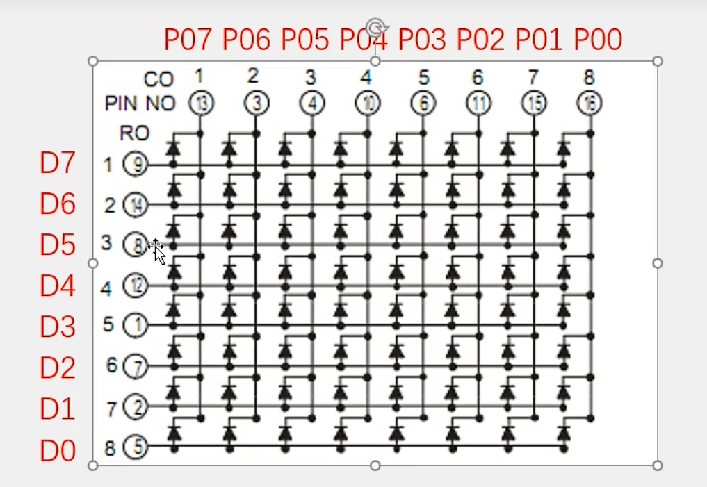

#### DS1302时钟

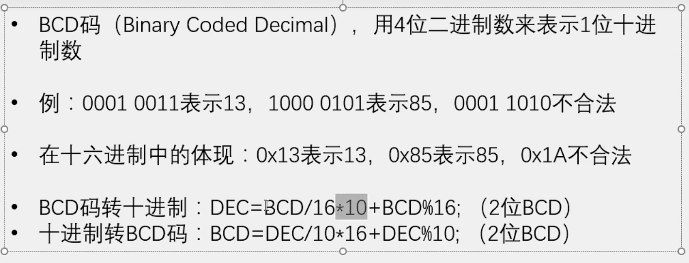

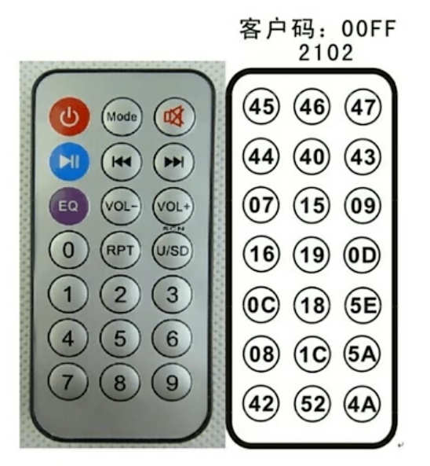

# STM32标准库

### 型号分类及缩写

STM32F103C8T6

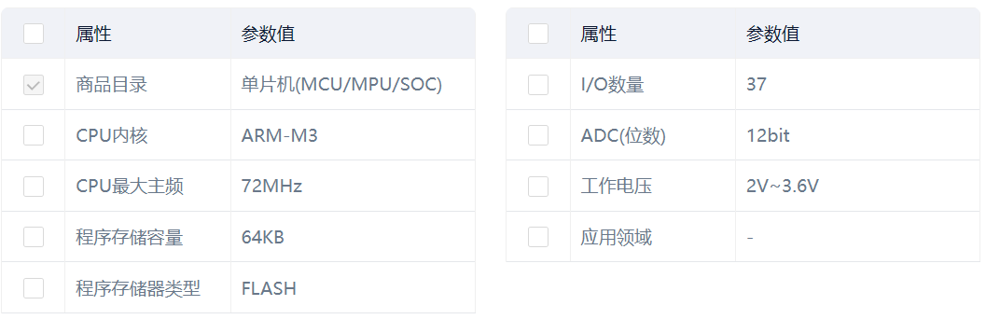

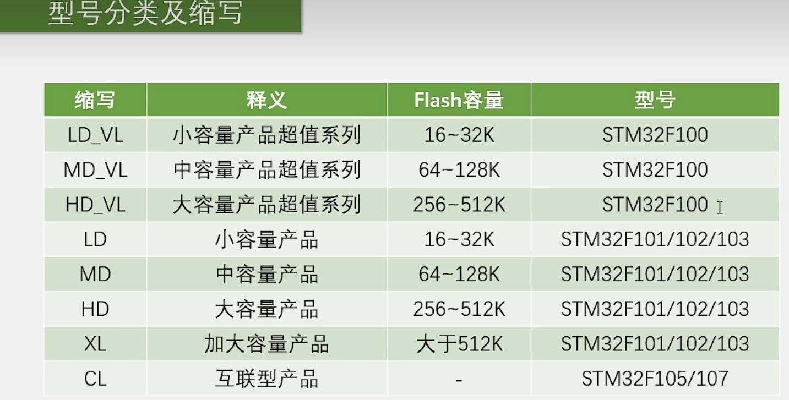

### Keli5新建工程

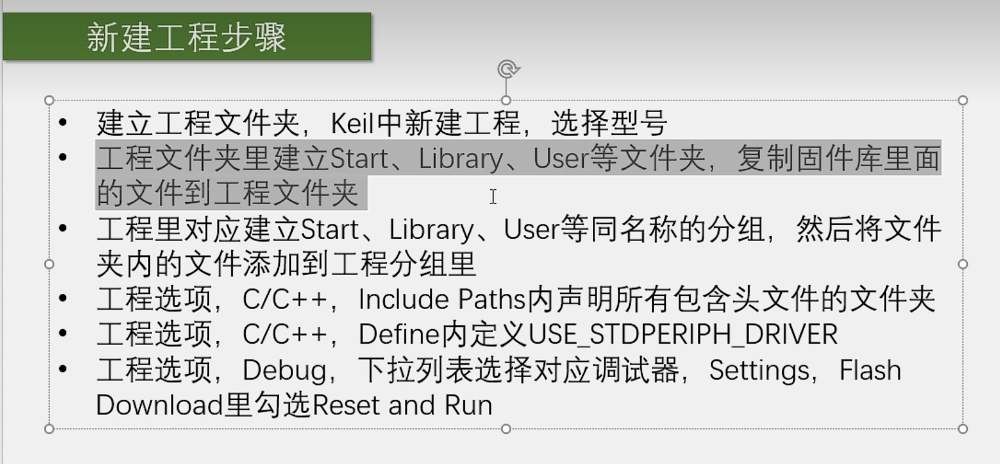

控制灯

```c
#include "stm32f10x.h" // Device headerint main(){	RCC_APB2PeriphClockCmd(RCC_APB2Periph_GPIOC, ENABLE);  //配置外置时钟	GPIO_InitTypeDef GPIO_InitStructure;              //GPIO结构体	GPIO_InitStructure.GPIO_Mode = GPIO_Mode_Out_PP;  //GPIO模式，通用推管输出	GPIO_InitStructure.GPIO_Pin = GPIO_Pin_13;        //GPIO端口，13端口	GPIO_InitStructure.GPIO_Speed = GPIO_Speed_50MHz; //GPIO速度，	GPIO_Init(GPIOC, &GPIO_InitStructure);     //GPIO一共7组，每组13个引脚	GPIO_SetBits(GPIOC, GPIO_Pin_13);          // 设置高电平	// GPIO_ResetBits(GPIOC, GPIO_Pin_13);     // 设置低电平	while (1)	{		// 18报错解决办法：魔法棒-output--ARM compiler将编译器换成第5版本		// 4错误0警告直接使用v6不用做替换把start内的core_cm3.hc删掉		// 报错的大部分是安装了新版kile的原因，直接在kile5安装目录->ARM目录下新建一个目录然后在这个目录下安装老师提供的kile5安装包，		// 安装完成后点击魔术棒右边三个方块按钮添加5.0版本编译器		// 没有version 5的去官网下载一个5.06的包，现在最新的软件默认没有安装version 5		// 代码自动补全联想：点击上方Edit/最底下的Configuration/第一排Text Completion /勾选Symbols after3 Characters/OK保存	}}
```

### GPIO模式

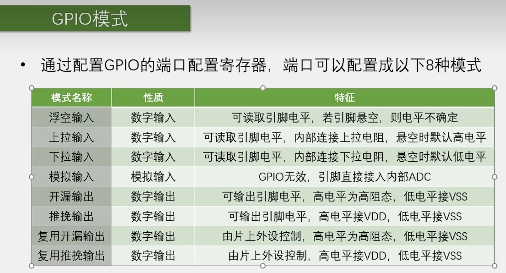

点灯门外汉

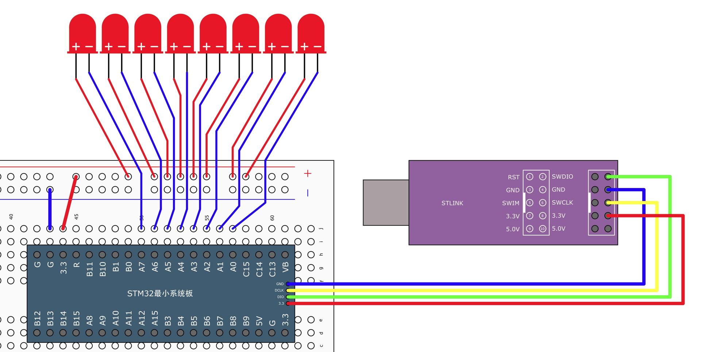

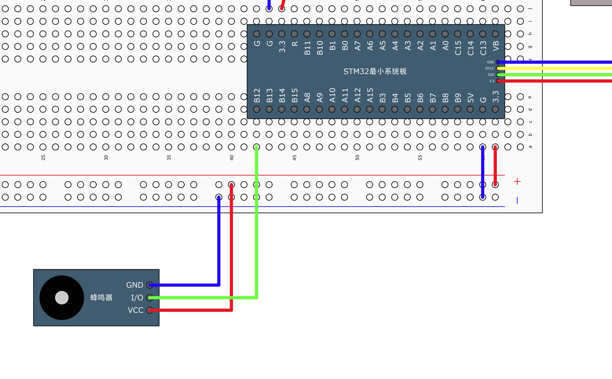

```c
#include "stm32f10x.h" // Device header#include "Delay.h"int main(){	RCC_APB2PeriphClockCmd(RCC_APB2Periph_GPIOA | RCC_APB2Periph_GPIOB, ENABLE); // 配置外置时钟	GPIO_InitTypeDef GPIO_InitStructure;	GPIO_InitStructure.GPIO_Mode = GPIO_Mode_Out_PP;	GPIO_InitStructure.GPIO_Pin = GPIO_Pin_All;	GPIO_InitStructure.GPIO_Speed = GPIO_Speed_50MHz;	GPIO_Init(GPIOA, &GPIO_InitStructure);	GPIO_Init(GPIOB, &GPIO_InitStructure);	// GPIO_SetBits(GPIOA, GPIO_Pin_0); // 设置高电平	// GPIO_ResetBits(GPIOA, GPIO_Pin_0); // 设置低电平	while (1)	{		GPIO_ResetBits(GPIOB, GPIO_Pin_12);  //蜂鸣器		GPIO_Write(GPIOA, ~0x0081);		Delay_ms(500);		GPIO_Write(GPIOA, ~0x0042);		Delay_ms(500);		GPIO_SetBits(GPIOB, GPIO_Pin_12);		GPIO_Write(GPIOA, ~0x0024);		Delay_ms(500);		GPIO_Write(GPIOA, ~0x0018);		Delay_ms(500);	}	//}
```

#### 数据类型

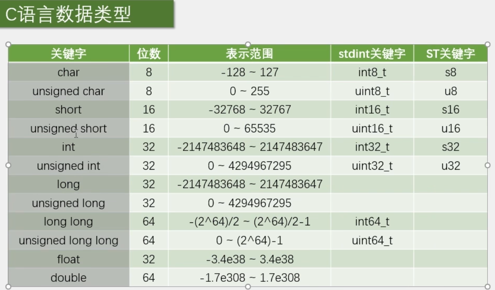

### 串口通信

**电平标准**TTL：+3.3V或+5V表示1，0V表示0（单片机常用）RS232：-3~-15V表示1，+3~15表示0（大型设备常用）RS485：两线压差+2~+6V表示1，-2~-6V表示0（差分信号）

### 5461BS数码管

```c
#include "stm32f10x.h"#include "OLED.h"#include "Delay.h"// 共阳数码管编码表uint16_t smgduan[17] = {	0xc0, 0xf9, 0xa4, 0xb0, 0x99, 0x92, 0x82, 0xf8,	0x80, 0x90, 0x88, 0x83, 0xc6, 0xa1, 0x86, 0x8e};void Nixie_Init(){	RCC_APB2PeriphClockCmd(RCC_APB2Periph_GPIOA, ENABLE);	GPIO_InitTypeDef GPIO_InitStructure;	GPIO_InitStructure.GPIO_Mode = GPIO_Mode_Out_PP;	GPIO_InitStructure.GPIO_Pin = GPIO_Pin_0 | GPIO_Pin_1 | GPIO_Pin_2 | GPIO_Pin_3 | GPIO_Pin_4 | GPIO_Pin_5 | GPIO_Pin_6 | GPIO_Pin_7 | GPIO_Pin_8 | GPIO_Pin_9 | GPIO_Pin_10 | GPIO_Pin_11;	GPIO_InitStructure.GPIO_Speed = GPIO_Speed_50MHz;	GPIO_Init(GPIOA, &GPIO_InitStructure);	GPIO_SetBits(GPIOA, GPIO_Pin_0 | GPIO_Pin_1 | GPIO_Pin_2 | GPIO_Pin_3 | GPIO_Pin_4 | GPIO_Pin_5 | GPIO_Pin_6 | GPIO_Pin_7 | GPIO_Pin_8 | GPIO_Pin_9 | GPIO_Pin_10 | GPIO_Pin_11);}void Nixie_Display(uint8_t Location, uint8_t Number){	GPIO_Write(GPIOA, smgduan[Number]);	GPIO_SetBits(GPIOA, 0x0800 >> (Location - 1));	Delay_ms(5);	GPIO_Write(GPIOA, 0x0000);}int main(){	Nixie_Init();	while (1)	{		Nixie_Display(1, 1);		Nixie_Display(2, 2);		Nixie_Display(3, 1);		Nixie_Display(4, 2);	}}
```

#### 1088AS+MAX7219

管脚描述

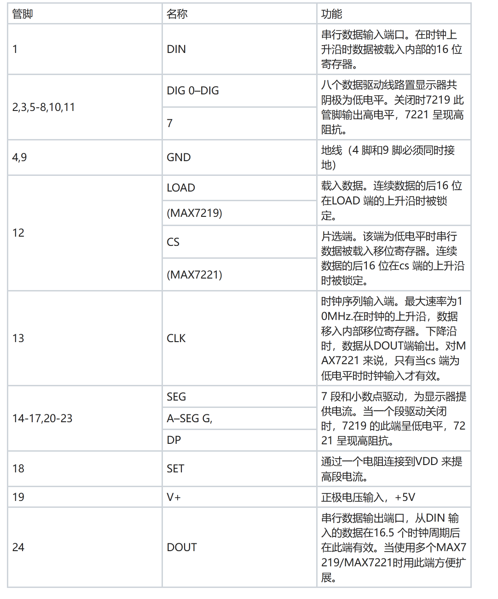

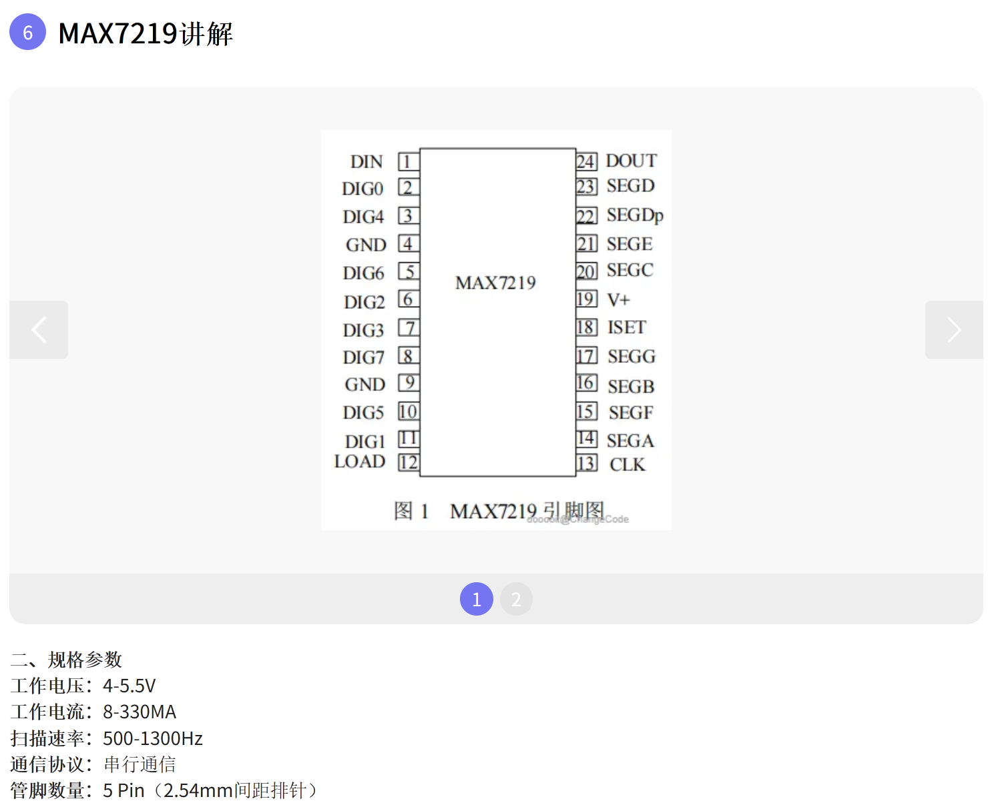

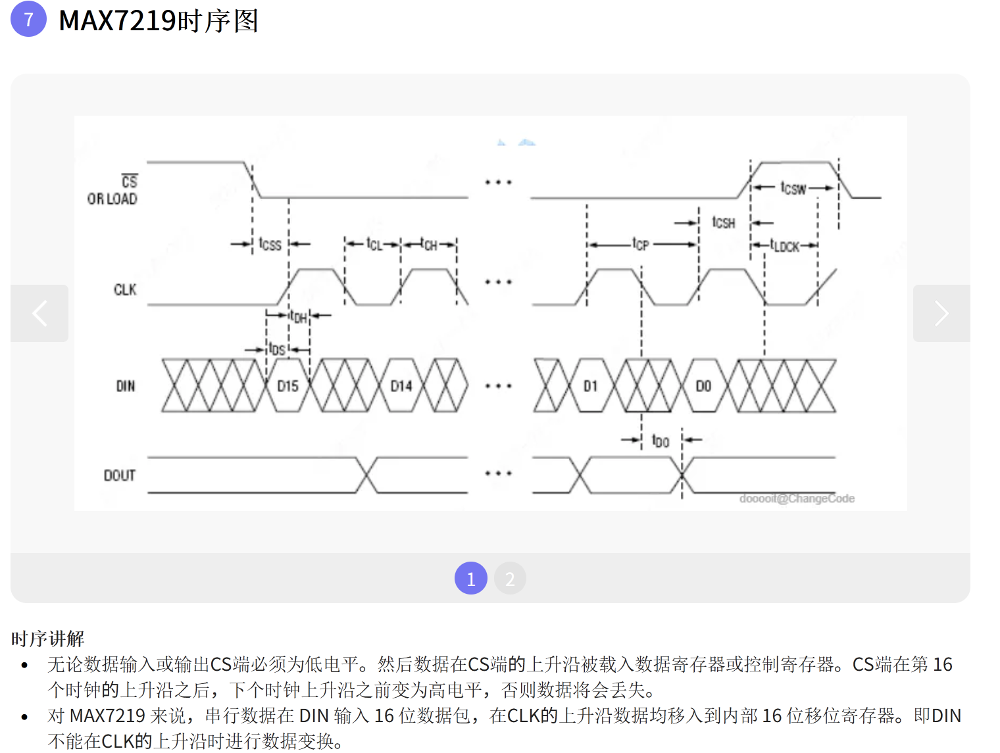