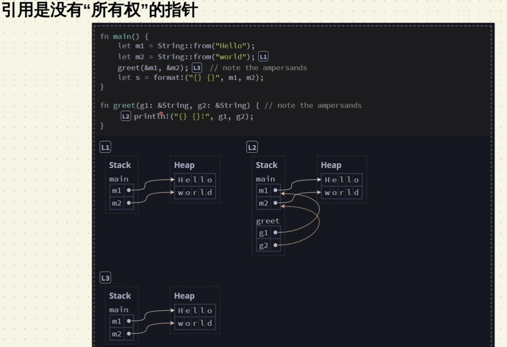
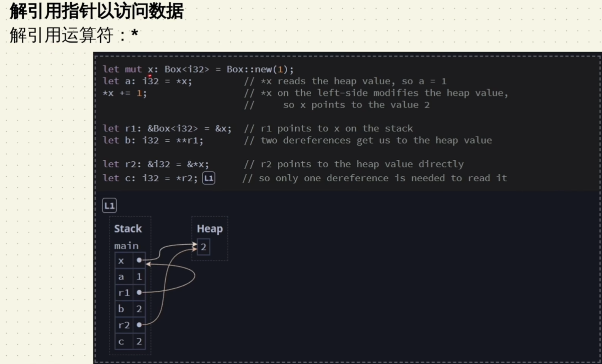
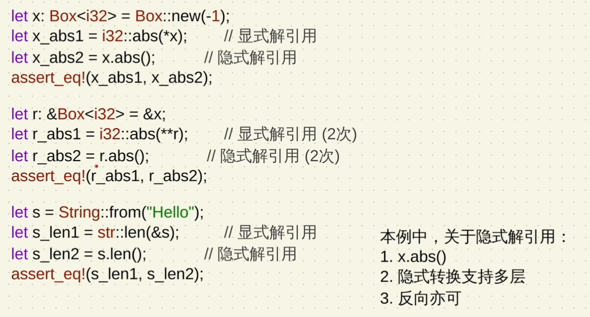
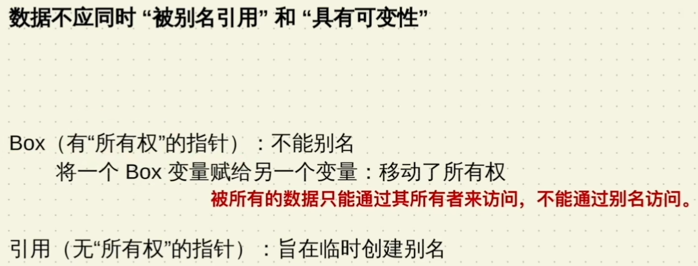
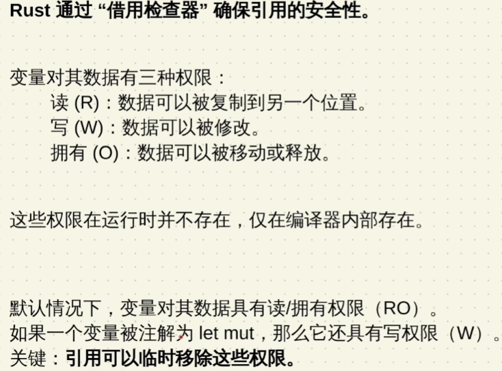
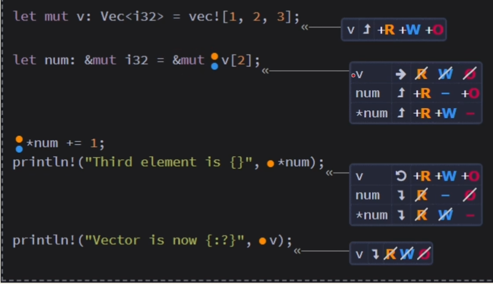

#  Rust Rebegin

### Rust结构

crate
library crate  (1)
binary crate  (n)

### 猜数游戏

```rust
use rand::Rng;  //引入的crate为rand 0.8.5
use std::{cmp::Ordering, io};

fn main() {
    println!("Guess the number");
    let secret_number: u32 = rand::thread_rng().gen_range(1..=100); //生成 1 <= secret_number <= 100
    // println!("The secret number is: {}", secret_number);
    loop {
        println!("Please enter your guess.");
        let mut guess: String = String::new();
        io::stdin()
            .read_line(&mut guess)
            .expect("Failed to read line");

        let guess: u32 = match guess.trim().parse() {
            Ok(num) => num,
            Err(_) => continue,
        };
        println!("Your guess is: {}", guess);

        match guess.cmp(&secret_number) {
            Ordering::Less => println!("Too small"),
            Ordering::Greater => println!("Too big"),
            Ordering::Equal => {
                println!("You win");
                break;
            },
        }
    }
}
```

### 变量与数据类型

#### 常量

1. 使用const声明
2. 不可使用mut
3. 必须标注类型
4. 可以在任意作用域声明
5. 仅可以使用常量表达式赋值

#### 变量遮蔽 Shadowing

1. 可以用之前变量相同的名字声明一个新变量:第一个变量被第二个变量“遮蔽”了
2. 就是创建了一个新变量,只不过名字相同

```rust
fn main(){
    let x = 5;
    let x = x + 1;
    {
        let x = x * 2;
        println!("The value of x in the inner scope is : {x}"); // 12
    }
    println!("The value of x  is : {x}"); //6
}
```

#### 数据类型

##### 标量类型 Scalar

表示一个单一的值

1. 整数 Integer
   
   
   
   

2. 浮点 Floating Point
   
    a. f32:4字节

    b. f64(默认):8字节

    c. 都有符号(signed)

3. 布尔 Boolean
   
    a. 两个值:true,false

    b. 1字节

4. 字符 Character
   
    a. 4字节

    b. 表示一个Unicode标量值(Unicode Scalar Value)

##### 复合类型 Compound

可以将多个值组合在一个类型

1. 元组 Tuple
   
    a. 固定长度

    b. 可包含不同类型的数据

2. 数组 Array
   
    a. 固定长度

    b. 元素类型相同

   ```rust
   fn main() {
       let tup1 = (100, 'A', false);
       let tup2: (i32, f64, u8) = (500, 6.4, 1);
       println!("tup1.0: {}", tup1.0);
       println!("tup2.0: {}", tup2.0);
   
       let (x, y, z) = tup2;
       println!("x: {}, y: {},z: {}", x, y, z);
   
       let arr1 = [1, 2, 3, 4, 5];
       let arr2: [i32; 5] = [6, 7, 8, 9, 10];
       let arr3: [i32; 5] = [3; 5];
   
       println!("arr1[0]: {}", arr1[0]);
       println!("arr2[0]: {}", arr2[0]);
       println!("arr3[0]: {}", arr3[0]);
   }
   
   fn main() {
       let one = [1, 2, 3];
   
       let two: [u8; 3] = [4, 5, 6];
       let blank1 = [0; 3];
       let blank2: [u8; 3] = [1; 3];
   
       let arrays: [[u8; 3]; 4] = [one, two, blank1, blank2];
   
       for a in &arrays {
           print!("{:?}", a);
   
           for n in a.iter() {
               print!("\t{} + 10 = {}", n, n + 10);
           }
   
           let mut sum = 0;
   
           for i in 0..a.len() {
               sum += a[i];
           }
           println!("\t({:?} = {})", a, sum);
       }
   }
   ```

#### 字符串

遍历字符串

```rust
fn main() {
    let str: String = String::from("China");
    let bytes: &[u8] = str.as_bytes();

    for (i, &item) in bytes.iter().enumerate() {
        println!("{} {}", i, item as char);
    }
}
```


#### 函数

命名和变量的命名规范：snake case

1. 所有字母都小写

2. 单词之间用“_”连接

3. 必须声明参数的类型
   
   ```rust
   fn main(){
   	println!("Hello World!");
   
   	another_function();
   	print_label_message(5，a);
   }
   
   fn another_function(){
   	println!("This is another_function")
   }
   
   fn print_label_message(value: i32, unit_label: char){
   	println!("Value is {},unit_label is {}",value,unit_label);
   }
   ```
   
   函数体由一系列语句组成，可由表达式结尾
   
   ##### 函数的返回值
   
   1. 可以使用return返回
   
   2. 函数最后一个表达式的值

#### 语句与表达式

语句(Statements): 执行某些指令的操作，不返回值
 表达式(Expressions): 计算并返回一个结果值

```rust
fn main(){
 let x = five();
 println!("x is {}",x);
}

fn five() -> i32 {
 5
}
```

#### 控制流(Control Flow)

##### IF表达式

```rust
fn main() {
    let number = 6;

    if number % 4 == 0 {
        println!("number is divisible by 4");
    } else if number % 3 == 0 {
        println!("number is divisible by 3");
    } else if number % 2 == 0 {
        println!("number is divisible by 2");
    } else {
        println!("number is not divisible by 4 or 3 or 2");
    }
}
```

```rust
fn main(){
    let condition = true;
    let number = if condition { 5 } else { 6 };

    println!("number is {}",number); // 5    
}
```

##### loop循环

```rust
fn main() {
    let mut counter = 0;
    let result = loop {
        counter += 1;

        if counter == 10 {
            break counter * 2;  //跳出循环且带返回值
        }
    };

    println!("result is {}", result); // result is 20
}
```

loop循环添加标签，在循环嵌套时可以在内层循环里直接跳出外层循环。

```rust
fn main() {
    let mut x = 1;
    let mut y = 1;
    'label1: loop { //label1是loop循环的标签
        loop {
            if x > 9 {
                break 'label1;  //直接跳出label1循环
            }
            if y <= x {
                print!("{} * {} = {}  ", y, x, x * y);
                y += 1;
            } else {
                break;
            }
        }
        print!("\n");
        y = 1;
        x += 1;
    }
}
```

##### for循环

```rust
fn main() {
    for i in 1..=5 {
        println!("{}", i);
    }
    let arr = [1,2,3,4,5];
    for x in arr {
        println!("arr {}",x)
    }
}
```

### 模式匹配

#### match

match类似其他语言的switch，但match必须穷尽所有可能，

```rust
fn main() {
    let x = 10;
    match x {
        1 => println!("This is 1"),
        10 => println!("This is 10"),
        _ => println!("I don't know")   //_表示default
    }
}

//使用match复制
enum IpAddr {
    Ipv4,
    Ipv6,
}
fn main() {
    let ip1 = IpAddr::Ipv6;
    let ip_str = match ip1 {
        IpAddr::Ipv4 => "127.0.0.1",
        _ => "::1",
    };
    println!("{}", ip_str);
}
```

#### 模式绑定

从模式中取出绑定的值

```rust
#[derive(Debug)]
enum UsState {
    Alabama,
    Alaska,
}

enum Coin {
    Penny,
    Nikel,
    Dime,
    Quarter(UsState),
}

fn value_in_cents(coin: Coin) -> u8 {
    match coin {
        Coin::Penny => 1,
        Coin::Nikel => 5,
        Coin::Dime => 10,
        Coin::Quarter(state) => {
            println!("State quarter from {:?}!", state);
            25
        }
    }
}
fn main() {
    let t = Coin::Quarter(UsState::Alaska);
    value_in_cents(t);
}
```

```rust
enum Action {
    Say(String),
    MoveTo(i32, i32),
    ChangeColorRGB(u16, u16, u16),
}

fn main() {
    let actions = [
        Action::Say("Hello Rust".to_string()),
        Action::MoveTo(1, 2),
        Action::ChangeColorRGB(255, 255, 0),
    ];

    for action in actions {
        match action {
            Action::Say(s) => {
                println!("he say {}", s);
            }
            Action::MoveTo(x, y) => {
                println!("Then move to x:{} , y:{}", x, y);
            }
            Action::ChangeColorRGB(R, G, B) => {
                println!("Change to color to RGB({},{},{})", R, G, B);
            }
        }
    }
}

```

#### 穷尽匹配

`match` 的匹配必须穷尽所有情况。

#### _ 通配符

除了目标情况，其他用_代替

```rust
let some_u8_value = 0u8;
match some_u8_value {
    1 => println!("one"),
    3 => println!("three"),
    5 => println!("five"),
    7 => println!("seven"),
    _ => (),
}

```

除了`_`通配符，用一个变量来承载其他情况也是可以的。

```rust
#[derive(Debug)]
enum Direction {
    East,
    West,
    North,
    South,
}

fn main() {
    let dire = Direction::South;
    match dire {
        Direction::East => println!("East"),
        other => println!("other direction: {:?}", other),
    };
}
```

#### if let

**你只要匹配一个条件，且忽略其他条件时就用 `if let` ，否则都用 `match`**。

```rust
let v = Some(3u8);
match v {
    Some(3) => println!("three"),
    _ => (),
}
//这两段代码的作用相同
if let Some(3) = v {
    println!("three");
}
```

#### matches!宏

将一个表达式跟模式进行匹配，然后返回匹配的结果 `true` or `false`。

```rust
#[derive(Debug)]
enum MyEnum {
    Foo,
    Bar,
}
fn main() {
    let v = vec![MyEnum::Foo, MyEnum::Bar, MyEnum::Foo];
    // 对 v 进行过滤，只保留类型是 MyEnum::Foo 的元素
    let mut v2 = v.iter().filter(|x| matches!(x, MyEnum::Foo));
    let mut temp = v2.next();
    while !matches!(temp, None) {
        println!("{:?}", temp);
        temp = v2.next();
    }
    // println!("{:?}", v2.next());
    // println!("{:?}", v2.next());
    // println!("{:?}", v2.next());
    
    //更多例子
    let foo = 'f';
	assert!(matches!(foo, 'A'..='Z' | 'a'..='z'));

	let bar = Some(4);
	assert!(matches!(bar, Some(x) if x > 2));
}
```

#### Option\<T>

**一个变量要么有值：`Some(T)`, 要么为空：`None`**。

因为 `Option`，`Some`，`None` 都包含在 `prelude` 中，因此你可以直接通过名称来使用它们，而无需以 `Option::Some` 这种形式去使用，总之，千万不要因为调用路径变短了，就忘记 `Some` 和 `None` 也是 `Option` 底下的枚举成员！

```rust
//定义
enum Option<T> {
    None,
    Some(T),
}

//例子
fn option_plus_int(a: Option<i32>, b: i32) -> Option<i32> {
    match a {
        None => None,
        Some(i) => Some(i + b),
    }
}
fn main() {
    let mut x = Some(5);
    let y = 12;
    x = option_plus_int(x, y);
    println!("new x is {:?}",x);
}
//使用if let取出Some(T)中的T
fn main() {
    let x = Some(52);
    let mut x2: i32 = 0;
    if let Some(y) = x {
        x2 = y;
    }
    println!("{}", x2);
}
```

结构嵌套的结构体和枚举

```rust
enum Color {
    RGB(i32, i32, i32),
    HSV(i32, i32, i32),
}

enum Message {
    Quit,
    Move { x: i32, y: i32 },
    Write(String),
    ChangeColor(Color),
}

fn main() {
    let msg = Message::ChangeColor(Color::HSV(0, 160, 255));

    match msg {
        Message::ChangeColor(Color::RGB(r, g, b)) => {
            println!("Change Color to red: {} , blur: {} , green: {}", r, g, b)
        }
        Message::ChangeColor(Color::HSV(h, s, v)) => {
            println!("Change Color to hue: {} , saturation: {} , value: {}", h, s, v)
        }
        _ => println!("I don't know how to do"),
    }
}
```

### 方法Method

#### 定义方法

```rust
struct Circle {
    x: f64,
    y: f64,
    radius: f64,
}

impl Circle {
    // new是Circle的关联函数，因为它的第一个参数不是self，且new并不是关键字
    // 这种方法往往用于初始化当前结构体的实例
    fn new(x: f64, y: f64, radius: f64) -> Circle {
        Circle {
            x: x,
            y: y,
            radius: radius,
        }
    }
    // Circle的方法，&self表示借用当前的Circle结构体
    fn area(&self) -> f64 {
        std::f64::consts::PI * (self.radius * self.radius)
    }
}
```

模块

```rust
mod my {
    pub struct Rectangle {
        width: u32,         //该参数是私有的
        pub height: u32,    //该参数是公开可见的
    }
    impl Rectangle {
        pub fn new(width: u32, height: u32) -> Self {
            Rectangle { width, height }
        }
        pub fn width(&self) -> u32 {
            self.width
        }
        pub fn height(&self) -> u32 {
            self.height
        }
    }
}

use crate::my::Rectangle;
fn main() {
    let rec1 = Rectangle::new(12, 55);

    println!("width: {}", rec1.width());
    println!("height: {}", rec1.height());
    println!("height: {}", rec1.height);
}
```

#### 为枚举实现方法

```rust
#[allow(unused)]
enum Message {
    Quit,
    Move { x: i32, y: i32 },
    Write(String),
    ChangeColor(i32, i32, i32),
}

impl Message {
    fn call(&self) {
        if let Message::Write(str) = &self {
            println!("He yall {}", str);
        }
    }
}

fn main() {
    let m = Message::Write(String::from("Hello"));

    m.call();
}
```

### 泛型和特征

#### 泛型Generics

T是**泛型参数**，可以是任何类型，使用效果类似C语言中的多态，但在实现某些功能，如相加时，不是所有T都能相加，需要使用std::ops::Add<Output = T>对T进行限制。

```rust
fn add<T: std::ops::Add<Output = T>>(a: T, b: T) -> T {
    a + b
}
```

**显式地指定泛型的类型参数**

```rust
use std::fmt::Display;

fn create_and_print<T>() where T: From<i32> + Display {
    let a: T = 100.into(); // 创建了类型为 T 的变量 a，它的初始值由 100 转换而来
    println!("a is: {}", a);
}

fn main() {
    create_and_print::<i64>();  //在此处显式指定参数类型为 i64
}
```

**在结构体中使用泛型**

```rust
/// eg1
struct Point<T> {
    x: T,
    y: T,
}

fn main() {
    let intP = Point { x: 5, y: 7 };
    let floatP = Point { x: 1.2, y: 4.5 };
    // let mixP = Point {x: 1,y: 2.4};  //这个类型会报错，在该结构体中x和y只能是同一种类型
}


/// eg2
struct Point<T, U> {
    x: T,
    y: U,
}

fn main() {
    let intP = Point { x: 5, y: 7 };
    let floatP = Point { x: 1.2, y: 4.5 };
    let mixP = Point { x: 1, y: 2.4 }; //此时x和y可以是不同类型
}
```

**方法中使用泛型**

```rust
/// eg1
struct Point<T> {
    x: T,
    y: T,
}
impl<T> Point<T> {
    fn x(&self) -> T {
        &self.x 
    }
}

/*使用泛型参数前，依然需要提前声明：impl<T>，只有提前声明了，我们才能在Point<T>中使用它，
这样 Rust 就知道 Point 的尖括号中的类型是泛型而不是具体类型。需要注意的是，这里的 Point<T> 不再是泛型声明，
而是一个完整的结构体类型，因为我们定义的结构体就是 Point<T> 而不再是 Point。 */

fn main() {
    let intP = Point { x: 5, y: 7 };
    let floatP = Point { x: 1.2, y: 4.5 };
    let mixP = Point { x: 1, y: 2.4 }; //此时x和y可以是不同类型
}


struct Point<T, U> {
    x: T,
    y: U,
}

/// eg2
impl<T, U> Point<T, U> {
    fn mixup<V, W>(self, other: Point<V, W>) -> Point<T, W> {
        Point {
            x: self.x,
            y: other.y,
        }
    }
}

fn main() {
    let p1 = Point { x: 5, y: 10.4 };
    let p2 = Point { x: "Hello", y: 'c'};

    let p3 = p1.mixup(p2);

    println!("p3.x = {}, p3.y = {}", p3.x, p3.y);
}
```

**为具体的泛型类型实现方法**

```rust
impl Point<f32> {
    fn distance_from_origin(&self) -> f32 {
        (self.x.powi(2) + self.y.powi(2)).sqrt()
    }
}
```

 **Const泛型**

```rust
//定义一个[T; N]的数组，中 T 是一个基于类型的泛型参数，这个和之前讲的泛型没有区别，而重点在于 N 这个泛型参数，它是一个基于值的泛型参数！因为它用来替代的是数组的长度。
fn display_array<T: std::fmt::Debug, const N: usize>(arr: [T; N]) {
    println!("{:?}", arr);
}
fn main() {
    let arr: [i32; 3] = [1, 2, 3];
    display_array(arr);

    let arr: [i32; 2] = [1, 2];
    display_array(arr);
}
```


### 所有权

#### 引用



#### 解引用





```rust
fn main() {
    let m1 = String::from("Hello");
    let m2 = String::from("Rust");
    greet_rust(&m1, &m2);
    println!("{} {}",m1, m2);
}

fn greet_rust(g1: &String, g2: &String) {
    println!("{} {}",g1,g2)
}
```






```rust
//eg1
fn main() {
    let x = 0;  
    let mut x_ref = &x; //此处mut可变表示x_ref可以借用其他变量，x本身是不可变的，所以x_ref也无法修改x的值0
}

//eg2

fn main() {
    let mut v: Vec<i32> = vec![1, 2, 3];
    let x = &v[2];

    v.push(4);      //这一句会报错，此时v处于被借用状态，v不具备写（W）权限
    //变量在被借用时，本身只有读（R）的权限，没有写（W）和所有权（O）

    println!("{}", x);
}


```

可变引用提供对数据“唯一的”且“非拥有的”访问
不可变引用（共享引用）：只读的
可变引用（独占引用）：在不移动数据的情况下，临时提供可变访问



**流动权限F** ：在表达式使用输入引用或返回输出引用时需要。
F权限在函数体内不会变化。
如果一个引用被允许在特定表达式中使用（即流动），那么它就具有流动权限。

```rust
fn main()
{
    
}
```


#### 修复所有权常见错误

```rust
//eg1
fn main() {
    let value = return_a_string();
    println!("{}", value);
}

fn return_a_string() -> &'static str {
    "Hello world" //这个字符串数据的声明周期从程序开始到程序结束
}

//eg2
use std::rc::Rc;
fn main() {
    let value = return_a_string();
    println!("{}", value);
}

fn return_a_string() -> Rc<String> {
    let s = Rc::new(String::from("Hello wprld"));
    Rc::clone(&s)
}

//eg3
fn main() {
    let mut s = String::from("Hello");
    return_a_string(&mut s);
    println!("{}", s);
}

fn return_a_string(output: &mut String) {
    output.replace_range(.., "Hello world");
}
```

